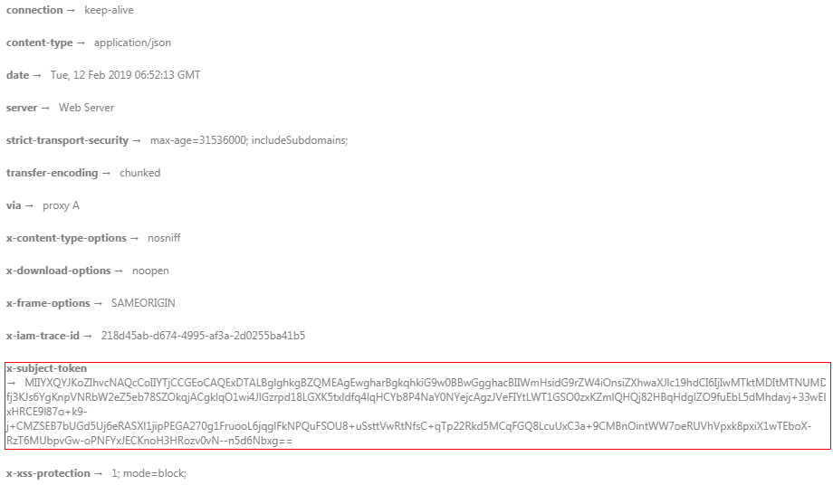

# 返回结果<a name="aom_04_0060"></a>

## 状态码<a name="section38027644115"></a>

请求发送以后，您会收到响应，包含状态码、响应消息头和消息体。

状态码是一组从1xx到5xx的数字代码，状态码表示了请求响应的状态，完整的状态码列表请参见[状态码](状态码.md)。

对于[获取用户Token](https://support.huaweicloud.com/api-iam/iam_30_0001.html)接口，如果调用后返回状态码为“201”，则表示请求成功。

## 响应消息头<a name="section98041694115"></a>

对应请求消息头，响应同样也有消息头，如“Content-type”。

对于[获取用户Token](https://support.huaweicloud.com/api-iam/iam_30_0001.html)接口，返回如[图1](#fig224543414712)所示的消息头，其中“x-subject-token”就是需要获取的用户Token。有了Token之后，您就可以使用Token认证调用其他API。

**图 1**  获取用户Token响应消息头<a name="fig224543414712"></a>  


## 响应消息体<a name="section48088610413"></a>

响应消息体通常以结构化格式返回，与响应消息头中Content-type对应，传递除响应消息头之外的内容。

对于[获取用户Token](https://support.huaweicloud.com/api-iam/iam_30_0001.html)接口，返回如下消息体。为篇幅起见，这里只展示部分内容。

```
{
    "token": {
        "expires_at": "2019-02-13T06:52:13.855000Z",
        "methods": [
            "password"
        ],
        "catalog": [
            {
                "endpoints": [
                    {
                        "region_id": "cn-north-1",
......
```

当接口调用出错时，会返回错误码及错误信息说明，错误响应的Body体格式如下所示。

```
{ 
    "errorCode": "SVCSTG_AMS_4000001", 
    "errorMessage": "Request param invalid" 
}
```

其中，errorCode表示错误码，errorMessage表示错误信息。

