# APP管理

APP管理即创建移动APP应用。

> **说明：**   
>1.  Mobile探针需要的手机权限：  
>    权限1：android.permission.INTERNET  
>    权限2：android.permission.ACCESS\_NETWORK\_STATE  
>2.  执行埋点命令行的环境必须安装Java1.8及以上版本，并设置了正确的JAVA\_HOME环境变量。  

## 新建移动APP应用

1.  登录[应用运维管理](https://console.huaweicloud.com/aom/#/aom/ams/summary)。
2.  在左侧导航栏中选择“Mobile”，展开选项卡，单击“APP管理”。
3.  单击“下载埋点工具包”下载埋点工具，并解压埋点工具包到本地。

    Windows：

    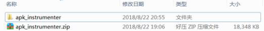

    Linux：

    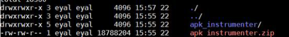

4.  创建APP。单击“添加”，按提示输入应用名称后点击“生成”，系统将生成专属您应用的埋点命令行。

    黑色背景框中会生成Windows和Linux的命令行。

    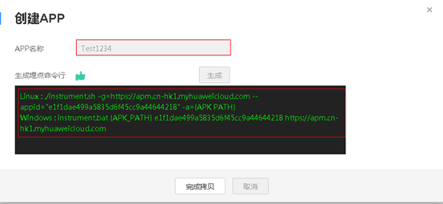

5.  单击“完成拷贝”，完成应用创建并自动拷贝命令行到剪贴板。
6.  将拷贝的命令行粘贴到记事本文档，将其中的\{APK\_PATH\}替换为您的实际apk地址。

    Windows：

    1.  进入apk\_instrumenter文件夹。
    2.  在当前文件夹打开命令行：

        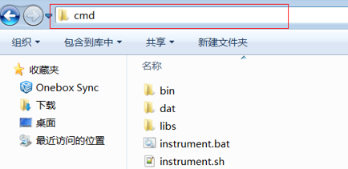

    3.  把生成的Windows命令行中的 “\{APK\_PATH\}” 替换为需要埋点的apk全路径。

        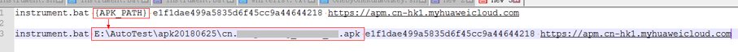

    Linux:

    1.  进入apk\_instrumenter文件夹
    2.  把生成的Linux命令行中的 “\{APK\_PATH\}” 替换为需要埋点的apk全路径，例：

        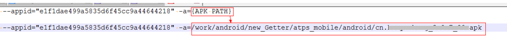

7.  根据您运行埋点的操作系统拷贝对应执行命令行运行命令。

    Windows

    1.  在刚才打开的cmd中执行替换好的命令行

        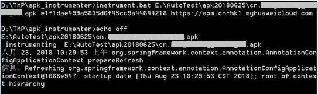

    2.  埋点完成后会弹出一个文件夹，文件夹中包含了原始apk和埋点后的apk，名称如

        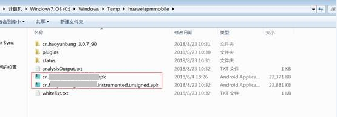

    Linux:

    在apk\_instrumenter目录下执行埋点命令行，执行完毕后生成的apk会显示在命令行中：

    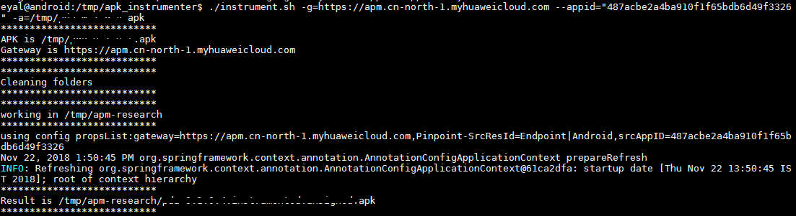

8.  将APK签名即可发布安装。

    > **说明：**   
    >**埋点完成后是不带签名的，需要用户自己对生成后的apk进行签名**。  

## 埋点命令行

1.  在应用创建完成后，埋点命令行就已存在于剪贴板中。若您不慎丢失命令行，或需要埋点升级的app，可在列表右侧的动作列单击按钮。

    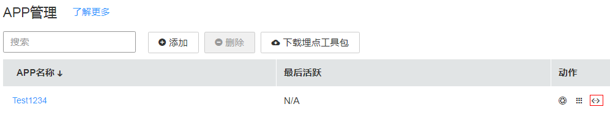

2.  在“查看埋点命令行”弹框中单击“完成拷贝”重新获取埋点命令行。

    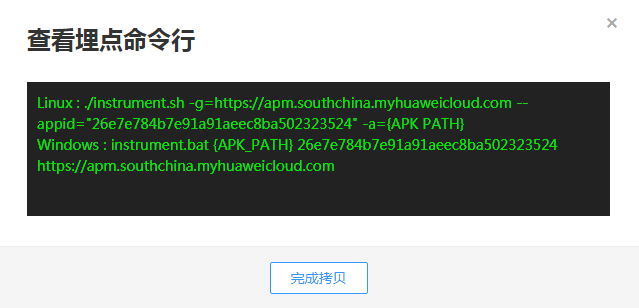

3.  重新执行埋点过程生成新的APK文件即可。

## 更多APP管理界面操作

在APP管理中，您还可以执行如下表操作。

**表 1**  相关操作

<table><thead align="left"><tr id="zh-cn_topic_0127936423_row14583153620596"><th class="cellrowborder" valign="top" width="20%" id="mcps1.2.3.1.1">
操作

</th>
<th class="cellrowborder" valign="top" width="80%" id="mcps1.2.3.1.2">
说明

</th>
</tr>
</thead>
<tbody><tr id="zh-cn_topic_0127936423_row1058316369591"><td class="cellrowborder" valign="top" width="20%" headers="mcps1.2.3.1.1 ">
全选或者取消全选

</td>
<td class="cellrowborder" valign="top" width="80%" headers="mcps1.2.3.1.2 ">
可通过全选APP管理表中行，通过可取消全选。

</td>
</tr>
<tr id="zh-cn_topic_0127936423_row019992094812"><td class="cellrowborder" valign="top" width="20%" headers="mcps1.2.3.1.1 ">
跳转到拓扑界面

</td>
<td class="cellrowborder" valign="top" width="80%" headers="mcps1.2.3.1.2 ">
单击列表右侧的动作列单击按钮，可跳转到Mobile拓扑界面详细查看调用过程。

</td>
</tr>
<tr id="zh-cn_topic_0127936423_row185831236125917"><td class="cellrowborder" valign="top" width="20%" headers="mcps1.2.3.1.1 ">
跳转到APP汇总界面

</td>
<td class="cellrowborder" valign="top" width="80%" headers="mcps1.2.3.1.2 ">
单击列表右侧的动作列单击按钮，可跳转到APP汇总界面，查看用户体验详情。

</td>
</tr>
</tbody>
</table>

