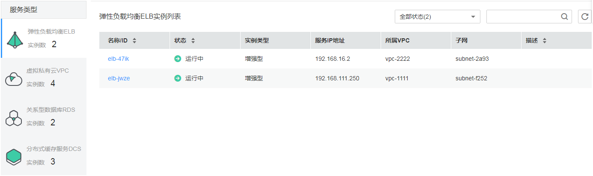
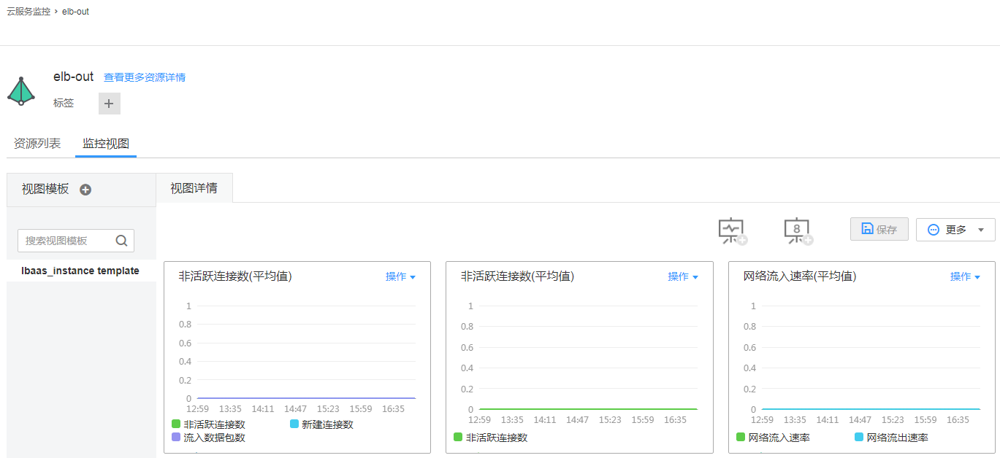

# 中间件监控

当您购买了弹性负载均衡（ELB）、虚拟私有云（VPC）、关系型数据库（RDS）、分布式缓存服务（DCS）后，无需额外安装其他插件，即可在AOM界面监控这些云服务的运行状态及各种指标。

## 监控中间件状态

在实例列表中可监控中间件的实例状态等信息，下面以ELB为例，如下图所示。

**图 1**  监控ELB状态  

## 监控中间件指标

在日常运维中，您可在AOM的“监控视图”页签，集中监控ELB、VPC、RDS、DCS的各种指标。下面以ELB为例，如[图2](#fig173461316202319)所示。

ELB指标详见《弹性负载均衡用户指南》的[支持的监控指标](https://support.huaweicloud.com/usermanual-elb/zh_cn_elb_08_0001.html)页面，VPC指标详见《虚拟私有云用户指南》的[支持的监控指标](https://support.huaweicloud.com/usermanual-vpc/vpc010012.html)页面，RDS指标详见《关系型数据库用户指南》的[支持的监控指标](https://support.huaweicloud.com/usermanual-rds/rds_06_0001.html)页面，DCS指标详见《分布式缓存服务用户指南》的[支持的监控指标](https://support.huaweicloud.com/usermanual-dcs/dcs-zh-ug-180419002.html)页面。

**图 2**  监控ELB指标  

您还可以执行如下操作：

-   **创建视图模板**

    AOM提供了默认视图模板且支持修改，例如，ELB的默认视图模板lbaas\_instance template，您还可单击中的加号自定义视图模板。

-   **添加指标图表**

    单击、可在视图模板中分别添加曲线图、数字图。您还可对视图模板中的指标图表进行删除、移动、复制等操作，详细操作请参见[仪表盘](仪表盘.md)。

-   **添加到仪表盘**

    通过右上角“更多”下拉列表框，可对视图模板中的指标图表批量设置时间范围（只是临时展示，不支持保存），添加视图模板到仪表盘并在“视图管理 \> 仪表盘”界面进行监控等。

