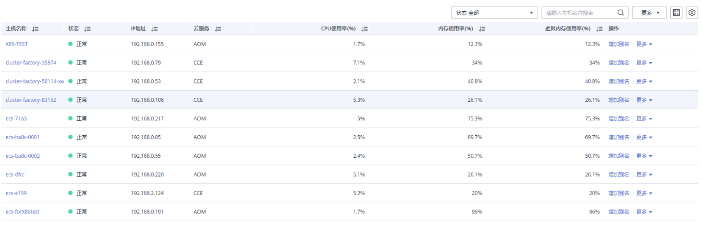

# 主机监控

主机包括弹性云服务器（ECS）、裸金属服务器（BMS）。AOM既可监控通过创建CCE、ServiceStage集群时创建的主机，也可监控非CCE、ServiceStage集群环境下直接创建的主机（直接创建的主机操作系统需满足操作系统及版本，且创建后需要给主机安装ICAgent，安装操作详见[安装ICAgent](安装ICAgent.md)，否则AOM将无法监控）。同时，主机的IP地址支持IPv4、IPv6。

通过AOM您可监控主机的资源占用与健康状态，监控主机的磁盘、文件系统等常用系统设备，监控运行在主机上的业务进程或实例的资源占用与健康状态。

## 注意事项

-   一个主机最多可添加5个标签，且标签不能重复。
-   不同主机可添加同一个标签。
-   通过创建CCE、ServiceStage集群时创建的主机，不支持添加自定义集群和别名。
-   主机状态包含“正常”、“异常”、“亚健康”、“通道静默”、“已删除”。当由于网络异常、主机下电、关机等原因导致的主机异常，或主机产生阈值告警时，主机状态为“异常”。

## 主机监控

1.  在左侧导航栏中选择“主机监控”，查看主机列表。

    为了方便您查看主机列表，您可以：

    -   单击右上角图标对主机列表进行过滤显示，实现隐藏控制节点。
    -   可以在主机列表上方设置过滤条件，实现主机列表过滤显示。

2.  您可根据需要选择是否对主机执行如下操作：
    -   **添加别名**

        当主机名称过于复杂不便于识别时，您可根据需要给主机添加一个便于识别的别名。

        在主机列表中，单击主机所在行“操作”列的“增加别名”进行添加。

    -   **添加标签**

        标签是主机的标识，通过标签您可管理主机，并对主机进行简单分类。添加标签后，您可快速识别、选择或搜索主机。

        在主机列表中，单击主机所在行“操作”列的“更多\>增加标签”，单击，输入标签后，单击，再单击“确定”。标签添加成功后，即可在页面右上角的搜索框中输入标签关键字进行搜索。主机列表的“标签”列默认隐藏，您可单击右上角的，通过选中或取消选中“标签”前的复选框，自定义其展示与隐藏。

3.  设置搜索条件搜索待监控的主机。

    **图 1**  主机列表  
    

4.  单击主机名称，进入“主机详情”页面，在列表中可监控运行在主机上实例的资源占用与健康状态，单击“监控视图”页签，可监控该主机的各种指标。
    -   **创建视图模板**

        AOM提供了默认视图模板：Application template，且支持修改，您还可单击中的加号自定义视图模板。

    -   **添加指标图表**

        单击、可在视图模板中分别添加曲线图、数字图。您还可对视图模板中的指标图表进行删除、移动、复制等操作，详细操作请参见[仪表盘](仪表盘.md)。

    -   **添加到仪表盘**

        通过右上角“更多”下拉列表框，可对添加视图模板到仪表盘并在“ 仪表盘”界面进行监控等。

5.  监控主机的显卡、网卡等常用系统设备。
    -   单击“显卡”页签，在列表中可查该主机显卡的基本信息，单击显卡名称，可在“监控视图”页面监控该显卡的各种指标。
    -   单击“网卡”页签，在列表中可查看该主机网卡的基本信息，单击网卡名称，可在“监控视图”页面监控该网卡的各种指标。
    -   单击“磁盘”页签，在列表中可查看该主机磁盘的基本信息，单击磁盘名称，可在“监控视图”页面监控该磁盘的各种指标。
    -   单击“文件系统”页签，在列表中可查看该主机文件系统的基本信息，单击磁盘文件分区名称，可在“监控视图”页面监控该文件系统的各种指标。
    -   单击“告警分析”页签，在列表中可查看该主机的相关告警信息。
    -   当主机类型为“CCE”时，单击“磁盘分区”页签，在列表中可查看该磁盘分区的基本信息，单击磁盘分区名称，

        可在“监控视图”页面监控该磁盘分区的各种指标。

        > **说明：** 
        >当前磁盘分区功能支持的系统为：CentOS 7.x版本、EulerOS 2.5。

