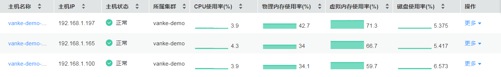

# 主机监控

AOM的每一台主机对应一台虚拟机或物理机。只要主机的操作系统满足AOM支持的操作系统（AOM支持的操作系统详见[表1 AOM支持的操作系统及版本](https://support.huaweicloud.com/productdesc-aom/aom_06_0001.html)）且主机已安装ICAgent，即可将主机接入到AOM中进行监控。同时，主机的IP地址支持IPv4、IPv6。

通过AOM您可监控主机的资源占用与健康状态，监控主机的磁盘、文件系统等常用系统设备，监控运行在主机上的业务进程或实例的资源占用与健康状态。

## 注意事项

-   一个主机最多可添加5个标签，且标签不能重复。
-   不同主机可添加同一个标签。
-   通过创建CCE、ServiceStage集群时创建的主机，不支持添加自定义集群和别名。
-   主机状态包含“正常”和“异常”。当由于网络异常、主机下电、关机等原因导致的主机异常，或主机产生阈值告警时，主机状态为“异常”。

## 主机监控

1.  登录AOM控制台，在左侧导航栏中选择“主机监控”，您可根据需要选择是否对主机执行如下操作：
    -   **添加别名**

        当主机名称过于复杂不便于识别时，您可根据需要给主机添加一个便于识别的别名。

        在主机列表中，单击主机所在行“操作”列的“增加别名”进行添加。

    -   **添加标签**

        标签是主机的标识，通过标签您可管理主机，并对主机进行简单分类。添加标签后，您可快速识别、选择或搜索主机。

        在主机列表中，单击主机所在行“操作”列的“编辑标签”，单击，输入标签后，单击，再单击“确定”。标签添加成功后，即可在页面右上角的搜索框中输入标签关键字进行搜索。主机列表的“标签”列默认隐藏，您可单击右上角的，通过选中或取消选中“展示标签”前的复选框，自定义其展示与隐藏。

    -   **添加自定义集群**

        对于在非CCE、ServiceStage集群环境下直接购买的主机，若想要对其进行批量管理，例如，您购买了50个主机， 需要每十个主机分组批量管理，即可对这些主机分别创建不同的集群。

        在右上角的“更多”下拉列表框中选择“新增集群”，输入集群名称后，选择您直接购买的一个或多个主机，单击“确定”。自定义集群添加完成后，通过“更多”下拉列表框，您还可编辑、删除集群，修改集群名称。

2.  设置搜索条件搜索待监控的主机，在主机列表中监控该主机的资源占用及健康状态。

    **图 1**  监控主机的资源占用及健康状态  
    

3.  单击主机名称，进入“主机详情”页面，在列表中可监控运行在主机上实例的资源占用与健康状态，单击“监控视图”页签，可监控该主机的各种指标。
4.  监控主机的显卡、网卡等常用系统设备。
    -   单击“显卡”页签，在列表中可查该主机显卡的基本信息，单击显卡名称，可在“监控视图”页面监控该显卡的各种指标。
    -   单击“网卡”页签，在列表中可查看该主机网卡的基本信息，单击网卡名称，可在“监控视图”页面监控该网卡的各种指标。
    -   单击“磁盘”页签，在列表中可查看该主机磁盘的基本信息，单击磁盘名称，可在“监控视图”页面监控该磁盘的各种指标。
    -   单击“文件系统”页签，在列表中可查看该主机文件系统的基本信息，单击磁盘文件分区名称，可在“监控视图”页面监控该文件系统的各种指标。

