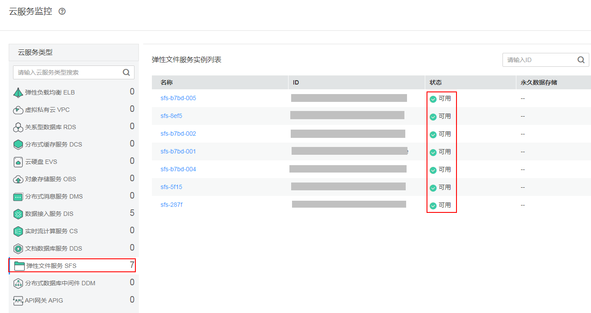
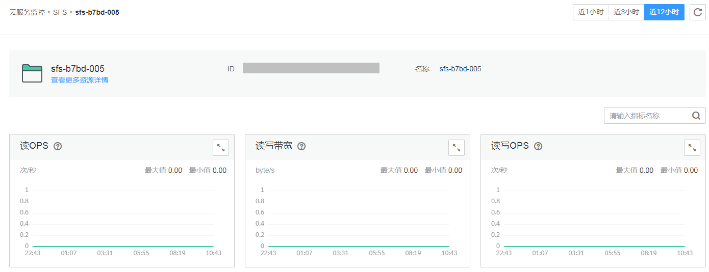
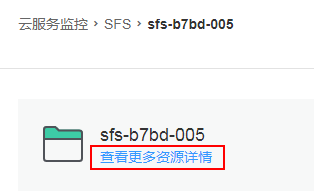

# 云服务监控

云服务监控展示华为云各服务实例的历史性能数据曲线，当前支持如下云服务的监控：弹性负载均衡（ELB）、虚拟私有云（VPC）、关系型数据库（RDS）、分布式缓存服务（DCS）、云硬盘（EVS）、对象存储服务（OBS）、分布式消息服务（DMS）、数据接入服务（DIS）、实时流计算服务（CS）、文档数据库服务（DDS）、弹性文件服务（SFS）、分布式数据库中间件（DDM）和API网关（APIG）。最长可查阅近6个月内的数据，有助于您了解云服务实例运行状况。

## 监控云服务状态

当您购买了云服务后，无需额外安装其他插件，即可在AOM界面监控这些云服务的运行状态、查看其基本信息。

## 监控云服务指标

单击云服务列表中的名称，进入云服务监控详细页面。此时您可以直接查看云服务各指标的数据曲线。

您还可以执行如下操作：

-   在各指标卡片右上角点击放大云服务指标监控卡片
-   在页面右上角选择时间范围以查看不同时间段的历史数据。

    

-   单击“查看更多资源详情”跳转至对应服务Console界面查看更多信息，如下：

    

