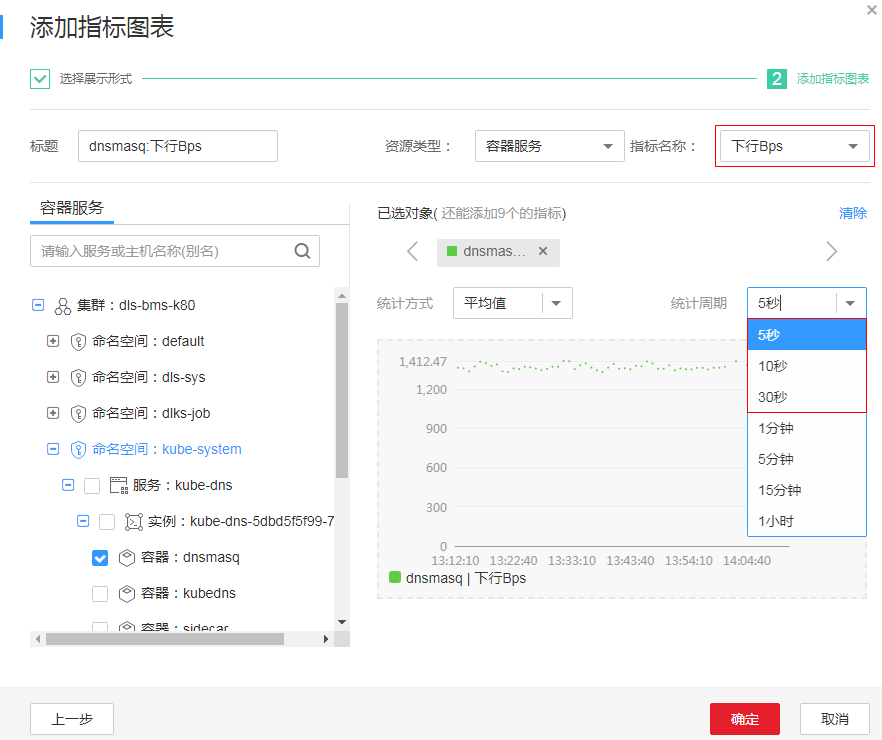
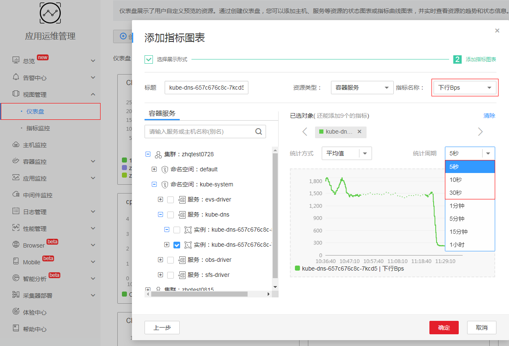
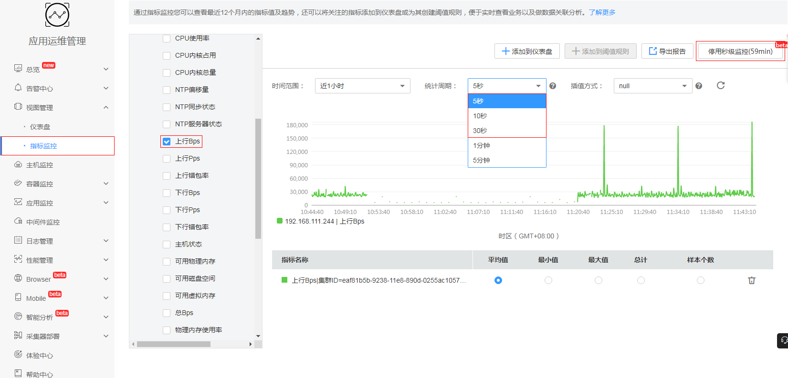
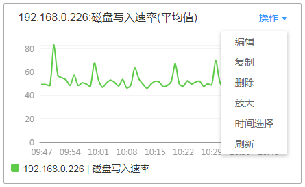

# 仪表盘

通过仪表盘您可将不同指标展示到同一个屏幕上，通过不同的仪表形式来展示指标数据，如曲线、饼图、进度条、列表等。典型场景下，可将重要资源的关键指标展示到仪表盘中，从而实时的进行服务状态的监控。还可将不同指标展示到同一个图形界面上进行对比。另外对于例行运维需要查看的指标，可以添加到自定义仪表盘中，以便再次打开系统时无需重新选择指标就可以进行例行检查任务。

仪表盘支持两种数据类型的图表展示，分为指标数据和状态数据。指标数据可使用曲线图、数字图展示，状态数据支持阈值、主机、服务状态的展示。

## 创建仪表盘

1.  登录[应用运维管理](https://console.huaweicloud.com/aom/#/aom/ams/summary)。
2.  在左侧导航栏中选择“视图管理 \> 仪表盘”。
3.  （可选）单击“启用秒级监控”，选择采集周期并单击“确定”，可以使用秒级监控功能进行更全面细致的监控。
4.  在“仪表盘”页面中单击“创建仪表盘”，在弹出的“创建仪表盘”对话框中输入仪表盘名称并单击“确定”。
5.  为该仪表盘添加指标图表。

    > **说明：**   
    >添加阈值状态图前请先创建阈值规则，否则将无法添加阈值状态图。  

    下面以添加1个曲线图为例：

    1.  选择指标图表添加方式：在“选择添加方式”对话框中，单击“指标数据”下的“添加”。
    2.  选择指标图表展现形式：在“添加指标图表”对话框中选择曲线图，单击“下一步”。
    3.  选择指标并设置指标的统计方式和统计周期，单击“确定”。

        如果您在[3](#li17977178215)中启用秒级监控，则在统计周期的可以选择5秒、10秒、30秒的秒级监控，如下图所示。

        **图 1**  添加指标图表  
        

6.  单击页面右侧的“保存”。

## 更多仪表盘操作

仪表盘创建完成后，您还可以执行[表1](#table16941192520152)中的操作。

**表 1**  相关操作

<table><thead align="left"><tr id="row6826364"><th class="cellrowborder" valign="top" width="15%" id="mcps1.2.4.1.1">
操作对象

</th>
<th class="cellrowborder" valign="top" width="15%" id="mcps1.2.4.1.2">
操作

</th>
<th class="cellrowborder" valign="top" width="70%" id="mcps1.2.4.1.3">
说明

</th>
</tr>
</thead>
<tbody><tr id="row53067518"><td class="cellrowborder" rowspan="5" valign="top" width="15%" headers="mcps1.2.4.1.1 ">
仪表盘

</td>
<td class="cellrowborder" valign="top" width="15%" headers="mcps1.2.4.1.2 ">
另存为

</td>
<td class="cellrowborder" rowspan="3" valign="top" width="70%" headers="mcps1.2.4.1.3 ">
通过页面右侧的“更多”下拉列表框，可另存、重命名或删除仪表盘。

<b>图1 </b>更多操作 

</td>
</tr>
<tr id="row41334227"><td class="cellrowborder" valign="top" headers="mcps1.2.4.1.1 ">
重命名

</td>
</tr>
<tr id="row772049"><td class="cellrowborder" valign="top" headers="mcps1.2.4.1.1 ">
删除

</td>
</tr>
<tr id="row25953254"><td class="cellrowborder" valign="top" headers="mcps1.2.4.1.1 ">
导出监控报告

</td>
<td class="cellrowborder" valign="top" headers="mcps1.2.4.1.2 ">
单击“导出监控报告”，可将仪表盘中的指标图表（仅可导出曲线图）以CSV格式导出，以便进行本地存储及进一步分析。

</td>
</tr>
<tr id="row51121461115"><td class="cellrowborder" valign="top" headers="mcps1.2.4.1.1 ">
启用秒级监控

</td>
<td class="cellrowborder" valign="top" headers="mcps1.2.4.1.2 ">
秒级监控：提供5秒、10秒、30秒级粒度的指标监控，即ICAgent每5秒、10秒或30秒采集一次指标数据，采集周期为5秒、10秒或30秒。

当您在业务高峰时期需要对资源进行更全面细致的监控，1分钟级粒度的指标监控已无法满足需求时，您可在仪表盘界面启用秒级监控并根据实际需求选择采集周期，进行秒级监控。如图所示：

<b>图2 </b>在仪表盘界面进行秒级监控 

秒级监控对您的指标监控也生效，启用秒级监控后，您可在指标监控中对指标进行秒级监控。如图所示：

<b>图3 </b>在指标监控界面进行秒级监控 

 说明： 

在使用秒级监控时，您需注意以下使用限制：

<ul id="ul559051716358"><li>秒级监控生效时长为60分钟。
您单击“启用秒级监控”后，“启用秒级监控”按钮变为“停用秒级监控”，同时系统开始倒计时，您不需要进行任何操作，1小时后AOM会自动停用秒级监控。

</li><li>启用秒级监控后，“指标监控”和“仪表盘”界面指标的统计周期将自动切换为您设置的采集周期；停用秒级监控后，指标统计周期会自动恢复为您启用前的默认设置。</li><li>秒级监控不支持立即启停，启停间隔为1分钟。
启用秒级监控后，需立即停用时，您需等待1分钟方能停用。

停用秒级监控后，需立即启用时，您需等待1分钟方能启用。

</li></ul>

</td>
</tr>
<tr id="row15716008"><td class="cellrowborder" rowspan="9" valign="top" width="15%" headers="mcps1.2.4.1.1 ">
指标图表

</td>
<td class="cellrowborder" valign="top" width="15%" headers="mcps1.2.4.1.2 ">
添加

</td>
<td class="cellrowborder" valign="top" width="70%" headers="mcps1.2.4.1.3 ">
单击“添加指标图表”，可在仪表盘中添加曲线图、数字图、阈值状态、主机状态或服务状态图。

</td>
</tr>
<tr id="row4760790"><td class="cellrowborder" valign="top" headers="mcps1.2.4.1.1 ">
编辑

</td>
<td class="cellrowborder" rowspan="6" valign="top" headers="mcps1.2.4.1.2 ">
通过指标图表右上角的“操作”下拉列表框，可对指标图标进行编辑、复制、删除、放大（仅可放大曲线图）等操作。其中“时间选择”按钮仅在指标曲线图中存在，通过该按钮您可以设置临时的时间范围和统计周期，方便您查看某一时间范围的指标数据。

<b>图4 </b>指标图表操作 

 说明： 

仪表盘中，当主机、服务等资源被删除后，针对这些资源创建的指标图表不会自动删除，为提高系统性能，您需要手动删除不需要的指标图表。

</td>
</tr>
<tr id="row25194735"><td class="cellrowborder" valign="top" headers="mcps1.2.4.1.1 ">
复制

</td>
</tr>
<tr id="row46242468"><td class="cellrowborder" valign="top" headers="mcps1.2.4.1.1 ">
删除

</td>
</tr>
<tr id="row22109730"><td class="cellrowborder" valign="top" headers="mcps1.2.4.1.1 ">
放大

</td>
</tr>
<tr id="row10239610191216"><td class="cellrowborder" valign="top" headers="mcps1.2.4.1.1 ">
时间选择

</td>
</tr>
<tr id="row11865948"><td class="cellrowborder" valign="top" headers="mcps1.2.4.1.1 ">
刷新

</td>
</tr>
<tr id="row60341581"><td class="cellrowborder" valign="top" headers="mcps1.2.4.1.1 ">
调整大小

</td>
<td class="cellrowborder" valign="top" headers="mcps1.2.4.1.2 ">
将鼠标指针移至指标图表右下角，当鼠标指针变为时按住鼠标左键并进行拖动。

</td>
</tr>
<tr id="row19569896"><td class="cellrowborder" valign="top" headers="mcps1.2.4.1.1 ">
调整位置

</td>
<td class="cellrowborder" valign="top" headers="mcps1.2.4.1.2 ">
在指标图表上方或下方的空白区域按住鼠标左键拖动至目标位置。

</td>
</tr>
</tbody>
</table>

