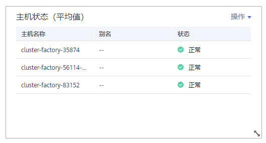
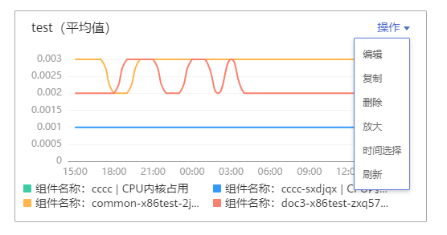

# 仪表盘

通过仪表盘可将不同图表展示到同一个屏幕上，通过不同的仪表形式来展示资源数据，例如，曲线图、数字图、TopN图表等，同时仪表盘支持全屏监控和全屏轮播功能，帮助您全面、深入地掌握监控数据。

例如，可将重要资源的关键指标添加到仪表盘中，从而实时地进行监控。还可将不同资源的同一指标展示到同一个图形界面上进行对比。另外，对于例行运维需要查看的指标，可添加到仪表盘中，以便再次打开AOM时无需重新选择指标就可进行例行检查任务。

创建仪表盘前，请您先了解仪表盘中支持添加的图表类型，以便选择合适的图表，更精准地对资源进行监控。仪表盘中支持添加的图表如下：

## 指标数据类图表（包括曲线图和数字图）

-   **曲线图**：以时间先后顺序显示指标的数据趋势。当需要监控一段时间内一个或多个资源的指标数据趋势时，请使用此类型图表。

    使用曲线图可对不同资源的同一指标进行对比，如下图所示，在同一个图表中展示了不同服务的句柄数。

    **图 1**  曲线图  
    

-   **数字图**：当需要实时监控某个指标的最新数值时，可使用此类型的图表。

    如下图所示，可实时查看vmall-apigw-service服务的句柄数的最新值。

    **图 2**  数字图  
    

## 健康状态类图表（包括阈值状态、主机状态、服务状态图表）

支持阈值、主机、服务状态的展示。可将关注的一个或多个阈值规则、主机或服务的状态信息分别置于同一图表中进行监控。

-   **阈值状态图表：**实时监控阈值规则的状态。

    **图 3**  阈值状态图表  
    

    > **说明：**   
    >添加阈值状态图表前请先创建阈值规则，否则将无法添加阈值状态图表。  

-   **主机状态图表：**实时监控主机的状态。

    **图 4**  主机状态图表  
    

-   **服务状态图表：**实时监控服务的状态。

    **图 5**  服务状态图表  
    

## 资源TopN图表

资源TopN图表的统计单位为集群，统计对象为集群下的资源（这里的资源指主机、服务和实例）。资源TopN图表可视化地展示了集群中资源占用最高的N个资源，支持资源Top5、Top15数据的汇报展示，其中默认展示资源Top5，放大图表后展示资源Top15。

当资源数量很多时，您想快速了解资源占用最高的资源，可在仪表盘中添加TopN图表，您只需要选择资源类型和指标，例如主机的CPU使用率，那么AOM将自动将TopN的主机挑选出来展示，如果不超过N个资源，则按照实际资源展示。如下图所示，展示了集群zhqtest1225的主机CPU使用率Top5：

**图 6**  资源TopN图表  

> **说明：**   
>-   默认展示资源Top5图表，通过单击“显示Top15”、在图表任意处双击或在“操作”列选择“放大”，均可查看资源Top15图表。  
>-   如果您需监控所有集群下的所有资源的Top5数据，可在“运维概览”界面查看，也可将“运维概览”界面的资源Top5数据添加到仪表盘，操作详见[表1](运维概览.md#table62191141172620)。  
>-   资源TopN图表的标题支持您自定义，标题默认命名为资源类型\(集群名称\)，例如[图6](#fig517132418250)中图表的标题为“主机\(zhqtest1225\)”。  

## 注意事项

-   1个区域（例如，华北-北京一区域）中最多可创建50个仪表盘。
-   1个仪表盘中最多可添加20个图表。
-   1个曲线图中最多可添加100个资源，且资源可跨集群选择。
-   1个数字图只能添加1个资源。
-   1个阈值状态图表最多可添加10个阈值规则。
-   1个主机状态图表最多可添加10个主机。
-   1个服务状态图表最多可添加10个服务。

## 创建仪表盘

1.  登录AOM控制台，在左侧导航栏中选择“视图管理 \> 仪表盘”。
2.  （可选）单击“启用秒级监控”，选择采集周期并单击“确定”，可以使用秒级监控功能进行更全面细致的监控。
3.  在“仪表盘”页面左上方单击“创建仪表盘”，在弹出的“创建仪表盘”对话框中输入仪表盘名称并单击“确定”。
4.  为该仪表盘添加图表。仪表盘支持添加的图表有：曲线图、数字图、阈值状态图表、主机状态图表、服务状态图表、资源TopN图表。您可根据需要，选择合适的图表。

    下面以添加1个曲线图为例：

    1.  选择指标图表添加方式：在“选择添加方式”对话框中，单击“指标数据”下的“添加”。
    2.  选择指标图表展现形式：在“添加指标图表”对话框中选择曲线图，单击“下一步”。
    3.  选择指标并设置指标的统计方式和统计周期，单击“确定”。

        如果您在[2](#li17977178215)中启用秒级监控，则统计周期可选择5秒、10秒、30秒，如下图所示。

        **图 7**  添加指标图表  
        

5.  单击页面右侧的“保存”。

    > **说明：**   
    >“仪表盘”界面右上角的自动刷新开关对仪表盘中所有的图表生效。  
    >-   开启（默认）  
    >    如果未开启秒级监控，则仪表盘中的数据每分钟自动刷新一次。  
    >    如果开启了秒级监控，则仪表盘中的数据根据开启秒级监控时设置的采集周期，即5秒、10秒、30秒自动刷新一次。  
    >-   关闭  
    >    仪表盘中的数据不会自动刷新。  

## 仪表盘全屏监控

仪表盘创建完成后，可使用仪表盘全屏模式进行监控。仪表盘全屏模式支持自定义在线时长和轮播功能。

-   **全屏模式在线时长**：全屏模式会随华为云账号的退出而退出，无法实时进行监控。AOM支持您自定义全屏模式在线时长。
-   **全屏模式下仪表盘轮播**：日常巡检时，需同时全屏监控多个仪表盘。AOM支持您自定义轮播周期，在同一个显示屏上按照轮播周期对仪表盘进行定期切换。

1.  登录AOM控制台，在左侧导航栏中选择“视图管理 \> 仪表盘”。
2.  在左侧的“仪表盘”下拉列表框中选择目标仪表盘，并单击右上角的。
3.  设置全屏模式在线时长。[了解更多](https://support.huaweicloud.com/aom_faq/aom_03_0012.html)
    -   自定义在线时长：默认在线时长为1小时，您可在文本框中输入1～24小时。

        例如，在文本框中输入2，则2小时后自动退出到登录界面。

    -   保持在线：表示不限制，即全屏界面永远不会自动退出到登录界面，可持续在全屏模式下进行监控。

4.  （可选）设置全屏轮播：在“轮播周期”文本框中输入轮播周期，在“仪表盘”下拉列表框中选择待轮播的仪表盘。

    > **说明：**   
    >轮播开关默认打开，若您不需要在全屏模式下对仪表盘进行轮播时，可关闭该开关。  

5.  单击“确认”，进入仪表盘全屏模式，对仪表盘进行全屏监控。

## 更多仪表盘操作

仪表盘创建完成后，您还可以执行[表1](#table16941192520152)中的操作。

**表 1**  相关操作

<table><thead align="left"><tr id="row6826364"><th class="cellrowborder" valign="top" width="15%" id="mcps1.2.4.1.1">
操作对象

</th>
<th class="cellrowborder" valign="top" width="15%" id="mcps1.2.4.1.2">
操作

</th>
<th class="cellrowborder" valign="top" width="70%" id="mcps1.2.4.1.3">
说明

</th>
</tr>
</thead>
<tbody><tr id="row53067518"><td class="cellrowborder" rowspan="5" valign="top" width="15%" headers="mcps1.2.4.1.1 ">
仪表盘

</td>
<td class="cellrowborder" valign="top" width="15%" headers="mcps1.2.4.1.2 ">
另存为

</td>
<td class="cellrowborder" rowspan="3" valign="top" width="70%" headers="mcps1.2.4.1.3 ">
保存仪表盘后，通过页面右侧的“更多”下拉列表框，可另存、重命名或删除仪表盘。

<b>图1 </b>更多操作 

</td>
</tr>
<tr id="row41334227"><td class="cellrowborder" valign="top" headers="mcps1.2.4.1.1 ">
重命名

</td>
</tr>
<tr id="row772049"><td class="cellrowborder" valign="top" headers="mcps1.2.4.1.1 ">
删除

</td>
</tr>
<tr id="row25953254"><td class="cellrowborder" valign="top" headers="mcps1.2.4.1.1 ">
导出监控报告

</td>
<td class="cellrowborder" valign="top" headers="mcps1.2.4.1.2 ">
单击“导出监控报告”，可将仪表盘中的曲线图以CSV格式导出，以便进行本地存储及进一步分析。

</td>
</tr>
<tr id="row51121461115"><td class="cellrowborder" valign="top" headers="mcps1.2.4.1.1 ">
启用秒级监控

</td>
<td class="cellrowborder" valign="top" headers="mcps1.2.4.1.2 ">
秒级监控：提供5秒、10秒、30秒级粒度的指标监控，即ICAgent每5秒、10秒或30秒采集一次指标数据，采集周期为5秒、10秒或30秒。

当您在业务高峰时期需要对资源进行更全面细致的监控，1分钟级粒度的指标监控已无法满足需求时，您可在仪表盘界面启用秒级监控并根据实际需求选择采集周期，进行秒级监控。如图所示：

<b>图2 </b>在仪表盘界面进行秒级监控 

秒级监控对您的指标监控也生效，启用秒级监控后，您可在指标监控中对指标进行秒级监控。如图所示：

<b>图3 </b>在指标监控界面进行秒级监控 

 说明： 

在使用秒级监控时，您需注意以下使用限制：

<ul id="ul559051716358"><li>秒级监控生效时长为60分钟。
您单击“启用秒级监控”后，“启用秒级监控”按钮变为“停用秒级监控”，同时系统开始倒计时，您不需要进行任何操作，1小时后AOM会自动停用秒级监控。

</li><li>启用秒级监控后，“指标监控”和“仪表盘”界面指标的统计周期将自动切换为您设置的采集周期；停用秒级监控后，指标统计周期会自动恢复为您启用前的默认设置。</li><li>秒级监控不支持立即启停，启停间隔为1分钟。
启用秒级监控后，需立即停用时，您需等待1分钟方能停用。

停用秒级监控后，需立即启用时，您需等待1分钟方能启用。

</li></ul>

</td>
</tr>
<tr id="row15716008"><td class="cellrowborder" rowspan="9" valign="top" width="15%" headers="mcps1.2.4.1.1 ">
图表

</td>
<td class="cellrowborder" valign="top" width="15%" headers="mcps1.2.4.1.2 ">
添加

</td>
<td class="cellrowborder" valign="top" width="70%" headers="mcps1.2.4.1.3 ">
单击“添加指标图表”，可在仪表盘中添加曲线图、数字图、阈值状态图表、主机状态图表、服务状态图表、资源TopN图表。

</td>
</tr>
<tr id="row4760790"><td class="cellrowborder" valign="top" headers="mcps1.2.4.1.1 ">
编辑

</td>
<td class="cellrowborder" rowspan="6" valign="top" headers="mcps1.2.4.1.2 ">
通过图表右上角的“操作”下拉列表框，可对图表进行编辑（“运维概览”界面的资源Top5图表添加到仪表盘后不支持编辑操作）、复制、删除、放大（仅可放大曲线图、资源TopN图表）等操作。其中“时间选择”按钮仅在曲线图、资源TopN图表中存在，通过该按钮您可以设置临时的时间范围和统计周期，方便您查看某一时间范围的资源数据。

<b>图4 </b>图表操作 

 说明： 

当主机、服务等资源被删除后，在仪表盘中针对这些资源创建的图表不会自动删除，为提高系统性能，您需要手动删除不需要的图表。

</td>
</tr>
<tr id="row25194735"><td class="cellrowborder" valign="top" headers="mcps1.2.4.1.1 ">
复制

</td>
</tr>
<tr id="row46242468"><td class="cellrowborder" valign="top" headers="mcps1.2.4.1.1 ">
删除

</td>
</tr>
<tr id="row22109730"><td class="cellrowborder" valign="top" headers="mcps1.2.4.1.1 ">
放大

</td>
</tr>
<tr id="row10239610191216"><td class="cellrowborder" valign="top" headers="mcps1.2.4.1.1 ">
时间选择

</td>
</tr>
<tr id="row11865948"><td class="cellrowborder" valign="top" headers="mcps1.2.4.1.1 ">
刷新

</td>
</tr>
<tr id="row60341581"><td class="cellrowborder" valign="top" headers="mcps1.2.4.1.1 ">
调整大小

</td>
<td class="cellrowborder" valign="top" headers="mcps1.2.4.1.2 ">
将鼠标指针移至图表右下角，当鼠标指针变为时按住鼠标左键并进行拖动。

</td>
</tr>
<tr id="row19569896"><td class="cellrowborder" valign="top" headers="mcps1.2.4.1.1 ">
调整位置

</td>
<td class="cellrowborder" valign="top" headers="mcps1.2.4.1.2 ">
在图表上方或下方的空白区域按住鼠标左键拖动至目标位置。

</td>
</tr>
</tbody>
</table>

