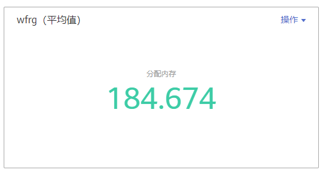

# 仪表盘

通过仪表盘可将不同图表展示到同一个屏幕上，通过不同的仪表形式来展示资源数据，例如，曲线图、数字图等，进而全面、深入地掌握监控数据。

例如，可将重要资源的关键指标添加到仪表盘中，从而实时地进行监控。还可将不同资源的同一指标展示到同一个图形界面上进行对比。另外，对于例行运维需要查看的指标，可添加到仪表盘中，以便再次打开AOM时无需重新选择指标就可进行例行检查任务。

创建仪表盘前，请您先了解仪表盘中支持添加的图表类型，以便选择合适的图表，更精准地对资源进行监控。仪表盘中支持添加的图表如下：

## 指标数据类图表（包括曲线图和数字图）

-   **曲线图**：以时间先后顺序显示指标的数据趋势。当需要监控一段时间内一个或多个资源的指标数据趋势时，请使用此类型图表。

    使用曲线图可对不同资源的同一指标进行对比，如下图所示，在同一个图表中展示了不同组件的CPU内核总量。

    **图 1**  曲线图  
    

-   **数字图**：当需要实时监控某个指标的最新数值时，可使用此类型的图表。

    如下图所示，可实时查看组件的分配内存的平均值。

    **图 2**  数字图  
    

## 健康状态类图表（包括阈值状态、主机状态、组件状态图表）

支持阈值、主机、组件状态的展示。可将关注的一个或多个阈值规则、主机或组件的状态信息分别置于同一图表中进行监控。

-   **阈值状态图表：**实时监控阈值规则的状态。

    **图 3**  阈值状态图表  
    

    > **说明：** 
    >添加阈值状态图表前请先创建阈值规则，否则将无法添加阈值状态图表。

-   **主机状态图表：**实时监控主机的状态。

    **图 4**  主机状态图表  
    

-   **组件状态图表：**实时监控组件的状态。

    **图 5**  组件状态图表  
    

## 资源TopN图表

资源TopN图表的统计单位为集群，统计对象为集群下的资源（这里的资源指主机、组件和实例）。资源TopN图表可视化地展示了集群中资源占用最高的N个资源，支持资源Top5、Top15数据的汇报展示，其中默认展示资源Top5，放大图表后展示资源Top15。

当资源数量很多时，您想快速了解资源占用最高的资源，可在仪表盘中添加TopN图表，您只需要选择资源类型和指标，例如主机的CPU使用率，那么AOM将自动将TopN的主机挑选出来展示，如果不超过N个资源，则按照实际资源展示。如下图所示，展示了集群cluster-factory的实例CPU内核占用Top5：

**图 6**  资源TopN图表  

> **说明：** 
>-   默认展示资源Top5图表，通过单击“显示Top15”、在图表任意处双击或在“操作”列选择“放大”，均可查看资源Top15图表。
>-   如果您需监控所有集群下的所有资源的Top5数据，可在“监控概览”界面查看，也可将“监控概览”界面的资源Top5数据添加到仪表盘。
>-   资源TopN图表的标题支持您自定义，标题默认命名为资源类型\(集群名称\)。

## 注意事项

-   1个区域中最多可创建50个仪表盘。
-   1个仪表盘中最多可添加20个图表。
-   1个曲线图中最多可添加10个资源，且资源可跨集群选择。
-   1个数字图只能添加1个资源。
-   1个阈值状态图表最多可添加10个阈值规则。
-   1个主机状态图表最多可添加10个主机。
-   1个组件状态图表最多可添加10个组件。

## 创建仪表盘

1.  在左侧导航栏中选择“总览 \> 仪表盘”。
2.  在“仪表盘”页面左上方单击“创建仪表盘”，在弹出的“创建仪表盘”对话框中输入仪表盘名称并单击“确定”。
3.  为该仪表盘添加指标图表。仪表盘支持添加的图表有：曲线图、数字图、阈值状态图表、主机状态图表、组件状态图表。您可根据需要，选择合适的图表。

    下面以添加1个曲线图为例：

    1.  选择指标图表添加方式：在“选择添加方式”对话框中，单击“指标数据”下的“添加”。
    2.  选择指标图表展现形式：在“添加指标图表”对话框中选择曲线图，单击“下一步”。
    3.  选择指标并设置指标的统计方式和统计周期，单击“确定”。

        

4.  单击页面右侧的“保存”。

    > **说明：** 
    >“仪表盘”界面右上角的自动刷新开关对仪表盘中所有的图表生效。
    >-   开启（默认）
    >    仪表盘中的数据每分钟自动刷新一次。
    >-   关闭
    >    仪表盘中的数据不会自动刷新。

## 更多仪表盘操作

仪表盘创建完成后，您还可以执行[表1](#table16941192520152)中的操作。

**表 1**  相关操作

<table><thead align="left"><tr id="row6826364"><th class="cellrowborder" valign="top" width="15%" id="mcps1.2.4.1.1">
操作对象

</th>
<th class="cellrowborder" valign="top" width="15%" id="mcps1.2.4.1.2">
操作

</th>
<th class="cellrowborder" valign="top" width="70%" id="mcps1.2.4.1.3">
说明

</th>
</tr>
</thead>
<tbody><tr id="row53067518"><td class="cellrowborder" rowspan="4" valign="top" width="15%" headers="mcps1.2.4.1.1 ">
仪表盘

</td>
<td class="cellrowborder" valign="top" width="15%" headers="mcps1.2.4.1.2 ">
另存为

</td>
<td class="cellrowborder" rowspan="3" valign="top" width="70%" headers="mcps1.2.4.1.3 ">
保存仪表盘后，通过页面右侧的“更多”下拉列表框，可另存、重命名或删除仪表盘。

</td>
</tr>
<tr id="row41334227"><td class="cellrowborder" valign="top" headers="mcps1.2.4.1.1 ">
重命名

</td>
</tr>
<tr id="row772049"><td class="cellrowborder" valign="top" headers="mcps1.2.4.1.1 ">
删除

</td>
</tr>
<tr id="row25953254"><td class="cellrowborder" valign="top" headers="mcps1.2.4.1.1 ">
导出监控报告

</td>
<td class="cellrowborder" valign="top" headers="mcps1.2.4.1.2 ">
单击“导出监控报告”，可将仪表盘中的曲线图以CSV格式导出，以便进行本地存储及进一步分析。

</td>
</tr>
<tr id="row15716008"><td class="cellrowborder" rowspan="9" valign="top" width="15%" headers="mcps1.2.4.1.1 ">
图表

</td>
<td class="cellrowborder" valign="top" width="15%" headers="mcps1.2.4.1.2 ">
添加

</td>
<td class="cellrowborder" valign="top" width="70%" headers="mcps1.2.4.1.3 ">
单击“添加指标图表”，可在仪表盘中添加曲线图、数字图、阈值状态图表、主机状态图表、组件状态图表。

</td>
</tr>
<tr id="row4760790"><td class="cellrowborder" valign="top" headers="mcps1.2.4.1.1 ">
编辑

</td>
<td class="cellrowborder" rowspan="6" valign="top" headers="mcps1.2.4.1.2 ">
通过图表右上角的“操作”下拉列表框，可对图表进行编辑、复制、删除、放大（仅可放大曲线图）等操作。其中“时间选择”按钮仅在曲线图中存在，通过该按钮您可以设置临时的时间范围和统计周期，方便您查看某一时间范围的资源数据。

<b>图1 </b>图表操作 

 说明： 

当主机、组件等资源被删除后，在仪表盘中针对这些资源创建的图表不会自动删除，为提高系统性能，您需要手动删除不需要的图表。

</td>
</tr>
<tr id="row25194735"><td class="cellrowborder" valign="top" headers="mcps1.2.4.1.1 ">
复制

</td>
</tr>
<tr id="row46242468"><td class="cellrowborder" valign="top" headers="mcps1.2.4.1.1 ">
删除

</td>
</tr>
<tr id="row22109730"><td class="cellrowborder" valign="top" headers="mcps1.2.4.1.1 ">
放大

</td>
</tr>
<tr id="row10239610191216"><td class="cellrowborder" valign="top" headers="mcps1.2.4.1.1 ">
时间选择

</td>
</tr>
<tr id="row11865948"><td class="cellrowborder" valign="top" headers="mcps1.2.4.1.1 ">
刷新

</td>
</tr>
<tr id="row60341581"><td class="cellrowborder" valign="top" headers="mcps1.2.4.1.1 ">
调整大小

</td>
<td class="cellrowborder" valign="top" headers="mcps1.2.4.1.2 ">
将鼠标指针移至图表右下角，当鼠标指针变为时按住鼠标左键并进行拖动。

</td>
</tr>
<tr id="row19569896"><td class="cellrowborder" valign="top" headers="mcps1.2.4.1.1 ">
调整位置

</td>
<td class="cellrowborder" valign="top" headers="mcps1.2.4.1.2 ">
在图表上方或下方的空白区域按住鼠标左键拖动至目标位置。

</td>
</tr>
</tbody>
</table>

