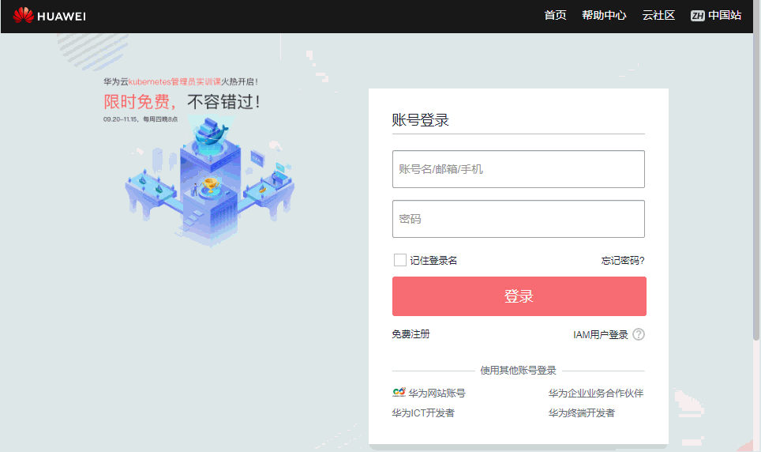

# 免费体验AOM服务

我们已经为您提供并安装好了一个示例应用，您可以进行免费体验，以便能够深入了解AOM的各功能。体验步骤如下：

打开华为云登录界面，单击“IAM用户登录”切换至IAM用户账号登录界面，使用IAM用户账号（账号名：apmdemo，用户名：apmdemo1，密码：apm1234）登录，在AOM界面中查看示例应用网站生成的指标、性能数据。登录如下图示：

**图 1**  登录AOM  

