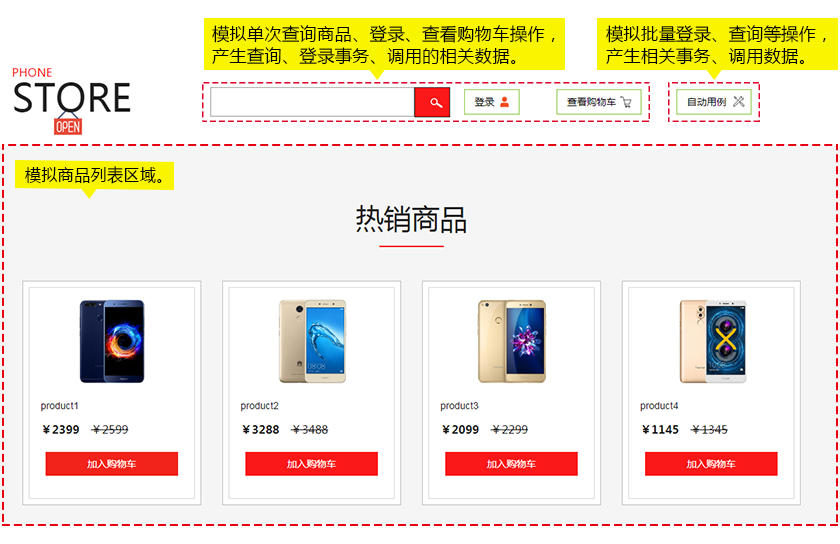

# 免费体验AOM服务

我们已经为您提供并安装好了一个示例应用，您可以进行免费体验，以便能够深入了解AOM的各功能。体验步骤如下：

1.  （可选）单击[此处](http://117.78.47.229/)访问示例应用网站（它是一个模拟的电商网站）。在网站中进行登录（帐号：apm，密码：123456）、查询、购买等操作，以生成指标、性能数据。
2.  [打开华为云登录界面](https://console.huaweicloud.com/aom/?region=cn-north-1#/aom/ams/summary)，点击“IAM用户登录”切换至IAM用户账号登录界面，使用IAM用户账号（账号名：apmdemo，用户名：apmdemo1，密码：apm1234）登录，在AOM界面中查看示例应用网站生成的指标、性能数据。登录如下图示：

    **图 1**  登录AOM  
    

## 示例应用说明

**图 2**  示例应用说明  

