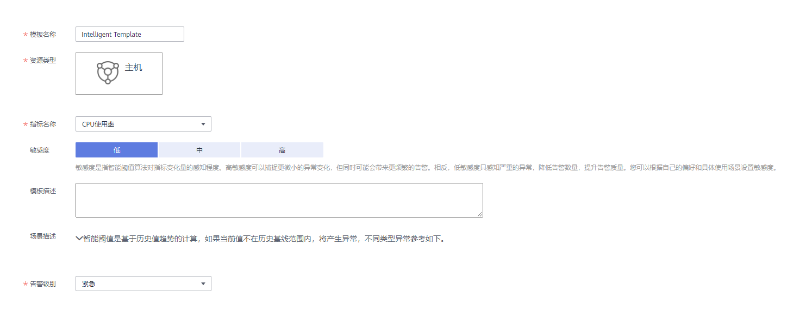

# 创建智能阈值模板

该章节功能仅对华北-北京一区域和华东-上海二区域生效。

智能阈值模板是为[创建智能阈值规则](创建智能阈值规则.md)做准备的。您最多可创建10个智能阈值模板，如果智能阈值模板数量已达上限10个时，请删除不需要的智能阈值模板后重新创建。

## 创建智能阈值模板

1.  登录[应用运维管理](https://console.huaweicloud.com/aom/#/aom/ams/summary)。
2.  在左侧导航栏中选择“智能分析 \> 智能异常检测”。
3.  选择“智能阈值模板”页签，单击“创建智能阈值模板”。
4.  设置智能阈值模板名称、资源类型、指标名称、敏感度等参数，如[图1](#fig317885972515)所示。

    高敏感度表示指标数据有很小的异常波动，则判定为异常，高敏感度可捕捉到更微小的异常变化，但同时会带来更频繁的告警，可能会产生误报。低敏感度表示容忍指标数据有异常波动，如果出现了特别大的波动，则判定为异常，低敏感度只感知严重的异常，降低了告警数量，减少了误报几率，提升了告警质量。敏感度默认为低，您可以根据自己的偏好和具体使用场景设置。

    **图 1**  设置智能阈值模板参数  
    

5.  设置通知策略，如[图3](#fig257115293402)所示。如果您不需要接收短信或邮件通知，请跳过该步骤。

    1.  在设置通知策略前您需先创建一个主题并设置主题策略，然后再为主题添加相关的订阅者。

        AOM已对接消息通知服务（Simple Message Notification，简称SMN），单击“创建主题”进入SMN界面。您首先需在SMN界面创建一个主题，并参考[图3](#fig257115293402)设置主题策略，否则会导致通知发送失败，然后再为这个主题添加相关的订阅者，即通知的接收人（短信或邮件），详细操作请分别参见《消息通知服务用户指南》的[创建主题](https://support.huaweicloud.com/usermanual-smn/zh-cn_topic_0043961401.html)、[设置主题策略](https://support.huaweicloud.com/usermanual-smn/zh-cn_topic_0043394891.html)、[订阅主题](https://support.huaweicloud.com/usermanual-smn/zh-cn_topic_0043961402.html)页面。这样在某一个资源发生异常时，AOM可以实时地将阈值规则状态变更信息以广播的方式通知这些订阅者，以便您及时获取资源运行状态等信息并采取相应措施，避免因资源问题造成业务损失。

        设置完成后，您在“选择主题”下拉列表框选择已创建的主题即可。

    2.  设置触发场景，即发送通知的触发条件。

        例如，当某一个资源的阈值状态由正常变为超限时，您需要收到通知，则触发场景可以选择超限阈值。

    **图 2**  设置主题策略  
    

    **图 3**  设置通知策略  
    

## 更多智能阈值模板操作

智能阈值模板创建完成后，您还可以执行[表1](#table15831736105910)中的操作。

**表 1**  相关操作

<table><thead align="left"><tr id="row14583153620596"><th class="cellrowborder" valign="top" width="14.000000000000002%" id="mcps1.2.3.1.1">
操作

</th>
<th class="cellrowborder" valign="top" width="86%" id="mcps1.2.3.1.2">
说明

</th>
</tr>
</thead>
<tbody><tr id="row6101517649"><td class="cellrowborder" valign="top" width="14.000000000000002%" headers="mcps1.2.3.1.1 ">
通过智能阈值模板创建一条智能阈值规则

</td>
<td class="cellrowborder" valign="top" width="86%" headers="mcps1.2.3.1.2 ">
单击“操作”列的“创建规则”。详细操作请参见<a href="创建智能阈值规则.md#section775917213398">使用模板创建智能阈值规则</a>。

</td>
</tr>
<tr id="row59859311645"><td class="cellrowborder" valign="top" width="14.000000000000002%" headers="mcps1.2.3.1.1 ">
修改智能阈值模板

</td>
<td class="cellrowborder" valign="top" width="86%" headers="mcps1.2.3.1.2 ">
单击“操作”列的“编辑”。

</td>
</tr>
<tr id="row155831436125915"><td class="cellrowborder" valign="top" width="14.000000000000002%" headers="mcps1.2.3.1.1 ">
删除智能阈值模板

</td>
<td class="cellrowborder" valign="top" width="86%" headers="mcps1.2.3.1.2 "><ul id="ul98211552932"><li>删除一个智能阈值模板：单击“操作”列的“删除”。</li><li>删除一个或多个智能阈值模板：选中一个或多个智能阈值模板前的复选框，单击页面上方的“删除”。</li></ul>
</td>
</tr>
<tr id="row1058316369591"><td class="cellrowborder" valign="top" width="14.000000000000002%" headers="mcps1.2.3.1.1 ">
搜索智能阈值模板

</td>
<td class="cellrowborder" valign="top" width="86%" headers="mcps1.2.3.1.2 ">
在右上角的搜索框中输入模板名称关键字，单击后显示匹配对象。

</td>
</tr>
</tbody>
</table>

