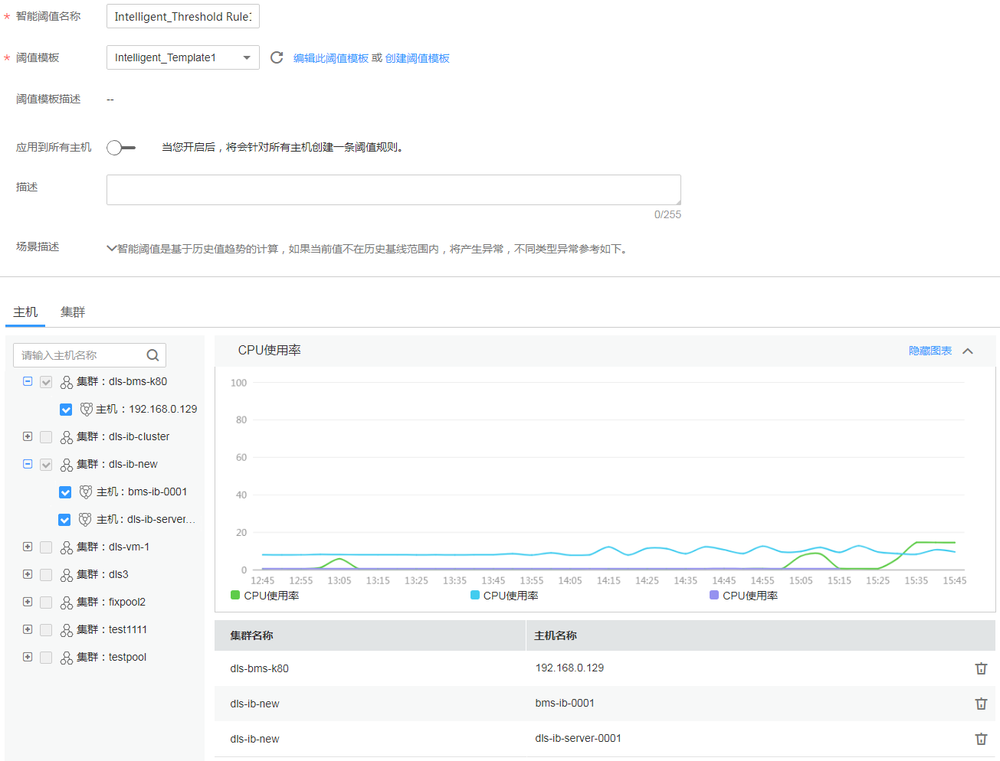

# 创建智能阈值规则

该功能仅对华北-北京一区域和华东-上海二区域生效。

智能阈值规则您不用设置阈值，阈值是以指标历史数据的趋势为基线，能够根据历史指标趋势智能检测指标潜在的异常。对于大型系统的运维，使用智能阈值规则可有效降低人工成本，同时也避免了因阈值设置不合理而不断调整阈值的重复操作，提升监控效率。

如果当前指标值不在基线范围内，则认为资源发生了异常，AOM会产生阈值告警。当智能阈值规则的状态（超限阈值、恢复正常、数据不足）变化时，支持以邮件或短信等方式通知，以便您在第一时间发现异常并进行处理。

## 注意事项

-   智能阈值规则只能使用智能阈值模板创建。创建智能阈值规则前，请先创建一个智能阈值模板，操作详见[创建智能阈值模板](创建智能阈值模板.md)。
-   您最多可创建10条智能阈值规则，如果智能阈值规则数量已达上限10条时，请删除不需要的智能阈值规则后重新创建。

## 使用模板创建智能阈值规则

1.  登录AOM控制台，在左侧导航栏中选择“告警 \> 智能异常检测”，单击右上角的“添加智能阈值”。
2.  输入规则名称，选择已创建的智能阈值模板，并设置监控的资源，如[图1](#fig5559832126)所示。
    -   若开关为开启状态：则监控的资源默认为您所有的主机。若您后续又新增了主机，您不用做任何操作，AOM会自动将新增资源添加到规则中。
    -   若开关为关闭状态：则您可自定义监控资源，选择一个或多个资源。若监控资源为同一集群下的所有主机，您可在“集群”页签以集群的维度快速选择。

        **图 1**  创建一条智能阈值规则  
        

3.  单击“添加”后，生成一条智能阈值规则，单击其前的，您可对其下的多个资源的同一指标批量监控，如[图2](#fig1819815364317)所示。

    在展开的列表中，只要某个主机满足已设的通知策略，则AOM就会发送一条邮件或短信。

    **图 2**  一条智能阈值规则  
    

## 更多智能阈值规则操作

智能阈值规则创建完成后，您还可以执行[表1](#zh-cn_topic_0169698279_table289773015816)中的操作。

**表 1**  相关操作

<table><thead align="left"><tr id="zh-cn_topic_0169698279_row1089753013810"><th class="cellrowborder" valign="top" width="20%" id="mcps1.2.3.1.1">
操作

</th>
<th class="cellrowborder" valign="top" width="80%" id="mcps1.2.3.1.2">
说明

</th>
</tr>
</thead>
<tbody><tr id="zh-cn_topic_0169698279_row889712307814"><td class="cellrowborder" valign="top" width="20%" headers="mcps1.2.3.1.1 ">
修改智能阈值规则

</td>
<td class="cellrowborder" valign="top" width="80%" headers="mcps1.2.3.1.2 ">
单击“操作”列的“修改阈值”。

</td>
</tr>
<tr id="zh-cn_topic_0169698279_row58971630183"><td class="cellrowborder" valign="top" width="20%" headers="mcps1.2.3.1.1 ">
删除智能阈值规则

</td>
<td class="cellrowborder" valign="top" width="80%" headers="mcps1.2.3.1.2 "><ul id="zh-cn_topic_0169698279_ul98211552932"><li>删除一个智能阈值规则：单击“操作”列的“删除”。</li><li>删除一个或多个智能阈值规则：选中一个或多个智能阈值规则前的复选框，单击页面上方的“删除”。</li></ul>
</td>
</tr>
<tr id="zh-cn_topic_0169698279_row158974301886"><td class="cellrowborder" valign="top" width="20%" headers="mcps1.2.3.1.1 ">
启停智能阈值规则

</td>
<td class="cellrowborder" valign="top" width="80%" headers="mcps1.2.3.1.2 ">
在“操作”列的“更多”下拉列表框中选择“启动”。

在“操作”列的“更多”下拉列表框中选择“停止”。

</td>
</tr>
<tr id="zh-cn_topic_0169698279_row31821833243"><td class="cellrowborder" valign="top" width="20%" headers="mcps1.2.3.1.1 ">
搜索智能阈值规则

</td>
<td class="cellrowborder" valign="top" width="80%" headers="mcps1.2.3.1.2 ">
在右上角的搜索框中输入智能阈值规则名称关键字，单击后显示匹配对象。

</td>
</tr>
<tr id="zh-cn_topic_0169698279_row938673611152"><td class="cellrowborder" valign="top" width="20%" headers="mcps1.2.3.1.1 ">
查看告警

</td>
<td class="cellrowborder" valign="top" width="80%" headers="mcps1.2.3.1.2 ">
在已设的连续周期内，当某个资源的指标数据满足阈值条件时，系统会发送一条阈值告警。

可在左侧导航栏中选择“告警&gt; 告警列表”，在告警列表中查看该告警。

</td>
</tr>
</tbody>
</table>

