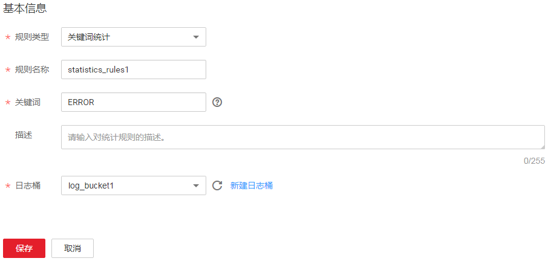
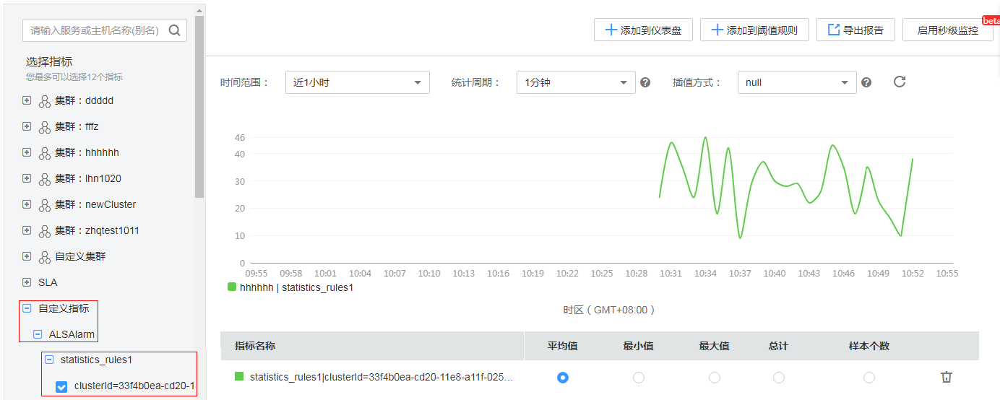

# 创建统计规则

日志包含了系统性能及业务等信息，例如，关键词ERROR的多少反应了系统的健康度，关键词BUY的多少反应了业务的成交量等，当您需要了解这些信息时，可创建统计规则。统计规则创建成功后，AOM能够针对您配置的关键词周期性地进行统计，并生成指标数据，以便您实时了解系统性能及业务等信息。

## 注意事项

统计规则是以日志桶为单位，创建统计规则前需确保至少已创建了一个日志桶，操作详见[添加日志桶](添加日志桶.md)，否则无法创建统计规则。

## 创建统计规则

1.  登录[应用运维管理](https://console.huaweicloud.com/aom/#/aom/ams/summary)。
2.  在左侧导航栏中选择“日志管理 \> 统计规则”，单击“创建统计规则”。
3.  您需先创建一个日志桶。单击“新建日志桶”进行创建，操作详见[添加日志桶](添加日志桶.md)。

    若您已创建过日志桶，请跳过该步骤。

4.  选择规则类型，设置规则名称、关键词，选择[3](#li62382120594)中创建的日志桶，单击“保存”，如下图所示。

    统计规则以日志桶为单位， AOM会周期统计关键词在日志桶的日志文件中出现的条数，并生成日志指标。

    

    统计规则创建完成后，会生成以统计规则名称命名的指标。

5.  （可选）查看指标数据。

    在左侧导航栏中选择“视图管理 \> 指标监控”，在左侧指标树中单击“自定义指标 \> ALSAlarm”，找到以统计规则名称命名的指标，然后查看指标趋势。

    

## 更多统计规则操作

创建完统计规则后，您还可以执行[表1](#table14918185010104)中的操作。

**表 1**  相关操作

<table><thead align="left"><tr id="row17920135010100"><th class="cellrowborder" valign="top" width="20%" id="mcps1.2.3.1.1">
操作

</th>
<th class="cellrowborder" valign="top" width="80%" id="mcps1.2.3.1.2">
说明

</th>
</tr>
</thead>
<tbody><tr id="row13752165816484"><td class="cellrowborder" valign="top" width="20%" headers="mcps1.2.3.1.1 ">
修改统计规则

</td>
<td class="cellrowborder" valign="top" width="80%" headers="mcps1.2.3.1.2 ">
单击“操作”列的“编辑”。

</td>
</tr>
<tr id="row79230504106"><td class="cellrowborder" valign="top" width="20%" headers="mcps1.2.3.1.1 ">
删除统计规则

</td>
<td class="cellrowborder" valign="top" width="80%" headers="mcps1.2.3.1.2 "><ul id="ul813142518315"><li>删除一个统计规则：单击“操作”列的“删除”。</li><li>删除一个或多个统计规则：选中一个或多个统计规则前的复选框，单击页面上方的“删除”。</li></ul>

 说明： 

删除统计规则后，您的日志桶、日志文件均不会被删除。

</td>
</tr>
</tbody>
</table>

