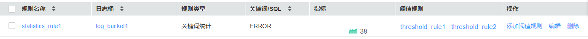
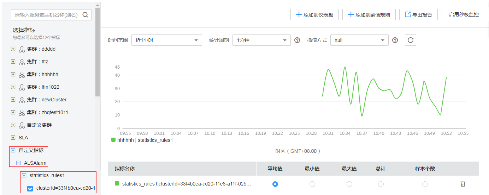

# 创建统计规则

日志包含了系统性能及业务等信息，例如，关键词ERROR的多少反应了系统的健康度，关键词BUY的多少反应了业务的成交量等，当您需要了解这些信息时，可创建统计规则。统计规则创建成功后，AOM能够针对您配置的关键词周期性地进行统计，并生成指标数据，以便您实时了解系统性能及业务等信息。

目前对于华北-北京一、华东-上海二和华南-广州区域，统计规则支持关键词统计和SQL统计。两者的区别在于统计对象不同。关键词统计的对象为原始日志；SQL统计的对象为结构化后的日志，且只有返回单个数值的SQL语句才能创建统计规则，例如select count\(\*\) where code \>= 500语句可创建统计规则，select count\(\*\) group by ip语句则不能创建统计规则。

## 注意事项

统计规则是以日志桶为单位，创建统计规则前需确保至少已创建了一个日志桶，操作详见[添加日志桶](添加日志桶.md)，否则无法创建统计规则。

## 创建统计规则

下面以关键词统计为例，创建统计规则：

1.  登录[应用运维管理](https://console.huaweicloud.com/aom/#/aom/ams/summary)。
2.  在左侧导航栏中选择“日志管理 \> 统计规则”，单击“创建统计规则”。
3.  您需先创建一个日志桶。单击“新建日志桶”进行创建，操作详见[添加日志桶](添加日志桶.md)。

    若您已创建过日志桶，请跳过该步骤。

4.  选择规则类型，设置规则名称、关键词，选择[3](#li62382120594)中创建的日志桶，单击“确认”，如下图所示。

    统计规则以日志桶为单位， AOM会周期统计关键词在日志桶的日志文件中出现的条数，并生成日志指标。

    **图 1**  创建统计规则  
    

    统计规则创建完成后，会生成以统计规则名称命名的指标。

5.  （可选）查看指标数据。
    -   方式一：在“统计规则”界面查看指标数据，如[图2](#fig589702618471)所示。

        “指标”列的缩略图展示了最近1小时内（统计周期为1分钟）指标的趋势，其后的数字为缩略图上最后一个非空的指标值。

        当需要查看更详细的指标数据时，可双击缩略图以对其进行放大。放大后，可在界面上方设置时间范围和统计周期，查看不同时间范围和统计周期下的指标数据。还可在界面上方单击“添加阈值规则”，对该指标添加阈值规则，当满足阈值条件时产生阈值告警，以便您能在第一时间发现异常并进行处理。

        **图 2**  方式一  
        

    -   方式二：在“指标监控”界面查看指标数据，如[图3](#fig338194210319)所示。

        在左侧导航栏中选择“视图管理 \> 指标监控”，在左侧指标树中单击“自定义指标 \> ALSAlarm”，找到以统计规则名称命名的指标，然后查看指标趋势。

        在“指标监控”界面右上方您还可对该指标执行添加到仪表盘、添加阈值规则、导出监控报告等操作。

        **图 3**  方式二  
        

## 更多统计规则操作

创建完统计规则后，您还可以执行[更多统计规则操作](#section267162514458)中的操作。

**表 1**  相关操作

<table><thead align="left"><tr id="row186791825114517"><th class="cellrowborder" valign="top" width="20%" id="mcps1.2.3.1.1">
操作

</th>
<th class="cellrowborder" valign="top" width="80%" id="mcps1.2.3.1.2">
说明

</th>
</tr>
</thead>
<tbody><tr id="row468352564512"><td class="cellrowborder" valign="top" width="20%" headers="mcps1.2.3.1.1 ">
查看统计规则

</td>
<td class="cellrowborder" valign="top" width="80%" headers="mcps1.2.3.1.2 ">
在“规则名称”列单击统计规则名称，查看统计规则的详细信息。

</td>
</tr>
<tr id="row181351748114317"><td class="cellrowborder" valign="top" width="20%" headers="mcps1.2.3.1.1 ">
查看阈值规则

</td>
<td class="cellrowborder" valign="top" width="80%" headers="mcps1.2.3.1.2 ">
“阈值规则”列展示了该统计规则生成的指标关联的所有阈值规则，多个阈值规则间使用空格分割。

单击阈值规则名称，跳转到阈值规则界面，可查看该阈值规则的详细信息。

</td>
</tr>
<tr id="row71371948184312"><td class="cellrowborder" valign="top" width="20%" headers="mcps1.2.3.1.1 ">
添加阈值规则

</td>
<td class="cellrowborder" valign="top" width="80%" headers="mcps1.2.3.1.2 ">
单击“操作”列的“添加阈值规则”，对统计规则生成的指标添加阈值规则，当满足阈值条件时产生阈值告警，以便能在第一时间发现异常并进行处理。

</td>
</tr>
<tr id="row469072518454"><td class="cellrowborder" valign="top" width="20%" headers="mcps1.2.3.1.1 ">
修改统计规则

</td>
<td class="cellrowborder" valign="top" width="80%" headers="mcps1.2.3.1.2 ">
单击“操作”列的“编辑”。

</td>
</tr>
<tr id="row369362517451"><td class="cellrowborder" valign="top" width="20%" headers="mcps1.2.3.1.1 ">
删除统计规则

</td>
<td class="cellrowborder" valign="top" width="80%" headers="mcps1.2.3.1.2 "><ul id="ul1969462518455"><li>删除一个统计规则：单击“操作”列的“删除”。</li><li>删除一个或多个统计规则：选中一个或多个统计规则前的复选框，单击页面上方的“删除”。</li></ul>

 说明： 

删除统计规则后，您的日志桶、日志文件均不会被删除。

</td>
</tr>
</tbody>
</table>

