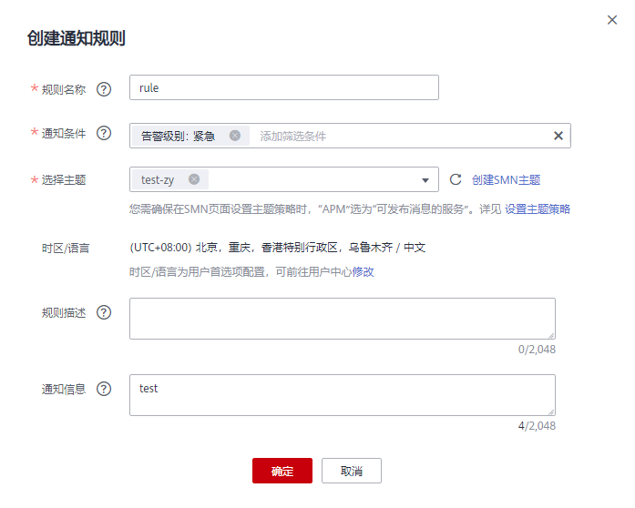
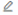

# 创建通知规则

AOM提供了告警通知功能，您可通过创建通知规则进行详细配置，当AOM自身或外部服务存在异常或可能存在异常而产生告警时，可利用此功能将告警信息通过邮件或短信发送给您指定的人员，以便提醒相关人员及时采取措施清除故障，避免造成业务损失。

如果您未创建任何通知规则，则无法收到告警通知。只能登录AOM控制台，在左侧导航栏中选择“告警\> 告警列表”，在告警页面查看。

## 创建通知规则

通知规则创建成功后，当符合通知规则时发送短信或邮件。

1.  登录AOM控制台，在左侧导航栏中选择“告警\> 通知规则”，单击右上角的“创建通知规则”。
2.  AOM已对接SMN，单击“创建主题”，在SMN界面设置通知策略。如果均已设置，请跳过该步骤。
    1.  创建一个主题，操作详见[创建主题](https://support.huaweicloud.com/usermanual-smn/zh-cn_topic_0043961401.html)。

        例如，创建名称为Topic1的主题。

    2.  设置主题策略，操作详见[设置主题策略](https://support.huaweicloud.com/usermanual-smn/zh-cn_topic_0043394891.html)。

        设置主题策略时，“可发布消息的服务”必须选择“APM”，否则会导致通知发送失败

    3.  为主题添加相关的订阅者，即通知的接收人（例如，邮件或短信），SMN可以实时地将告警信息以广播的方式通知这些订阅者，操作详见[订阅主题](https://support.huaweicloud.com/usermanual-smn/zh-cn_topic_0043961402.html)。

        例如，订阅者设置为该运维人员的邮箱。

3.  创建通知规则：输入规则名称，选择通知条件，选择[2](#zh-cn_topic_0169698264_li698019238343)中已创建的主题，根据实际选择时区/语言，输入通知消息后，单击“确定”。如[图1](#fig962916381994)所示。

    **图 1**  创建通知规则  
    

    通知规则创建成功后，满足通知规则时，该运维人员均会收到相关的邮件或短信通知信息。

## 更多通知规则操作

通知规则创建完成后，您还可以执行[表1](#zh-cn_topic_0169698264_table14918185010104)中的操作。

**表 1**  相关操作

<table><thead align="left"><tr id="zh-cn_topic_0169698264_row17920135010100"><th class="cellrowborder" valign="top" width="20%" id="mcps1.2.3.1.1">
操作

</th>
<th class="cellrowborder" valign="top" width="80%" id="mcps1.2.3.1.2">
说明

</th>
</tr>
</thead>
<tbody><tr id="zh-cn_topic_0169698264_row4922150191019"><td class="cellrowborder" valign="top" width="20%" headers="mcps1.2.3.1.1 ">
修改通知规则

</td>
<td class="cellrowborder" valign="top" width="80%" headers="mcps1.2.3.1.2 ">
单击“操作”列的。

</td>
</tr>
<tr id="row1214442917388"><td class="cellrowborder" valign="top" width="20%" headers="mcps1.2.3.1.1 ">
开启/关闭通知规则

</td>
<td class="cellrowborder" valign="top" width="80%" headers="mcps1.2.3.1.2 ">
单击“操作”列的“开启”/“关闭”。

</td>
</tr>
<tr id="zh-cn_topic_0169698264_row13752165816484"><td class="cellrowborder" valign="top" width="20%" headers="mcps1.2.3.1.1 ">
删除通知规则

</td>
<td class="cellrowborder" valign="top" width="80%" headers="mcps1.2.3.1.2 "><ul id="zh-cn_topic_0169698264_ul98211552932"><li>删除一个通知规则：单击“操作”列的。</li><li>删除一个或多个通知规则：选中一个或多个通知规则前的复选框，单击页面上方的“删除”。</li></ul>
</td>
</tr>
<tr id="zh-cn_topic_0169698264_row79230504106"><td class="cellrowborder" valign="top" width="20%" headers="mcps1.2.3.1.1 ">
搜索通知规则

</td>
<td class="cellrowborder" valign="top" width="80%" headers="mcps1.2.3.1.2 ">
在右上角的搜索框中输入通知规则名称关键字，单击后显示匹配对象。

</td>
</tr>
</tbody>
</table>

