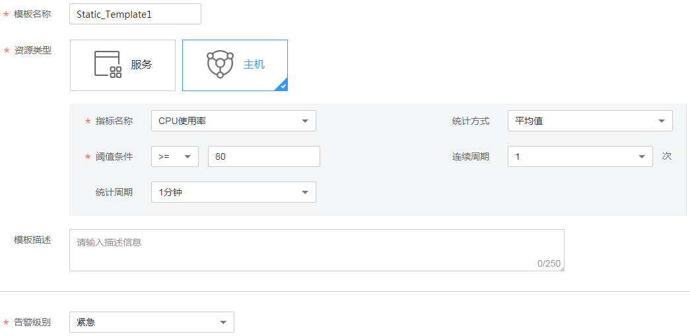

# 创建静态阈值模板

该章节功能仅对华北区域生效。

静态阈值模板是为[创建批量静态阈值规则](创建静态阈值规则.md#section775917213398)做准备的。您最多可创建50个静态阈值模板，如果静态阈值模板数量已达上限50个时，请删除不需要的静态阈值模板后重新创建。

AOM针对主机和服务的关键指标预置了默认静态阈值模板，供您选择使用，为您减少了大量的模板配置操作，您可[一键创建默认静态阈值模板](#section27837230431)。如果默认静态阈值模板不能满足您的需求时，您还可[自定义静态阈值模板](#section938319277517)。

## 一键创建默认静态阈值模板

1.  登录[应用运维管理](https://console.huaweicloud.com/aom/#/aom/ams/summary)。
2.  在左侧导航栏中选择“告警中心 \> 阈值规则”，单击“一键创建默认阈值”后，AOM会自动生成如[表1](#table1815074594315)所示的6个静态阈值模板。

    您可选择“静态阈值模板”页签，在静态阈值模板列表中进行查看，如[图1](#fig17875131012545)所示。

    **图 1**  默认静态阈值模板  
    

    **表 1**  默认静态阈值模板

    
    <table><thead align="left"><tr id="row115013459435"><th class="cellrowborder" valign="top" width="30%" id="mcps1.2.5.1.1">
默认静态阈值模板名称

    </th>
    <th class="cellrowborder" valign="top" width="20%" id="mcps1.2.5.1.2">
资源

    </th>
    <th class="cellrowborder" valign="top" width="20%" id="mcps1.2.5.1.3">
指标

    </th>
    <th class="cellrowborder" valign="top" width="30%" id="mcps1.2.5.1.4">
默认设置

    </th>
    </tr>
    </thead>
    <tbody><tr id="row8442434122011"><td class="cellrowborder" valign="top" width="30%" headers="mcps1.2.5.1.1 ">
[node: default-static-template] CPU Usage

    </td>
    <td class="cellrowborder" rowspan="3" valign="top" width="20%" headers="mcps1.2.5.1.2 ">
主机

    </td>
    <td class="cellrowborder" valign="top" width="20%" headers="mcps1.2.5.1.3 ">
CPU使用率

    </td>
    <td class="cellrowborder" rowspan="2" valign="top" width="30%" headers="mcps1.2.5.1.4 ">
统计方式：平均值；阈值条件：&gt;90%；连续周期：3次；统计周期：1分钟；告警级别：重要；发送通知：否

    </td>
    </tr>
    <tr id="row2150174544316"><td class="cellrowborder" valign="top" headers="mcps1.2.5.1.1 ">
[node: default-static-template] Physical Memory Usage

    </td>
    <td class="cellrowborder" valign="top" headers="mcps1.2.5.1.2 ">
物理内存使用率

    </td>
    </tr>
    <tr id="row1606202782512"><td class="cellrowborder" valign="top" headers="mcps1.2.5.1.1 ">
[node: default-static-template] Node Status

    </td>
    <td class="cellrowborder" valign="top" headers="mcps1.2.5.1.2 ">
主机状态

    </td>
    <td class="cellrowborder" valign="top" headers="mcps1.2.5.1.3 ">
统计方式：平均值；阈值条件：&gt;0；连续周期：1次；统计周期：1分钟；告警级别：重要；发送通知：否

    </td>
    </tr>
    <tr id="row17359595176"><td class="cellrowborder" valign="top" width="30%" headers="mcps1.2.5.1.1 ">
[service: default-static-template] CPU Usage

    </td>
    <td class="cellrowborder" rowspan="3" valign="top" width="20%" headers="mcps1.2.5.1.2 ">
服务

    </td>
    <td class="cellrowborder" valign="top" width="20%" headers="mcps1.2.5.1.3 ">
CPU使用率

    </td>
    <td class="cellrowborder" rowspan="2" valign="top" width="30%" headers="mcps1.2.5.1.4 ">
统计方式：平均值；阈值条件：&gt;90%；连续周期：3次；统计周期：1分钟；告警级别：重要；发送通知：否

    </td>
    </tr>
    <tr id="row106599521810"><td class="cellrowborder" valign="top" headers="mcps1.2.5.1.1 ">
[service: default-static-template] Physical Memory Usage

    </td>
    <td class="cellrowborder" valign="top" headers="mcps1.2.5.1.2 ">
物理内存使用率

    </td>
    </tr>
    <tr id="row57917381811"><td class="cellrowborder" valign="top" headers="mcps1.2.5.1.1 ">
[service: default-static-template] Status

    </td>
    <td class="cellrowborder" valign="top" headers="mcps1.2.5.1.2 ">
服务状态

    </td>
    <td class="cellrowborder" valign="top" headers="mcps1.2.5.1.3 ">
统计方式：平均值；阈值条件：&gt;0；连续周期：1次；统计周期：1分钟；告警级别：重要；发送通知：否

    </td>
    </tr>
    </tbody>
    </table>

    > **说明：**   
    >默认静态阈值模板支持删除和修改操作。如果您创建了默认静态阈值模板后又删除了，您可再次单击“一键创建默认阈值”重新创建。  

## 自定义静态阈值模板

1.  登录[应用运维管理](https://console.huaweicloud.com/aom/#/aom/ams/summary)。
2.  在左侧导航栏中选择“告警中心 \> 阈值规则”，选择“静态阈值模板”页签，单击“创建静态阈值模板”。
3.  设置静态阈值模板名称、资源类型、指标名称、统计方式、阈值条件等参数，如下图所示。

    

4.  设置通知策略，如[图3](#fig257115293402)所示。如果您不需要接收短信或邮件通知，请跳过该步骤。

    1.  在设置通知策略前您需先创建一个主题并设置主题策略，然后再为主题添加相关的订阅者。

        AOM已对接消息通知服务（Simple Message Notification，简称SMN），单击“创建主题”进入SMN界面。您首先需在SMN界面创建一个主题，并参考[图2](#fig1496810115426)设置主题策略，否则会导致通知发送失败，然后再为这个主题添加相关的订阅者，即通知的接收人（短信或邮件），详细操作请分别参见《消息通知服务用户指南》的[创建主题](https://support.huaweicloud.com/usermanual-smn/zh-cn_topic_0043961401.html)、[设置主题策略](https://support.huaweicloud.com/usermanual-smn/zh-cn_topic_0043394891.html)、[订阅主题](https://support.huaweicloud.com/usermanual-smn/zh-cn_topic_0043961402.html)页面。这样在某一个资源发生异常时，AOM可以实时地将阈值规则状态变更信息以广播的方式通知这些订阅者，以便您及时获取资源运行状态等信息并采取相应措施，避免因资源问题造成业务损失。

        设置完成后，您在“选择主题”下拉列表框选择已创建的主题即可。

    2.  设置触发场景，即发送通知的触发条件。

        例如，当某一个资源的阈值状态由正常变为超限时，您需要收到通知，则触发场景可以选择超限阈值。

    **图 2**  设置主题策略-1  
    

    **图 3**  设置通知策略-1  
    

## 更多静态阈值模板操作

静态阈值模板创建完成后，您还可以执行[表2](#table15831736105910)中的操作。

**表 2**  相关操作

<table><thead align="left"><tr id="row14583153620596"><th class="cellrowborder" valign="top" width="14.000000000000002%" id="mcps1.2.3.1.1">
操作

</th>
<th class="cellrowborder" valign="top" width="86%" id="mcps1.2.3.1.2">
说明

</th>
</tr>
</thead>
<tbody><tr id="row37401435356"><td class="cellrowborder" valign="top" width="14.000000000000002%" headers="mcps1.2.3.1.1 ">
使用静态阈值模板创建一条批量静态阈值规则

</td>
<td class="cellrowborder" valign="top" width="86%" headers="mcps1.2.3.1.2 ">
单击“操作”列的“创建规则”。详细操作请参见<a href="创建静态阈值规则.md#section775917213398">使用模板创建批量静态阈值规则</a>。

</td>
</tr>
<tr id="row155831436125915"><td class="cellrowborder" valign="top" width="14.000000000000002%" headers="mcps1.2.3.1.1 ">
修改静态阈值模板

</td>
<td class="cellrowborder" valign="top" width="86%" headers="mcps1.2.3.1.2 ">
单击“操作”列的“编辑”。

</td>
</tr>
<tr id="row1058316369591"><td class="cellrowborder" valign="top" width="14.000000000000002%" headers="mcps1.2.3.1.1 ">
删除静态阈值模板

</td>
<td class="cellrowborder" valign="top" width="86%" headers="mcps1.2.3.1.2 "><ul id="ul98211552932"><li>删除一个静态阈值模板：单击“操作”列的“删除”。</li><li>删除一个或多个静态阈值模板：选中一个或多个静态阈值模板前的复选框，单击页面上方的“删除”。</li></ul>
</td>
</tr>
<tr id="row185831236125917"><td class="cellrowborder" valign="top" width="14.000000000000002%" headers="mcps1.2.3.1.1 ">
搜索静态阈值模板

</td>
<td class="cellrowborder" valign="top" width="86%" headers="mcps1.2.3.1.2 ">
在右上角的搜索框中输入模板名称关键字，单击后显示匹配对象。

</td>
</tr>
</tbody>
</table>

