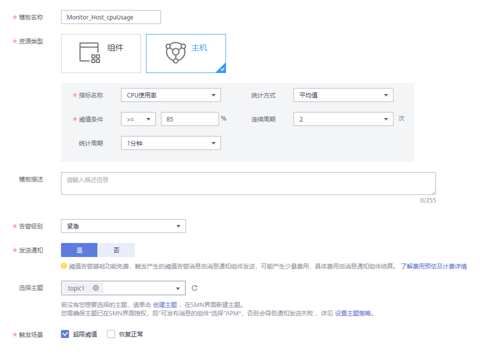

# 创建静态阈值模板

该功能仅对华北-北京一区域和华东-上海二区域生效。

静态阈值模板是为创建批量静态阈值规则做准备的，创建批量静态阈值规则操作详见[使用模板创建静态阈值规则](创建静态阈值规则.md#section215851225919)。

## 注意事项

-   最多可创建50个静态阈值模板，如果静态阈值模板数量已达上限50个时，请删除不需要的静态阈值模板后重新创建。
-   设置通知策略

    静态阈值规则的状态（正常、超限阈值、数据不足）发生变化时，如需使用邮件或短信等方式发送通知，请参考下面操作在SMN界面设置通知策略。如不需接收邮件或短信通知，请跳过下面操作。具体操作如下：

    1.  创建一个主题，操作详见[创建主题](https://support.huaweicloud.com/usermanual-smn/zh-cn_topic_0043961401.html)。
    2.  设置主题策略，操作详见[设置主题策略](https://support.huaweicloud.com/usermanual-smn/zh-cn_topic_0043394891.html)。

        设置主题策略时，“可发布消息的服务”必须选择“APM”，否则会导致通知发送失败。

    3.  为主题添加相关的订阅者，即通知的接收人（例如：邮件或短信），操作详见[订阅主题](https://support.huaweicloud.com/usermanual-smn/zh-cn_topic_0043961402.html)。

## 创建方式

-   一键创建默认静态阈值模板：AOM针对所有主机和所有服务的关键指标（包括CPU使用率指标、物理内存使用率指标、主机状态指标、服务状态指标）预置了默认静态阈值模板，供您选择使用，为您减少了大量的模板配置操作，操作详见[一键创建默认静态阈值模板](#section184435517495)。
-   自定义静态阈值模板：如果默认静态阈值模板不能满足您的需求，还可自定义静态阈值模板，操作详见[自定义静态阈值模板](#section938319277517)。

## 一键创建默认静态阈值模板

1.  登录[应用运维管理](https://console.huaweicloud.com/aom/#/aom/ams/summary)。
2.  在左侧导航栏中选择“告警中心 \> 阈值规则”，在“规则列表”页签单击“一键创建默认阈值”后，AOM会自动创建6个静态阈值模板（可单击“静态阈值模板”页签，在列表中进行查看，如[图1](#fig17875131012545)所示），于此同时AOM也会使用这6个模板分别创建6个默认的批量静态阈值规则（详见[一键创建默认批量静态阈值规则](创建静态阈值规则.md#section18998593164)）。

    **图 1**  默认静态阈值模板  
    

    **表 1**  默认静态阈值模板说明

    
    <table><thead align="left"><tr id="row115013459435"><th class="cellrowborder" valign="top" width="40%" id="mcps1.2.5.1.1">
默认静态阈值模板名称/其默认批量静态阈值规则名称

    </th>
    <th class="cellrowborder" valign="top" width="15%" id="mcps1.2.5.1.2">
资源

    </th>
    <th class="cellrowborder" valign="top" width="15%" id="mcps1.2.5.1.3">
指标

    </th>
    <th class="cellrowborder" valign="top" width="30%" id="mcps1.2.5.1.4">
默认设置

    </th>
    </tr>
    </thead>
    <tbody><tr id="row8442434122011"><td class="cellrowborder" valign="top" width="40%" headers="mcps1.2.5.1.1 "><ul id="ul38196241204"><li>模板：[node: default-static-template] CPU Usag</li><li>规则：[node: default-static-rule] CPU Usage</li></ul>
    </td>
    <td class="cellrowborder" rowspan="3" valign="top" width="15%" headers="mcps1.2.5.1.2 ">
主机

    </td>
    <td class="cellrowborder" valign="top" width="15%" headers="mcps1.2.5.1.3 ">
CPU使用率

    </td>
    <td class="cellrowborder" rowspan="2" valign="top" width="30%" headers="mcps1.2.5.1.4 ">
统计方式：平均值；阈值条件：&gt;90%；连续周期：3次；统计周期：1分钟；告警级别：重要；发送通知：否

    </td>
    </tr>
    <tr id="row2150174544316"><td class="cellrowborder" valign="top" headers="mcps1.2.5.1.1 "><ul id="ul34121161219"><li>模板：[node: default-static-template] Physical Memory Usage</li><li>规则：[node: default-static-rule] Physical Memory Usage</li></ul>
    </td>
    <td class="cellrowborder" valign="top" headers="mcps1.2.5.1.2 ">
物理内存使用率

    </td>
    </tr>
    <tr id="row1606202782512"><td class="cellrowborder" valign="top" headers="mcps1.2.5.1.1 "><ul id="ul10892207119"><li>模板：[node: default-static-template] Node Status</li><li>规则：[node: default-static-rule] Node Status</li></ul>
    </td>
    <td class="cellrowborder" valign="top" headers="mcps1.2.5.1.2 ">
主机状态

    </td>
    <td class="cellrowborder" valign="top" headers="mcps1.2.5.1.3 ">
统计方式：平均值；阈值条件：&gt;0；连续周期：1次；统计周期：1分钟；告警级别：重要；发送通知：否

    </td>
    </tr>
    <tr id="row17359595176"><td class="cellrowborder" valign="top" width="40%" headers="mcps1.2.5.1.1 "><ul id="ul39738222012"><li>模板：[service: default-static-template] CPU Usage</li><li>规则：[service: default-static-rule] CPU Usage</li></ul>
    </td>
    <td class="cellrowborder" rowspan="3" valign="top" width="15%" headers="mcps1.2.5.1.2 ">
服务

    </td>
    <td class="cellrowborder" valign="top" width="15%" headers="mcps1.2.5.1.3 ">
CPU使用率

    </td>
    <td class="cellrowborder" rowspan="2" valign="top" width="30%" headers="mcps1.2.5.1.4 ">
统计方式：平均值；阈值条件：&gt;90%；连续周期：3次；统计周期：1分钟；告警级别：重要；发送通知：否

    </td>
    </tr>
    <tr id="row106599521810"><td class="cellrowborder" valign="top" headers="mcps1.2.5.1.1 "><ul id="ul12261162614120"><li>模板：[service: default-static-template] Physical Memory Usage</li><li>规则：[service: default-static-rule] Physical Memory Usage</li></ul>
    </td>
    <td class="cellrowborder" valign="top" headers="mcps1.2.5.1.2 ">
物理内存使用率

    </td>
    </tr>
    <tr id="row57917381811"><td class="cellrowborder" valign="top" headers="mcps1.2.5.1.1 "><ul id="ul746222911116"><li>模板：[service: default-static-template] Status</li><li>规则：[service: default-static-rule] Status</li></ul>
    </td>
    <td class="cellrowborder" valign="top" headers="mcps1.2.5.1.2 ">
服务状态

    </td>
    <td class="cellrowborder" valign="top" headers="mcps1.2.5.1.3 ">
统计方式：平均值；阈值条件：&gt;0；连续周期：1次；统计周期：1分钟；告警级别：重要；发送通知：否

    </td>
    </tr>
    </tbody>
    </table>

    > **说明：**   
    >默认静态阈值模板支持删除和修改操作。如果您创建了默认静态阈值模板后又删除了，可再次单击“一键创建默认阈值”重新创建。  

## 自定义静态阈值模板

1.  登录[应用运维管理](https://console.huaweicloud.com/aom/#/aom/ams/summary)。
2.  在左侧导航栏中选择“告警中心 \> 阈值规则”，单击“静态阈值模板”页签，单击“创建静态阈值模板”。
3.  自定义静态阈值模板。

    输入模板名称，选择资源类型，设置指标名称、统计方式、阈值条件等参数，选择告警级别，选择是否发送通知。

    > **说明：**   
    >-   统计方式：指标数据按照所设置的统计方式进行聚合。  
    >-   阈值条件：阈值告警的触发条件，由判断条件（\>=、<=、\>、<）和阈值组成。例如，阈值条件设置为“\>85”，表示指标的实际值大于已设置的阈值85时，生成阈值告警。  
    >-   连续周期：连续多少个周期满足阈值条件后，发送阈值告警。  
    >-   统计周期：指标数据按照所设置的统计周期进行聚合。  
    >-   选择是否发送通知：当静态阈值规则的状态（正常、超限阈值、数据不足）发生变化时，选择是否发送邮件或短信通知该变动。  
    >    -   如需使用邮件或短信方式发送通知，请选择“是”，则需[设置通知策略](#li7359182111811)，选择已创建的主题，选择触发场景。  
    >    -   如不需接收邮件或短信通知，请选择“否”。  
    >-   触发场景：发送通知的触发条件。触发场景您可选择多个。例如，当阈值状态变为超限阈值时，您需要收到通知，则触发场景选择超限阈值。  

    **图 2**  自定义静态阈值模板  
    

4.  单击“创建”。

## 更多静态阈值模板操作

静态阈值模板创建完成后，您还可以执行[表2](#table15831736105910)中的操作。

**表 2**  相关操作

<table><thead align="left"><tr id="row14583153620596"><th class="cellrowborder" valign="top" width="20%" id="mcps1.2.3.1.1">
操作

</th>
<th class="cellrowborder" valign="top" width="80%" id="mcps1.2.3.1.2">
说明

</th>
</tr>
</thead>
<tbody><tr id="row37401435356"><td class="cellrowborder" valign="top" width="20%" headers="mcps1.2.3.1.1 ">
使用静态阈值模板创建一条批量静态阈值规则

</td>
<td class="cellrowborder" valign="top" width="80%" headers="mcps1.2.3.1.2 ">
单击“操作”列的“创建规则”，操作详见<a href="创建静态阈值规则.md#section215851225919">使用模板创建静态阈值规则</a>。

</td>
</tr>
<tr id="row155831436125915"><td class="cellrowborder" valign="top" width="20%" headers="mcps1.2.3.1.1 ">
修改静态阈值模板

</td>
<td class="cellrowborder" valign="top" width="80%" headers="mcps1.2.3.1.2 ">
单击“操作”列的“编辑”。

</td>
</tr>
<tr id="row1058316369591"><td class="cellrowborder" valign="top" width="20%" headers="mcps1.2.3.1.1 ">
删除静态阈值模板

</td>
<td class="cellrowborder" valign="top" width="80%" headers="mcps1.2.3.1.2 "><ul id="ul98211552932"><li>删除一个静态阈值模板：单击“操作”列的“删除”。</li><li>删除一个或多个静态阈值模板：选中一个或多个静态阈值模板前的复选框，单击页面上方的“删除”。</li></ul>
</td>
</tr>
<tr id="row185831236125917"><td class="cellrowborder" valign="top" width="20%" headers="mcps1.2.3.1.1 ">
搜索静态阈值模板

</td>
<td class="cellrowborder" valign="top" width="80%" headers="mcps1.2.3.1.2 ">
在右上角的搜索框中输入模板名称关键字，单击后显示匹配对象。

</td>
</tr>
</tbody>
</table>

