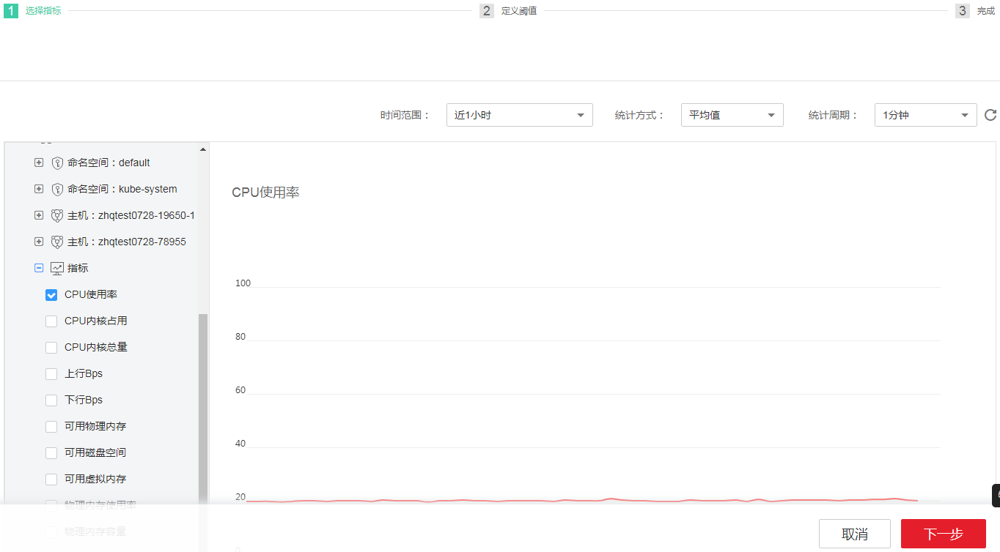
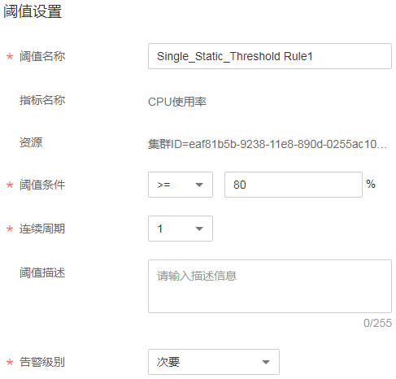
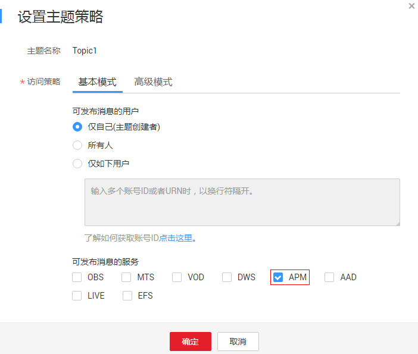
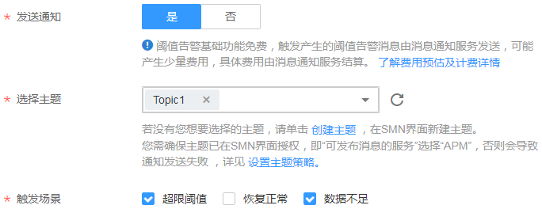
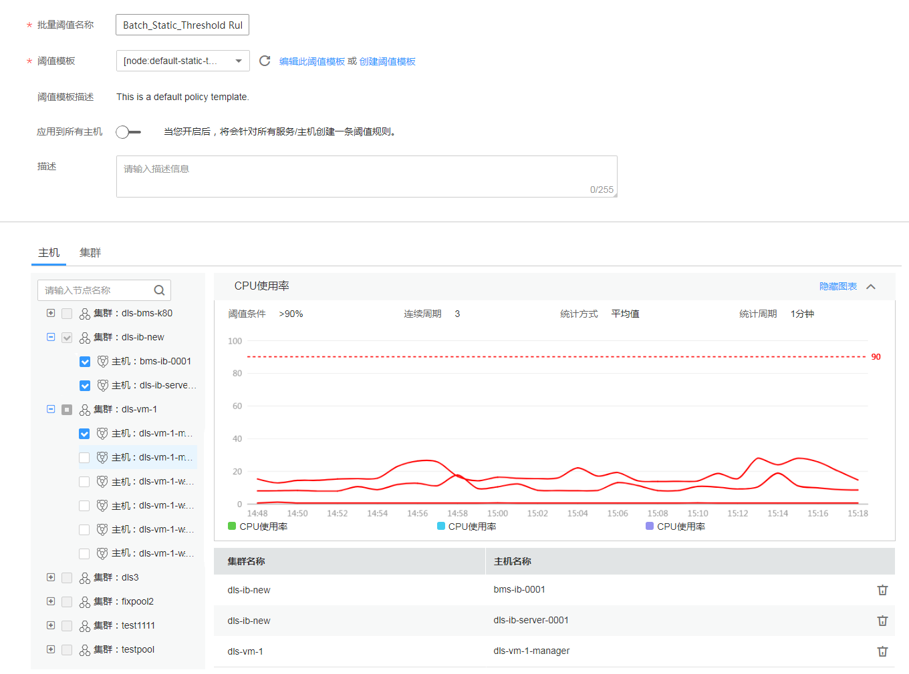
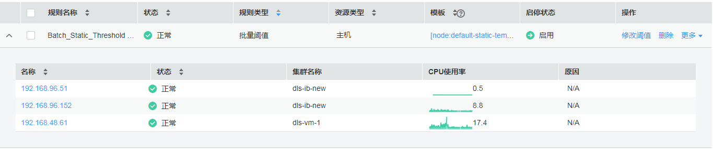

# 创建静态阈值规则

静态阈值规则您需要自定义阈值条件，当指标数据满足阈值条件时，AOM会产生阈值告警；当没有指标数据上报时，AOM会产生数据不足事件。当静态阈值规则的状态（超限阈值、恢复正常、数据不足）变化时，支持以邮件或短信等方式通知，以便您在第一时间发现异常并进行处理。

AOM提供了多种创建静态阈值规则的方式。您既可对某个资源[创建单条静态阈值规则](#section727418178353)，也可使用静态阈值模板为多个资源[创建批量静态阈值规则](#section775917213398)（该功能仅对华北区域生效）。对于批量静态阈值规则，AOM对主机和服务的关键指标预置了[默认批量静态阈值规则](#section18998593164)（该功能仅对华北区域生效），供您选择使用。

您最多可创建50个静态阈值规则，如果静态阈值规则数量已达上限50个时，请删除不需要的静态阈值规则后重新创建。

## 创建单条静态阈值规则

通过创建单条静态阈值规则，您可以对某一个资源的某一个指标进行监控。

1.  登录[应用运维管理](https://console.huaweicloud.com/aom/#/aom/ams/summary)。
2.  在左侧导航栏中选择“告警中心 \> 阈值规则”，单击“添加单条阈值”。

    非华北区域请单击“添加阈值”。

3.  在左侧指标树上选择一个待监控的资源及其指标，并参考[表1](#d0e4104)设置指标的参数信息后，单击“下一步”，如下图所示。

    **图 1**  设置指标基本信息  
    

    **表 1**  指标参数说明

    
    <table><thead align="left"><tr id="row2690320"><th class="cellrowborder" valign="top" width="20%" id="mcps1.2.3.1.1">
参数

    </th>
    <th class="cellrowborder" valign="top" width="80%" id="mcps1.2.3.1.2">
说明

    </th>
    </tr>
    </thead>
    <tbody><tr id="row59636639"><td class="cellrowborder" valign="top" width="20%" headers="mcps1.2.3.1.1 ">
时间范围

    </td>
    <td class="cellrowborder" valign="top" width="80%" headers="mcps1.2.3.1.2 ">
需要监控的指标数据的时间范围。

    </td>
    </tr>
    <tr id="row53301097"><td class="cellrowborder" valign="top" width="20%" headers="mcps1.2.3.1.1 ">
统计周期

    </td>
    <td class="cellrowborder" valign="top" width="80%" headers="mcps1.2.3.1.2 ">
指标数据按照所设置的统计周期进行聚合。

    </td>
    </tr>
    <tr id="row5722793"><td class="cellrowborder" valign="top" width="20%" headers="mcps1.2.3.1.1 ">
统计方式

    </td>
    <td class="cellrowborder" valign="top" width="80%" headers="mcps1.2.3.1.2 ">
指标数据按照所设置的统计方式进行聚合。

    </td>
    </tr>
    </tbody>
    </table>

4.  设置静态阈值规则名称、阈值条件、连续周期、告警级别等基本参数，如[图2](#fig8247147368)所示。

    **图 2**  设置单条阈值规则参数  
    

    > **说明：**   
    >-   阈值条件：阈值告警的触发条件，由判断条件（\>=、<=、\>、<）和阈值组成。例如，阈值条件设置为“\>=80”，表示指标的实际值大于已设置的阈值80时，系统将产生阈值告警。  
    >-   连续周期：连续多少个周期满足阈值条件后，发送阈值告警。  

5.  设置通知策略，如[图4](#fig257115293402)所示。如果您不需要接收短信或邮件通知，请跳过该步骤。

    1.  在设置通知策略前您需先创建一个主题并设置主题策略，然后再为主题添加相关的订阅者。

        AOM已对接消息通知服务（Simple Message Notification，简称SMN），单击“创建主题”进入SMN界面。您首先需在SMN界面创建一个主题，并参考[图3](#fig1496810115426)设置主题策略，否则会导致通知发送失败，然后再为这个主题添加相关的订阅者，即通知的接收人（短信或邮件），详细操作请分别参见《消息通知服务用户指南》的[创建主题](https://support.huaweicloud.com/usermanual-smn/zh-cn_topic_0043961401.html)、[设置主题策略](https://support.huaweicloud.com/usermanual-smn/zh-cn_topic_0043394891.html)、[订阅主题](https://support.huaweicloud.com/usermanual-smn/zh-cn_topic_0043961402.html)页面。这样在某一个资源发生异常时，AOM可以实时地将阈值规则状态变更信息以广播的方式通知这些订阅者，以便您及时获取资源运行状态等信息并采取相应措施，避免因资源问题造成业务损失。

        设置完成后，您在“选择主题”下拉列表框选择已创建的主题即可。

    2.  设置触发场景，即发送通知的触发条件。

        触发场景您可以选择多个。例如，当阈值状态由正常变为其他状态时，您需要收到通知，则触发场景可以同时选择超限阈值和数据不足；只要阈值状态发生变化时，您都需要收到通知，则触发场景可以全选。

    **图 3**  设置主题策略-2  
    

    **图 4**  设置通知策略-2  
    

6.  单击“添加”，完成设置。

## 一键创建默认批量静态阈值规则

该功能仅对华北区域生效。

AOM针对主机和服务的关键指标预置了批量静态阈值规则，供您选择使用，其监控对象为您所有的主机或所有服务，您需按照如下操作一键创建。

1.  登录[应用运维管理](https://console.huaweicloud.com/aom/#/aom/ams/summary)。
2.  在左侧导航栏中选择“告警中心 \> 阈值规则”，单击“一键创建默认阈值”后，AOM会自动创建如[图5](#fig155891444164518)所示的6条批量静态阈值规则。若您后续又新增了主机或服务，您不用做任何操作，AOM会自动将新增资源添加到规则中。

    例如，单击\[node:default-static-rule\] CPU Usage前的，您可批量监控您所有主机的CPU使用率。

    **图 5**  默认批量静态阈值规则  
    

    **表 2**  默认批量静态阈值规则

    
    <table><thead align="left"><tr id="row365013432315"><th class="cellrowborder" valign="top" width="30%" id="mcps1.2.5.1.1">
默认批量静态阈值规则名称

    </th>
    <th class="cellrowborder" valign="top" width="20%" id="mcps1.2.5.1.2">
资源

    </th>
    <th class="cellrowborder" valign="top" width="20%" id="mcps1.2.5.1.3">
指标

    </th>
    <th class="cellrowborder" valign="top" width="30%" id="mcps1.2.5.1.4">
<a href="创建静态阈值模板.md#section27837230431">其静态阈值模板</a>默认设置

    </th>
    </tr>
    </thead>
    <tbody><tr id="row1965333492319"><td class="cellrowborder" valign="top" width="30%" headers="mcps1.2.5.1.1 ">
[node: default-static-rule] CPU Usage

    </td>
    <td class="cellrowborder" rowspan="3" valign="top" width="20%" headers="mcps1.2.5.1.2 ">
主机

    </td>
    <td class="cellrowborder" valign="top" width="20%" headers="mcps1.2.5.1.3 ">
CPU使用率

    </td>
    <td class="cellrowborder" rowspan="2" valign="top" width="30%" headers="mcps1.2.5.1.4 ">
统计方式：平均值；阈值条件：&gt;90%；连续周期：3次；统计周期：1分钟；告警级别：重要；发送通知：否

    </td>
    </tr>
    <tr id="row2065363462318"><td class="cellrowborder" valign="top" headers="mcps1.2.5.1.1 ">
[node: default-static-rule] Physical Memory Usage

    </td>
    <td class="cellrowborder" valign="top" headers="mcps1.2.5.1.2 ">
物理内存使用率

    </td>
    </tr>
    <tr id="row126548347232"><td class="cellrowborder" valign="top" headers="mcps1.2.5.1.1 ">
[node: default-static-rule] Node Status

    </td>
    <td class="cellrowborder" valign="top" headers="mcps1.2.5.1.2 ">
主机状态

    </td>
    <td class="cellrowborder" valign="top" headers="mcps1.2.5.1.3 ">
统计方式：平均值；阈值条件：&gt;0；连续周期：1次；统计周期：1分钟；告警级别：重要；发送通知：否

    </td>
    </tr>
    <tr id="row1482835012425"><td class="cellrowborder" valign="top" width="30%" headers="mcps1.2.5.1.1 ">
[service: default-static-rule] CPU Usage

    </td>
    <td class="cellrowborder" rowspan="3" valign="top" width="20%" headers="mcps1.2.5.1.2 ">
服务

    </td>
    <td class="cellrowborder" valign="top" width="20%" headers="mcps1.2.5.1.3 ">
CPU使用率

    </td>
    <td class="cellrowborder" rowspan="2" valign="top" width="30%" headers="mcps1.2.5.1.4 ">
统计方式：平均值；阈值条件：&gt;90%；连续周期：3次；统计周期：1分钟；告警级别：重要；发送通知：否

    </td>
    </tr>
    <tr id="row631910559428"><td class="cellrowborder" valign="top" headers="mcps1.2.5.1.1 ">
[service: default-static-rule] Physical Memory Usage

    </td>
    <td class="cellrowborder" valign="top" headers="mcps1.2.5.1.2 ">
物理内存使用率

    </td>
    </tr>
    <tr id="row72101753104212"><td class="cellrowborder" valign="top" headers="mcps1.2.5.1.1 ">
[service: default-static-rule] Status

    </td>
    <td class="cellrowborder" valign="top" headers="mcps1.2.5.1.2 ">
服务状态

    </td>
    <td class="cellrowborder" valign="top" headers="mcps1.2.5.1.3 ">
统计方式：平均值；阈值条件：&gt;0；连续周期：1次；统计周期：1分钟；告警级别：重要；发送通知：否

    </td>
    </tr>
    </tbody>
    </table>

## 使用模板创建批量静态阈值规则

该功能仅对华北区域生效。

通过使用静态阈值模板您可对同类型的多个资源创建一条批量静态阈值规则，进而对多个资源的某一个指标进行监控，减少了您重复配置的工作量，极大的提高了您的工作效率。

1.  登录[应用运维管理](https://console.huaweicloud.com/aom/#/aom/ams/summary)。
2.  在左侧导航栏中选择“告警中心 \> 阈值规则”，单击“添加批量阈值”。
3.  创建批量静态阈值规则前，您必须先[创建一个静态阈值模板](创建静态阈值模板.md)。

    若您已创建过静态阈值模板，请跳过该步骤。

4.  输入规则名称，选择已创建的静态阈值模板，并设置监控的资源，如[图6](#fig1454618198503)所示。
    -   若开关为开启状态：，则监控的资源默认为您所有的主机或所有的服务。若您后续又新增了主机或服务，您不用做任何操作，AOM会自动将新增资源添加到规则中。
    -   若开关为关闭状态：，则您可自定义监控资源，选择一个或多个资源。若监控资源为某一集群下的所有主机或所有服务，您可在“集群”页签以集群的维度快速选择。

        **图 6**  创建一条批量静态阈值规则  
        

5.  单击“添加”后，生成一条批量静态阈值规则，单击其前的，您可对其下的多个资源的同一指标批量监控，如[图7](#fig17817551444)所示。

    在展开的列表中，只要某个主机或服务满足已设的通知策略，则AOM就会发送一条邮件或短信。

    **图 7**  一条批量静态阈值规则  
    

## 更多静态阈值规则操作

静态阈值规则创建完成后，您还可以执行[表3](#table289773015816)中的操作。

**表 3**  相关操作

<table><thead align="left"><tr id="row1089753013810"><th class="cellrowborder" valign="top" width="20%" id="mcps1.2.3.1.1">
操作

</th>
<th class="cellrowborder" valign="top" width="80%" id="mcps1.2.3.1.2">
说明

</th>
</tr>
</thead>
<tbody><tr id="row889712307814"><td class="cellrowborder" valign="top" width="20%" headers="mcps1.2.3.1.1 ">
修改静态阈值规则

</td>
<td class="cellrowborder" valign="top" width="80%" headers="mcps1.2.3.1.2 ">
单击“操作”列的“修改阈值”。

</td>
</tr>
<tr id="row58971630183"><td class="cellrowborder" valign="top" width="20%" headers="mcps1.2.3.1.1 ">
删除静态阈值规则

</td>
<td class="cellrowborder" valign="top" width="80%" headers="mcps1.2.3.1.2 "><ul id="ul98211552932"><li>删除一个静态阈值规则：单击“操作”列的“删除”。</li><li>删除一个或多个静态阈值规则：选中一个或多个静态阈值规则前的复选框，单击页面上方的“删除”。</li></ul>
</td>
</tr>
<tr id="row158974301886"><td class="cellrowborder" valign="top" width="20%" headers="mcps1.2.3.1.1 ">
启停静态阈值规则

</td>
<td class="cellrowborder" valign="top" width="80%" headers="mcps1.2.3.1.2 ">
在“操作”列的“更多”下拉列表框中选择“启动”。

在“操作”列的“更多”下拉列表框中选择“停止”。

 说明： 

单条静态阈值规则不支持启停操作。

</td>
</tr>
<tr id="row31821833243"><td class="cellrowborder" valign="top" width="20%" headers="mcps1.2.3.1.1 ">
搜索静态阈值规则

</td>
<td class="cellrowborder" valign="top" width="80%" headers="mcps1.2.3.1.2 ">
在右上角的搜索框中输入静态阈值规则名称关键字，单击后显示匹配对象。

</td>
</tr>
<tr id="row424843413542"><td class="cellrowborder" valign="top" width="20%" headers="mcps1.2.3.1.1 ">
查看告警

</td>
<td class="cellrowborder" valign="top" width="80%" headers="mcps1.2.3.1.2 ">
在已设的连续周期内，当某个资源的指标数据满足阈值条件时，系统会发送一条阈值告警。

可在左侧导航栏中选择“告警中心 &gt; 告警列表”，在告警列表中查看该告警。

</td>
</tr>
<tr id="row20557121935919"><td class="cellrowborder" valign="top" width="20%" headers="mcps1.2.3.1.1 ">
查看事件

</td>
<td class="cellrowborder" valign="top" width="80%" headers="mcps1.2.3.1.2 ">
在已设的连续周期内，当某个资源没有指标数据上报时，系统会发送一条数据不足的事件。

可在左侧导航栏中选择“告警中心 &gt; 事件列表”，在事件列表中查看该事件。

</td>
</tr>
</tbody>
</table>

