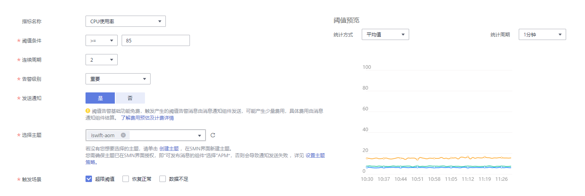
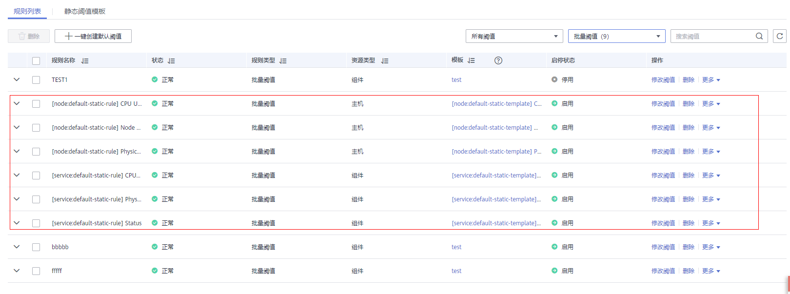

# 创建静态阈值规则

通过静态阈值规则可对资源的指标设置阈值条件。当指标数据满足阈值条件时产生阈值告警，当没有指标数据上报时产生数据不足事件。

AOM已对接[消息通知服务](https://support.huaweicloud.com/productdesc-smn/zh-cn_topic_0043394877.html)（Simple Message Notification，简称SMN），通过在SMN界面[设置通知策略](#li7359182111811)，当静态阈值规则的状态（正常、超限阈值、数据不足）发生变化时，会以邮件或短信等方式通知，以便您在第一时间发现异常并进行处理。

## 创建方式

静态阈值规则从资源与规则的对应关系上分为单条静态阈值规则和批量静态阈值规则，供您选择使用。

-   **单条静态阈值规则**：资源和规则是多对多的关系，当监控多个资源时，一次创建操作完成后，会生成多条规则，每个资源都可通过独立的规则进行监控。

    当需要单独监控某个资源时，建议使用此方式，操作详见[自定义静态阈值规则](#section727418178353)。

-   **批量静态阈值规则**（该功能仅对华北-北京一区域和华东-上海二区域生效）：资源和规则是多对一的关系，当监控多个资源时，一次创建操作完成后，只生成一条规则，多个资源是通过同一条规则进行监控。

    当需要集中监控多个资源时，建议使用此方式。

    -   根据运维经验，AOM对所有主机和所有服务的关键指标（包括CPU使用率指标、物理内存使用率指标、主机状态指标、服务状态指标）预置了默认批量阈值规则。您不用进行复杂的操作，单击按钮即可一键创建，操作详见[一键创建默认批量静态阈值规则](#section18998593164)。
    -   如果默认批量静态阈值规则不能满足需求时，您需使用静态阈值模板进行创建，操作详见[使用模板创建静态阈值规则](#section215851225919)。静态阈值模板是为创建批量静态阈值规则做准备的，您需先创建一个静态阈值模板，操作详见[创建静态阈值模板](创建静态阈值模板.md)。

## 注意事项

-   您最多可创建1000条静态阈值规则，如果静态阈值规则数量已达上限1000条时，请删除不需要的静态阈值规则后重新创建。
-   设置通知策略

    静态阈值规则的状态（正常、超限阈值、数据不足）发生变化时，如需使用邮件或短信等方式发送通知，请参考下面操作在SMN界面设置通知策略。如不需接收邮件或短信通知，请跳过下面操作。具体操作如下：

    1.  创建一个主题，操作详见[创建主题](https://support.huaweicloud.com/usermanual-smn/zh-cn_topic_0043961401.html)。
    2.  设置主题策略，操作详见[设置主题策略](https://support.huaweicloud.com/usermanual-smn/zh-cn_topic_0043394891.html)。

        设置主题策略时，“可发布消息的服务”必须选择“APM”，否则会导致通知发送失败。

    3.  为主题添加相关的订阅者，即通知的接收人（例如：邮件或短信），操作详见[订阅主题](https://support.huaweicloud.com/usermanual-smn/zh-cn_topic_0043961402.html)。

## 自定义静态阈值规则

1.  登录AOM控制台，在左侧导航栏中选择“告警中心 \> 阈值规则”，单击右上角的“添加阈值”。
2.  自定义静态阈值规则。
    1.  选择资源：在“阈值名称”文本框中输入阈值规则名称，单击“自定义创建”，选择资源类型，在资源树上选择待监控的资源，单击“下一步”。

        > **说明：**   
        >-   资源树上最多可选择100个资源。  
        >-   当选择多个资源时，创建操作完成后，会创建多个单条静态阈值规则，每个资源对应一个单条静态阈值规则。规则命名方式为：您在“阈值名称”文本框中设置的阈值规则名称加上0至9的序号（序号和资源选择时的先后顺序有关，先选择的资源序号越小，后选择的资源序号越大）。  
        >    例如，在“阈值名称”文本框中输入阈值规则名称：Monitor\_Host\_cpuUsage，在资源树上选择资源时，先选择主机my1014-92558，再选择主机my1014-master-1。创建操作完成后，会生成两条阈值规则Monitor\_Host\_cpuUsage0（其监控的对象为主机my1014-92558）和Monitor\_Host\_cpuUsage1（其监控对象为主机my1014-master-1）。  

        **图 1**  选择资源  
        

    2.  定义阈值：选择待监控的指标，设置阈值条件、连续周期、告警级别、统计方式等参数，选择是否发送通知。

        > **说明：**   
        >-   阈值条件：阈值告警的触发条件，由判断条件（\>=、<=、\>、<）和阈值组成。例如，阈值条件设置为“\>85”，表示指标的实际值大于已设置的阈值85时，生成阈值告警。  
        >-   连续周期：连续多少个周期满足阈值条件后，发送阈值告警。  
        >-   统计方式：指标数据按照所设置的统计方式进行聚合。  
        >-   统计周期：指标数据按照所设置的统计周期进行聚合。  
        >-   选择是否发送通知：当静态阈值规则的状态（正常、超限阈值、数据不足）发生变化时，选择是否发送邮件或短信通知该变动。  
        >    -   如需使用邮件或短信方式发送通知，请选择“是”，则需[设置通知策略](#li7359182111811)，选择已创建的主题，选择触发场景。  
        >    -   如不需接收邮件或短信通知，请选择“否”。  
        >-   触发场景：发送通知的触发条件。  
        >    触发场景您可选择多个。例如，当阈值状态变为超限阈值时，您需要收到通知，则触发场景选择超限阈值；只要阈值状态发生变化时，您都需要收到通知，则触发场景可以全选。  

        **图 2**  定义阈值  
        

3.  单击“添加”，完成创建。如下图所示，创建了多个单条静态阈值规则，一个资源对应一个规则，可使用独立的规则对某个资源进行监控。

    如下图所示，对于一个单条静态阈值规则，其监控对象为某个主机，当主机的CPU使用率超过85%时，在告警界面产生阈值告警，可在左侧导航栏中选择“告警中心 \> 告警列表”，在告警列表中查看该告警；当主机满足已设的通知策略时，就会发送邮件或短信。

    **图 3**  单条静态阈值规则  
    

## 使用模板创建静态阈值规则

该功能仅对华北-北京一区域和华东-上海二区域生效。

使用模板创建静态阈值规则前，请先创建一个静态阈值模板，操作详见[创建静态阈值模板](创建静态阈值模板.md)。

1.  登录AOM控制台，在左侧导航栏中选择“告警中心 \> 阈值规则”，单击右上角的“添加阈值”。
2.  选择资源：输入阈值规则名称，单击“模板导入”，选择资源类型，在资源树上选择待监控的资源，单击“下一步”。

    > **说明：**   
    >-   若开关为关闭状态（即为）：需您在资源树上自定义选择一个或多个资源，最多可选择100个资源。  
    >-   若开关为开启状态（即为）：当资源类型为主机时，监控的资源为所有的主机；当资源类型为服务时，监控的资源为所有服务。该功能对新增的主机或服务也生效，若后续又新增了主机或服务，您不用做任何操作。  

    **图 4**  选择待监控的资源  
    

3.  选择已创建的静态阈值模板。

    **图 5**  选择静态阈值模板  
    

4.  单击“添加”，完成创建。如下图所示，创建了一条批量静态阈值规则，单击其前的，可对其下的多个资源的同一指标批量监控。

    如下图所示，在展开的列表中，只要某个主机的CPU使用率超过85%时，在告警界面就会生成一条阈值告警，您可在左侧导航栏中选择“告警中心 \> 告警列表”，在告警列表中查看该告警；只要某个主机满足已设的通知策略，就会发送一条邮件或短信。

    **图 6**  批量静态阈值规则  
    

## 一键创建默认批量静态阈值规则

该功能仅对华北-北京一区域和华东-上海二区域生效。

1.  登录AOM控制台，在左侧导航栏中选择“告警中心 \> 阈值规则”。
2.  在“规则列表”页签中单击“一键创建默认阈值”。

    AOM会自动创建6个静态阈值模板（可单击“静态阈值模板”页签，在列表中进行查看，详见[一键创建默认静态阈值模板](创建静态阈值模板.md#section184435517495)），于此同时AOM也会使用这6个模板分别创建6个默认的批量静态阈值规则（其监控对象为所有的主机或所有的服务，如[图7](#fig1658715851417)所示）。例如，单击\[node:default-static-rule\] CPU Usage前的，可批量监控您所有主机的CPU使用率。

    若后续又新增了主机或服务，您不用做任何操作，AOM会自动将新增资源添加到规则中。

    **图 7**  默认批量静态阈值规则  
    

    **表 1**  默认批量静态阈值规则说明

    
    <table><thead align="left"><tr id="row175891258151413"><th class="cellrowborder" valign="top" width="40%" id="mcps1.2.5.1.1">
默认批量静态阈值规则名称/其默认静态阈值模板名称

    </th>
    <th class="cellrowborder" valign="top" width="15%" id="mcps1.2.5.1.2">
资源

    </th>
    <th class="cellrowborder" valign="top" width="15%" id="mcps1.2.5.1.3">
指标

    </th>
    <th class="cellrowborder" valign="top" width="30%" id="mcps1.2.5.1.4">
其静态阈值模板默认设置

    </th>
    </tr>
    </thead>
    <tbody><tr id="row115898582143"><td class="cellrowborder" valign="top" width="40%" headers="mcps1.2.5.1.1 "><ul id="ul135891058111412"><li>规则：[node: default-static-rule] CPU Usage</li><li>模板：[node: default-static-template] CPU Usag</li></ul>
    </td>
    <td class="cellrowborder" rowspan="3" valign="top" width="15%" headers="mcps1.2.5.1.2 ">
主机

    </td>
    <td class="cellrowborder" valign="top" width="15%" headers="mcps1.2.5.1.3 ">
CPU使用率

    </td>
    <td class="cellrowborder" rowspan="2" valign="top" width="30%" headers="mcps1.2.5.1.4 ">
统计方式：平均值；阈值条件：&gt;90%；连续周期：3次；统计周期：1分钟；告警级别：重要；发送通知：否

    </td>
    </tr>
    <tr id="row458975820144"><td class="cellrowborder" valign="top" headers="mcps1.2.5.1.1 "><ul id="ul1958975811149"><li>规则：[node: default-static-rule] Physical Memory Usage</li><li>模板：[node: default-static-template] Physical Memory Usage</li></ul>
    </td>
    <td class="cellrowborder" valign="top" headers="mcps1.2.5.1.2 ">
物理内存使用率

    </td>
    </tr>
    <tr id="row1058935812148"><td class="cellrowborder" valign="top" headers="mcps1.2.5.1.1 "><ul id="ul15891858191417"><li>规则：[node: default-static-rule] Node Status</li><li>模板：[node: default-static-template] Node Status</li></ul>
    </td>
    <td class="cellrowborder" valign="top" headers="mcps1.2.5.1.2 ">
主机状态

    </td>
    <td class="cellrowborder" valign="top" headers="mcps1.2.5.1.3 ">
统计方式：平均值；阈值条件：&gt;0；连续周期：1次；统计周期：1分钟；告警级别：重要；发送通知：否

    </td>
    </tr>
    <tr id="row758919585149"><td class="cellrowborder" valign="top" width="40%" headers="mcps1.2.5.1.1 "><ul id="ul958985813144"><li>规则：[service: default-static-rule] CPU Usage</li><li>模板：[service: default-static-template] CPU Usage</li></ul>
    </td>
    <td class="cellrowborder" rowspan="3" valign="top" width="15%" headers="mcps1.2.5.1.2 ">
服务

    </td>
    <td class="cellrowborder" valign="top" width="15%" headers="mcps1.2.5.1.3 ">
CPU使用率

    </td>
    <td class="cellrowborder" rowspan="2" valign="top" width="30%" headers="mcps1.2.5.1.4 ">
统计方式：平均值；阈值条件：&gt;90%；连续周期：3次；统计周期：1分钟；告警级别：重要；发送通知：否

    </td>
    </tr>
    <tr id="row1759045815143"><td class="cellrowborder" valign="top" headers="mcps1.2.5.1.1 "><ul id="ul10590145817146"><li>规则：[service: default-static-rule] Physical Memory Usage</li><li>模板：[service: default-static-template] Physical Memory Usage</li></ul>
    </td>
    <td class="cellrowborder" valign="top" headers="mcps1.2.5.1.2 ">
物理内存使用率

    </td>
    </tr>
    <tr id="row2059035812142"><td class="cellrowborder" valign="top" headers="mcps1.2.5.1.1 "><ul id="ul95902581143"><li>规则：[service: default-static-rule] Status</li></ul>
    <ul id="ul1259025811411"><li>模板：[service: default-static-template] Status</li></ul>
    </td>
    <td class="cellrowborder" valign="top" headers="mcps1.2.5.1.2 ">
服务状态

    </td>
    <td class="cellrowborder" valign="top" headers="mcps1.2.5.1.3 ">
统计方式：平均值；阈值条件：&gt;0；连续周期：1次；统计周期：1分钟；告警级别：重要；发送通知：否

    </td>
    </tr>
    </tbody>
    </table>

## 更多静态阈值规则操作

静态阈值规则创建完成后，您还可以执行[表2](#table289773015816)中的操作。

**表 2**  相关操作

<table><thead align="left"><tr id="row1089753013810"><th class="cellrowborder" valign="top" width="20%" id="mcps1.2.3.1.1">
操作

</th>
<th class="cellrowborder" valign="top" width="80%" id="mcps1.2.3.1.2">
说明

</th>
</tr>
</thead>
<tbody><tr id="row889712307814"><td class="cellrowborder" valign="top" width="20%" headers="mcps1.2.3.1.1 ">
修改静态阈值规则

</td>
<td class="cellrowborder" valign="top" width="80%" headers="mcps1.2.3.1.2 ">
单击“操作”列的“修改阈值”。

</td>
</tr>
<tr id="row58971630183"><td class="cellrowborder" valign="top" width="20%" headers="mcps1.2.3.1.1 ">
删除静态阈值规则

</td>
<td class="cellrowborder" valign="top" width="80%" headers="mcps1.2.3.1.2 "><ul id="ul98211552932"><li>删除一个静态阈值规则：单击“操作”列的“删除”。</li><li>删除一个或多个静态阈值规则：选中一个或多个静态阈值规则前的复选框，单击页面上方的“删除”。</li></ul>
</td>
</tr>
<tr id="row158974301886"><td class="cellrowborder" valign="top" width="20%" headers="mcps1.2.3.1.1 ">
启、停静态阈值规则

</td>
<td class="cellrowborder" valign="top" width="80%" headers="mcps1.2.3.1.2 "><ul id="ul96889142397"><li>在“操作”列的“更多”下拉列表框中选择“启用”。</li><li>在“操作”列的“更多”下拉列表框中选择“停用”。</li></ul>

 说明： 

单条静态阈值规则不支持启、停操作。

</td>
</tr>
<tr id="row31821833243"><td class="cellrowborder" valign="top" width="20%" headers="mcps1.2.3.1.1 ">
搜索静态阈值规则

</td>
<td class="cellrowborder" valign="top" width="80%" headers="mcps1.2.3.1.2 ">
支持规则名称、描述和指标名称搜索，可在右上角的搜索框中输入关键字，单击后显示匹配对象。

</td>
</tr>
<tr id="row424843413542"><td class="cellrowborder" valign="top" width="20%" headers="mcps1.2.3.1.1 ">
查看告警

</td>
<td class="cellrowborder" valign="top" width="80%" headers="mcps1.2.3.1.2 ">
在已设的连续周期内，当某个资源的指标数据满足阈值条件时，产生一条阈值告警。

可在左侧导航栏中选择“告警中心 &gt; 告警列表”，在告警列表中查看该告警。

</td>
</tr>
<tr id="row20557121935919"><td class="cellrowborder" valign="top" width="20%" headers="mcps1.2.3.1.1 ">
查看事件

</td>
<td class="cellrowborder" valign="top" width="80%" headers="mcps1.2.3.1.2 ">
在已设的连续周期内，当某个资源没有指标数据上报时，会产生一条数据不足的事件。

可在左侧导航栏中选择“告警中心 &gt; 事件列表”，在事件列表中查看该事件。

</td>
</tr>
</tbody>
</table>

