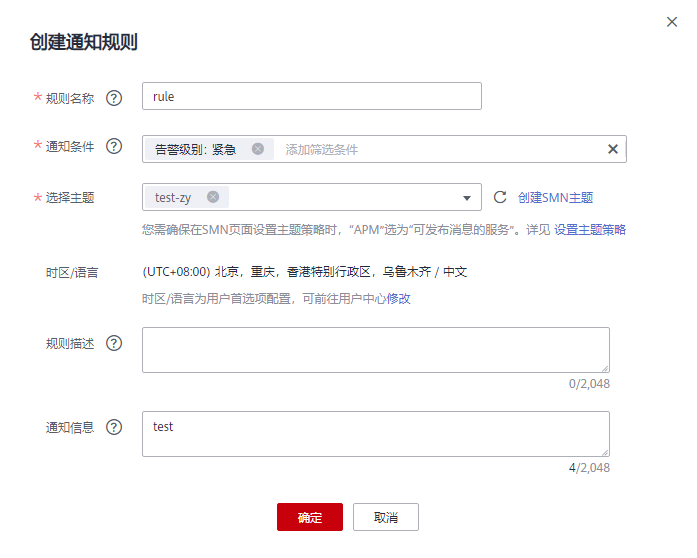

# 告警通知

AOM提供了告警通知功能，您可通过创建通知规则进行详细配置，当AOM自身或外部服务存在异常或可能存在异常而产生告警时，可利用此功能将告警信息通过邮件或短信发送给您指定的人员，以便提醒相关人员及时采取措施清除故障，避免造成业务损失。

如果您未创建任何通知规则，即未使用告警通知功能，则无法收到告警通知。只能登录[应用运维管理](https://console.huaweicloud.com/aom/#/aom/ams/summary)，在左侧导航栏中选择“告警中心 \> 告警列表”，在告警页面自行查看。

## 注意事项

告警通知是以集群为单位，且发送前提为同一类型的告警。可帮您将某个集群的某类告警以短信或邮件等方式批量发送给您指定的人员。目前支持发送通知的告警详见[表1](#table1767992833014)。

**表 1**  告警类型说明

<table><thead align="left"><tr id="row1290320620271"><th class="cellrowborder" valign="top" width="20%" id="mcps1.2.3.1.1">
告警类型

</th>
<th class="cellrowborder" valign="top" width="80%" id="mcps1.2.3.1.2">
说明

</th>
</tr>
</thead>
<tbody><tr id="row1501012113518"><td class="cellrowborder" valign="top" width="20%" headers="mcps1.2.3.1.1 ">
全部

</td>
<td class="cellrowborder" valign="top" width="80%" headers="mcps1.2.3.1.2 ">
所有的告警类型，包括AOM内置的告警类型和外部服务注册到AOM的告警类型。

</td>
</tr>
<tr id="row1498082919305"><td class="cellrowborder" valign="top" width="20%" headers="mcps1.2.3.1.1 ">
AOM内置的告警类型

（包括采集器安装告警和阈值告警）

</td>
<td class="cellrowborder" valign="top" width="80%" headers="mcps1.2.3.1.2 "><ul id="ul97994404329"><li>采集器安装告警：包括ICAgent安装失败告警、ICAgent升级失败告警、ICAgent卸载失败告警和ICAgent状态异常告警。</li><li>阈值告警：阈值规则产生的阈值告警。</li></ul>
</td>
</tr>
<tr id="row120193433014"><td class="cellrowborder" valign="top" width="20%" headers="mcps1.2.3.1.1 ">
外部服务注册到AOM的告警类型

</td>
<td class="cellrowborder" valign="top" width="80%" headers="mcps1.2.3.1.2 ">
例如，节点数据库告警（区块链服务注册）、探针休眠（应用性能管理服务注册）等。

</td>
</tr>
</tbody>
</table>

> **说明：**   
>更多告警类型正在开发中。  

## 创建通知规则

通知规则创建成功后，当符合通知规则时发送短信或邮件。

例如，Cluster1集群下有HostA、HostB、HostC、HostD 4个主机，当这4个主机的ICAgent安装、升级、卸载失败或状态异常时，均能通过邮件的方式及时通知到某运维人员。则可参考如下操作进行设置：

1.  登录[应用运维管理](https://console.huaweicloud.com/aom/#/aom/ams/summary)。
2.  在左侧导航栏中选择“告警中心 \> 通知规则”，单击“创建通知规则”。
3.  AOM已对接SMN，单击“创建主题”，在SMN界面设置通知策略。如果均已设置，请跳过该步骤。
    1.  创建一个主题，操作详见[创建主题](https://support.huaweicloud.com/usermanual-smn/zh-cn_topic_0043961401.html)。

        例如，创建名称为Topic1的主题。

    2.  设置主题策略，操作详见[设置主题策略](https://support.huaweicloud.com/usermanual-smn/zh-cn_topic_0043394891.html)。

        设置主题策略时，“可发布消息的服务”必须选择“APM”，否则会导致通知发送失败

    3.  为主题添加相关的订阅者，即通知的接收人（例如，邮件或短信），SMN可以实时地将告警信息以广播的方式通知这些订阅者，操作详见[订阅主题](https://support.huaweicloud.com/usermanual-smn/zh-cn_topic_0043961402.html)。

        例如，订阅者设置为该运维人员的邮箱。

4.  创建通知规则：输入规则名称，选择告警类型（即当产生哪一类型的告警时发送通知，详见[表1](#table1767992833014)），选择[3](#li698019238343)中已创建的主题，选择目标集群后，单击“创建”。

    例如，规则名称设置为Notification\_Rule1，告警类型选择采集器安装失败告警、主题选择Topic1，集群选择Cluster1，如[图1](#fig164851929204116)所示。

    **图 1**  创建通知规则  
    

    通知规则创建成功后，当Cluster1集群的4个主机的ICAgent安装、升级、卸载失败或异常时，该运维人员均会收到相关的告警邮件。

## 更多通知规则操作

通知规则创建完成后，您还可以执行[表2](#table14918185010104)中的操作。

**表 2**  相关操作

<table><thead align="left"><tr id="row17920135010100"><th class="cellrowborder" valign="top" width="20%" id="mcps1.2.3.1.1">
操作

</th>
<th class="cellrowborder" valign="top" width="80%" id="mcps1.2.3.1.2">
说明

</th>
</tr>
</thead>
<tbody><tr id="row4922150191019"><td class="cellrowborder" valign="top" width="20%" headers="mcps1.2.3.1.1 ">
修改通知规则

</td>
<td class="cellrowborder" valign="top" width="80%" headers="mcps1.2.3.1.2 ">
单击“操作”列的“修改”。

</td>
</tr>
<tr id="row13752165816484"><td class="cellrowborder" valign="top" width="20%" headers="mcps1.2.3.1.1 ">
删除通知规则

</td>
<td class="cellrowborder" valign="top" width="80%" headers="mcps1.2.3.1.2 "><ul id="ul98211552932"><li>删除一个通知规则：单击“操作”列的“删除”。</li><li>删除一个或多个通知规则：选中一个或多个通知规则前的复选框，单击页面上方的“删除”。</li></ul>
</td>
</tr>
<tr id="row79230504106"><td class="cellrowborder" valign="top" width="20%" headers="mcps1.2.3.1.1 ">
搜索通知规则

</td>
<td class="cellrowborder" valign="top" width="80%" headers="mcps1.2.3.1.2 ">
在右上角的搜索框中输入通知规则名称关键字，单击后显示匹配对象。

</td>
</tr>
</tbody>
</table>

