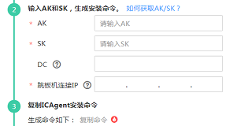

# 安装ICAgent（Linux）<a name="aom_02_0012"></a>

ICAgent状态说明详见下表。

**表 1**  ICAgent状态

<a name="zh-cn_topic_0127215848_table178415320113"></a>
<table><thead align="left"><tr id="zh-cn_topic_0127215848_row87841335115"><th class="cellrowborder" valign="top" width="20%" id="mcps1.2.3.1.1"><p id="zh-cn_topic_0127215848_p278081612119"><a name="zh-cn_topic_0127215848_p278081612119"></a><a name="zh-cn_topic_0127215848_p278081612119"></a>状态</p>
</th>
<th class="cellrowborder" valign="top" width="80%" id="mcps1.2.3.1.2"><p id="zh-cn_topic_0127215848_p67814168111"><a name="zh-cn_topic_0127215848_p67814168111"></a><a name="zh-cn_topic_0127215848_p67814168111"></a>说明</p>
</th>
</tr>
</thead>
<tbody><tr id="zh-cn_topic_0127215848_row187841321112"><td class="cellrowborder" valign="top" width="20%" headers="mcps1.2.3.1.1 "><p id="zh-cn_topic_0127215848_p978513162111"><a name="zh-cn_topic_0127215848_p978513162111"></a><a name="zh-cn_topic_0127215848_p978513162111"></a>运行</p>
</td>
<td class="cellrowborder" valign="top" width="80%" headers="mcps1.2.3.1.2 "><p id="zh-cn_topic_0127215848_p978610163116"><a name="zh-cn_topic_0127215848_p978610163116"></a><a name="zh-cn_topic_0127215848_p978610163116"></a>该主机ICAgent运行正常。</p>
</td>
</tr>
<tr id="zh-cn_topic_0127215848_row1778473101115"><td class="cellrowborder" valign="top" width="20%" headers="mcps1.2.3.1.1 "><p id="zh-cn_topic_0127215848_p87882016101117"><a name="zh-cn_topic_0127215848_p87882016101117"></a><a name="zh-cn_topic_0127215848_p87882016101117"></a>未安装</p>
</td>
<td class="cellrowborder" valign="top" width="80%" headers="mcps1.2.3.1.2 "><p id="zh-cn_topic_0127215848_p2788216121111"><a name="zh-cn_topic_0127215848_p2788216121111"></a><a name="zh-cn_topic_0127215848_p2788216121111"></a>该主机未安装ICAgent。安装ICAgent，详细操作请参见<a href="安装ICAgent（Linux）.md">安装ICAgent（Linux）</a>。</p>
</td>
</tr>
<tr id="zh-cn_topic_0127215848_row378483181120"><td class="cellrowborder" valign="top" width="20%" headers="mcps1.2.3.1.1 "><p id="zh-cn_topic_0127215848_p179091619119"><a name="zh-cn_topic_0127215848_p179091619119"></a><a name="zh-cn_topic_0127215848_p179091619119"></a>安装中</p>
</td>
<td class="cellrowborder" valign="top" width="80%" headers="mcps1.2.3.1.2 "><p id="zh-cn_topic_0127215848_p137925167113"><a name="zh-cn_topic_0127215848_p137925167113"></a><a name="zh-cn_topic_0127215848_p137925167113"></a>正在为该主机安装ICAgent。安装ICAgent预计需要1分钟左右，请耐心等待。</p>
</td>
</tr>
<tr id="zh-cn_topic_0127215848_row167841334116"><td class="cellrowborder" valign="top" width="20%" headers="mcps1.2.3.1.1 "><p id="zh-cn_topic_0127215848_p87941616161112"><a name="zh-cn_topic_0127215848_p87941616161112"></a><a name="zh-cn_topic_0127215848_p87941616161112"></a>安装失败</p>
</td>
<td class="cellrowborder" valign="top" width="80%" headers="mcps1.2.3.1.2 "><p id="zh-cn_topic_0127215848_p167951316191119"><a name="zh-cn_topic_0127215848_p167951316191119"></a><a name="zh-cn_topic_0127215848_p167951316191119"></a>该主机ICAgent安装失败，请<a href="卸载ICAgent（Linux）.md#zh-cn_topic_0127215850_section1218782615374">登录服务器卸载</a>后重新安装。</p>
</td>
</tr>
<tr id="zh-cn_topic_0127215848_row87841031113"><td class="cellrowborder" valign="top" width="20%" headers="mcps1.2.3.1.1 "><p id="zh-cn_topic_0127215848_p13798181641119"><a name="zh-cn_topic_0127215848_p13798181641119"></a><a name="zh-cn_topic_0127215848_p13798181641119"></a>升级中</p>
</td>
<td class="cellrowborder" valign="top" width="80%" headers="mcps1.2.3.1.2 "><p id="zh-cn_topic_0127215848_p17997166114"><a name="zh-cn_topic_0127215848_p17997166114"></a><a name="zh-cn_topic_0127215848_p17997166114"></a>正在升级该主机ICAgent。升级ICAgent预计需要1分钟左右，请耐心等待。</p>
</td>
</tr>
<tr id="zh-cn_topic_0127215848_row5784535116"><td class="cellrowborder" valign="top" width="20%" headers="mcps1.2.3.1.1 "><p id="zh-cn_topic_0127215848_p280014165112"><a name="zh-cn_topic_0127215848_p280014165112"></a><a name="zh-cn_topic_0127215848_p280014165112"></a>升级失败</p>
</td>
<td class="cellrowborder" valign="top" width="80%" headers="mcps1.2.3.1.2 "><p id="zh-cn_topic_0127215848_p13801101641119"><a name="zh-cn_topic_0127215848_p13801101641119"></a><a name="zh-cn_topic_0127215848_p13801101641119"></a>该主机ICAgent升级失败。请<a href="卸载ICAgent（Linux）.md#zh-cn_topic_0127215850_section1218782615374">登录服务器卸载</a>后重新安装。</p>
</td>
</tr>
<tr id="zh-cn_topic_0127215848_row1491511151116"><td class="cellrowborder" valign="top" width="20%" headers="mcps1.2.3.1.1 "><p id="zh-cn_topic_0127215848_p15802191631117"><a name="zh-cn_topic_0127215848_p15802191631117"></a><a name="zh-cn_topic_0127215848_p15802191631117"></a>离线</p>
</td>
<td class="cellrowborder" valign="top" width="80%" headers="mcps1.2.3.1.2 "><p id="zh-cn_topic_0127215848_p7901448152117"><a name="zh-cn_topic_0127215848_p7901448152117"></a><a name="zh-cn_topic_0127215848_p7901448152117"></a>输入的AK/SK错误或ECS委托设置错误导致该主机ICAgent功能异常。请获取正确的AK/SK或正确设置ECS委托。</p>
</td>
</tr>
<tr id="zh-cn_topic_0127215848_row1191311171114"><td class="cellrowborder" valign="top" width="20%" headers="mcps1.2.3.1.1 "><p id="zh-cn_topic_0127215848_p1380461681118"><a name="zh-cn_topic_0127215848_p1380461681118"></a><a name="zh-cn_topic_0127215848_p1380461681118"></a>异常</p>
</td>
<td class="cellrowborder" valign="top" width="80%" headers="mcps1.2.3.1.2 "><p id="zh-cn_topic_0127215848_p108041216131119"><a name="zh-cn_topic_0127215848_p108041216131119"></a><a name="zh-cn_topic_0127215848_p108041216131119"></a>该主机ICAgent功能异常。请提交工单处理，操作详见<a href="https://support.huaweicloud.com/usermanual-ticket/zh-cn_topic_0127038618.html" target="_blank" rel="noopener noreferrer">如何提交工单</a>。</p>
</td>
</tr>
</tbody>
</table>

## 安装前提<a name="zh-cn_topic_0127215848_zh-cn_topic_0089684077_section789175015231"></a>

确保本地浏览器时间与服务器时区、时间都一致。否则，可能会导致不能在界面上准确查看应用、服务器的指标数据。

## 安装方式说明<a name="zh-cn_topic_0127215848_zh-cn_topic_0089684077_zh-cn_topic_0089582074_zh-cn_topic_0089684077_section154003208582"></a>

**表 2**  安装方式

<a name="zh-cn_topic_0127215848_zh-cn_topic_0089684077_zh-cn_topic_0089582074_zh-cn_topic_0089684077_zh-cn_topic_0089582509_table5921281716319"></a>
<table><thead align="left"><tr id="zh-cn_topic_0127215848_zh-cn_topic_0089684077_zh-cn_topic_0089582074_zh-cn_topic_0089684077_zh-cn_topic_0089582509_row4088670316319"><th class="cellrowborder" valign="top" width="20.3%" id="mcps1.2.3.1.1"><p id="zh-cn_topic_0127215848_zh-cn_topic_0089684077_zh-cn_topic_0089582074_zh-cn_topic_0089684077_zh-cn_topic_0089582509_p1007152116319"><a name="zh-cn_topic_0127215848_zh-cn_topic_0089684077_zh-cn_topic_0089582074_zh-cn_topic_0089684077_zh-cn_topic_0089582509_p1007152116319"></a><a name="zh-cn_topic_0127215848_zh-cn_topic_0089684077_zh-cn_topic_0089582074_zh-cn_topic_0089684077_zh-cn_topic_0089582509_p1007152116319"></a>方式</p>
</th>
<th class="cellrowborder" valign="top" width="79.7%" id="mcps1.2.3.1.2"><p id="zh-cn_topic_0127215848_zh-cn_topic_0089684077_zh-cn_topic_0089582074_zh-cn_topic_0089684077_zh-cn_topic_0089582509_p1048688816319"><a name="zh-cn_topic_0127215848_zh-cn_topic_0089684077_zh-cn_topic_0089582074_zh-cn_topic_0089684077_zh-cn_topic_0089582509_p1048688816319"></a><a name="zh-cn_topic_0127215848_zh-cn_topic_0089684077_zh-cn_topic_0089582074_zh-cn_topic_0089684077_zh-cn_topic_0089582509_p1048688816319"></a>适用场景</p>
</th>
</tr>
</thead>
<tbody><tr id="zh-cn_topic_0127215848_zh-cn_topic_0089684077_zh-cn_topic_0089582074_zh-cn_topic_0089684077_zh-cn_topic_0089582509_row6164033616319"><td class="cellrowborder" valign="top" width="20.3%" headers="mcps1.2.3.1.1 "><p id="zh-cn_topic_0127215848_zh-cn_topic_0089684077_zh-cn_topic_0089582074_zh-cn_topic_0089684077_zh-cn_topic_0089582509_p2681132116319"><a name="zh-cn_topic_0127215848_zh-cn_topic_0089684077_zh-cn_topic_0089582074_zh-cn_topic_0089684077_zh-cn_topic_0089582509_p2681132116319"></a><a name="zh-cn_topic_0127215848_zh-cn_topic_0089684077_zh-cn_topic_0089582074_zh-cn_topic_0089684077_zh-cn_topic_0089582509_p2681132116319"></a>首次安装</p>
</td>
<td class="cellrowborder" valign="top" width="79.7%" headers="mcps1.2.3.1.2 "><p id="zh-cn_topic_0127215848_zh-cn_topic_0089684077_zh-cn_topic_0089582074_zh-cn_topic_0089684077_zh-cn_topic_0089582509_p2423342716319"><a name="zh-cn_topic_0127215848_zh-cn_topic_0089684077_zh-cn_topic_0089582074_zh-cn_topic_0089684077_zh-cn_topic_0089582509_p2423342716319"></a><a name="zh-cn_topic_0127215848_zh-cn_topic_0089684077_zh-cn_topic_0089582074_zh-cn_topic_0089684077_zh-cn_topic_0089582509_p2423342716319"></a>当满足以下条件时，您需要按照该方式安装：</p>
<a name="zh-cn_topic_0127215848_zh-cn_topic_0089684077_zh-cn_topic_0089582074_zh-cn_topic_0089684077_zh-cn_topic_0089582509_ol240967611653"></a><a name="zh-cn_topic_0127215848_zh-cn_topic_0089684077_zh-cn_topic_0089582074_zh-cn_topic_0089684077_zh-cn_topic_0089582509_ol240967611653"></a><ol id="zh-cn_topic_0127215848_zh-cn_topic_0089684077_zh-cn_topic_0089582074_zh-cn_topic_0089684077_zh-cn_topic_0089582509_ol240967611653"><li>服务器已绑定EIP。绑定EIP的详细操作请参见<a href="https://support.huaweicloud.com/usermanual-vpc/zh-cn_topic_0013748738.html" target="_blank" rel="noopener noreferrer">为弹性云服务器申请和绑定弹性IP</a>。</li><li>该服务器上未安装过ICAgent。</li></ol>
</td>
</tr>
<tr id="zh-cn_topic_0127215848_zh-cn_topic_0089684077_zh-cn_topic_0089582074_zh-cn_topic_0089684077_zh-cn_topic_0089582509_row1653765616319"><td class="cellrowborder" valign="top" width="20.3%" headers="mcps1.2.3.1.1 "><p id="zh-cn_topic_0127215848_zh-cn_topic_0089684077_zh-cn_topic_0089582074_zh-cn_topic_0089684077_zh-cn_topic_0089582509_p6448173016319"><a name="zh-cn_topic_0127215848_zh-cn_topic_0089684077_zh-cn_topic_0089582074_zh-cn_topic_0089684077_zh-cn_topic_0089582509_p6448173016319"></a><a name="zh-cn_topic_0127215848_zh-cn_topic_0089684077_zh-cn_topic_0089582074_zh-cn_topic_0089684077_zh-cn_topic_0089582509_p6448173016319"></a>继承安装</p>
</td>
<td class="cellrowborder" valign="top" width="79.7%" headers="mcps1.2.3.1.2 "><p id="zh-cn_topic_0127215848_zh-cn_topic_0089684077_zh-cn_topic_0089582074_zh-cn_topic_0089684077_zh-cn_topic_0089582509_p5563762416319"><a name="zh-cn_topic_0127215848_zh-cn_topic_0089684077_zh-cn_topic_0089582074_zh-cn_topic_0089684077_zh-cn_topic_0089582509_p5563762416319"></a><a name="zh-cn_topic_0127215848_zh-cn_topic_0089684077_zh-cn_topic_0089582074_zh-cn_topic_0089684077_zh-cn_topic_0089582509_p5563762416319"></a>当满足以下条件时，您需要按照该方式安装：</p>
<p id="zh-cn_topic_0127215848_zh-cn_topic_0089684077_zh-cn_topic_0089582074_zh-cn_topic_0089684077_zh-cn_topic_0089582509_p28718779182051"><a name="zh-cn_topic_0127215848_zh-cn_topic_0089684077_zh-cn_topic_0089582074_zh-cn_topic_0089684077_zh-cn_topic_0089582509_p28718779182051"></a><a name="zh-cn_topic_0127215848_zh-cn_topic_0089684077_zh-cn_topic_0089582074_zh-cn_topic_0089684077_zh-cn_topic_0089582509_p28718779182051"></a>您有多个服务器需要安装ICAgent，其中一个服务器绑定了EIP，而剩余的没有绑定EIP。其中一个服务器已经通过首次安装方式装好了ICAgent，对于没有绑定EIP的服务器，您可以采用该安装方式。</p>
</td>
</tr>
</tbody>
</table>

> **说明：**   
>上述两种安装方式，不适用于容器节点（通过ServiceStage、AOS、CCE创建的集群容器节点）。因为容器节点不需要手动安装ICAgent，只需要在创建集群或部署应用时进行操作，详见[快速入门](https://support.huaweicloud.com/qs-aom/aom_00_0001.html)。  

## 首次安装<a name="zh-cn_topic_0127215848_section689913619366"></a>

1.  获取AK/SK，通过如下两种方式获取AK/SK：
    -   通过创建委托获取临时AK/SK，请参考[如何通过创建委托获取AK/SK](https://support.huaweicloud.com/apm_faq/apm_03_0002.html)。

        > **说明：**   
        >安装ICAgent的每个ECS节点需要在弹性云服务器界面上绑定已创建的委托，5分钟后委托生效。  

    -   通过新增访问密钥获取永久AK/SK，请参考[如何获取AK/SK](https://support.huaweicloud.com/aom_faq/aom_03_0015.html)。

2.  登录AOM控制台，在左侧导航栏中选择“采集器部署 \> Agent管理”。
3.  单击“安装ICAgent”，选择“主机类型”为“华为云主机”、“安装系统”为“Linux”。
4.  生成ICAgent安装命令，并复制该命令。
    -   如[图 获取AK/SK凭证](#zh-cn_topic_0127215848_fig173350387512)所示，如果您已获取永久AK/SK，选择“安装方式”为“获取AK/SK凭证”，请在文本框中输入已获取的AK/SK，生成ICAgent安装命令。单击“复制命令”，复制ICAgent安装命令。

        > **说明：**   
        >请确保输入正确的AK/SK，否则将无法安装ICAgent。  

        **图 1**  获取AK/SK凭证<a name="zh-cn_topic_0127215848_fig173350387512"></a>  
        

    -   如果您已通过创建委托获取临时AK/SK，选择“安装方式”为“创建IAM委托”，单击“复制命令”，复制ICAgent安装命令。

5.  使用远程登录工具，以root用户登录待安装ICAgent的服务器，执行ICAgent安装命令进行安装。

    > **说明：**   
    >-   当显示“ICAgent install success”时，表示安装成功。  
    >-   安装失败，请参考卸载ICAgent章节的[登录服务器卸载](卸载ICAgent（Linux）.md#zh-cn_topic_0127215850_section1218782615374)后重新安装，如果还未安装成功，请联系华为技术工程师。  


## 继承安装<a name="zh-cn_topic_0127215848_section490015619361"></a>

当用户已有服务器安装过ICAgent，且该服务器“/opt/ICAgent/“路径下ICAgent安装包**ICProbeAgent.tar.gz**存在，通过该方式可对远端服务器进行一键式继承安装。

1.  在已安装ICAgent的服务器上执行如下命令，其中_x.x.x.x_表示服务器IP地址。

    **bash /opt/oss/servicemgr/ICAgent/bin/remoteInstall/remote\_install.sh -ip** **x.x.x.x**

2.  根据提示输入待安装ICAgent的服务器root用户密码。

    > **说明：**   
    >-   如果已安装ICAgent的服务器未安装expect工具，请根据提示输入，进行安装。  
    >-   请确保已安装ICAgent的服务器可以使用root用户执行SSH、SCP命令，来与待安装ICAgent的服务器进行远端通信。  
    >-   当显示“ICAgent install success”时，表示安装成功。  
    >-   安装失败，请参考卸载ICAgent章节的[登录服务器卸载](卸载ICAgent（Linux）.md#zh-cn_topic_0127215850_section1218782615374)后重新安装，如果还未安装成功，请联系华为技术工程师。  


## 继承批量安装<a name="zh-cn_topic_0127215848_section844164283613"></a>

当您已有服务器安装过ICAgent，且该服务器“/opt/ICAgent/”路径下ICAgent安装包**ICProbeAgent.tar.gz**存在，通过该方式可对多个远端服务器进行一键式继承批量安装。

> **须知：**   
>批量安装的ECS需同属一个VPC下，并在同一个网段中。  

**前提条件**

已收集需要安装Agent的所有虚拟机IP、密码，按照iplist.cfg格式整理好，并上传到已安装过ICAgent机器的/opt/ICAgent/目录下。iplist.cfg格式示例如下所示，IP与密码之间用空格隔开：

_192.168.0.109 密码（请根据实际填写）_

_192.168.0.39 密码（请根据实际填写）_

> **说明：**   
>-   iplist.cfg中包含您的敏感信息，建议您使用完之后清理一下。  
>-   如果所有弹性云服务器的密码一致，iplist.cfg中只需列出IP，无需填写密码，在执行时输入此密码即可；如果某个IP密码与其他不一致，则需在此IP后填写其密码。  

**操作步骤**

1.  在已安装ICAgent的服务器上执行如下命令。

    **bash /opt/oss/servicemgr/ICAgent/bin/remoteInstall/remote\_install.sh -batchModeConfig /opt/ICAgent/iplist.cfg**

    根据脚本提示输入待安装机器的root用户默认密码，如果所有IP的密码在iplist.cfg中已有配置，则直接输入回车键跳过即可，否则请输入默认密码。

    ```
    batch install begin
    Please input default passwd:
    send cmd to 192.168.0.109
    send cmd to 192.168.0.39
    2 tasks running, please wait...
    2 tasks running, please wait...
    2 tasks running, please wait...
    End of install agent: 192.168.0.39
    End of install agent: 192.168.0.109
    All hosts install icagent finish.
    ```

    请耐心等待，当提示All hosts install icagent finish.时，则表示配置文件中的所有主机安装操作已完成。

2.  安装完成后，可选择“采集器部署 \> Agent管理”，查看ICAgent状态。

