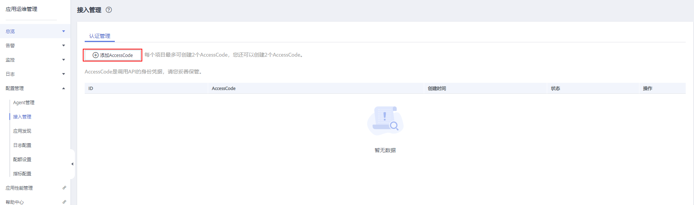
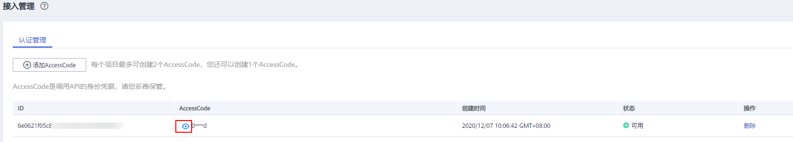

# 将Prometheus的数据上报到AOM<a name="aom_02_0922"></a>

如果您已经部署并正在使用开源prometheus，可直接进行[步骤三](#li13345647121718)。

本章主要介绍通过部署Prometheus将[AccessCode](#li622313202155)配置到Prometheus的配置文件并使之生效。

## 前提条件<a name="section13341447191219"></a>

已购买弹性云服务器ECS，具体操作请参见[《弹性云服务器快速入门》](https://support.huaweicloud.com/qs-ecs/ecs_02_0009.html)。

## 操作步骤<a name="section1435121917155"></a>

1.  安装并启动Prometheus，具体操作请参见[Prometheus官方文档](https://prometheus.io/docs/prometheus/latest/getting_started/)。
2.  <a name="li622313202155"></a>添加AccessCode。
    1.  登录AOM控制台，在左侧导航栏中选择“配置管理 \> 接入管理”。
    2.  在“认证管理”页签下，单击“添加AccessCode”。

        

        > **说明：** 
        >-   每个项目最多可创建2个AccessCode。
        >-   AccessCode是调用API的身份凭据，请您妥善保管。

    3.  在弹出的窗口，单击“确定”，添加AccessCode。

        

    4.  添加成功后，可在“认证管理”页签下，单击查看AccessCode。也可单击“删除”，删除AccessCode（**删除后无法恢复，请谨慎操作**）。

        

3.  <a name="li13345647121718"></a>登录ECS，找到prometheus的配置文件。

    示例：如果通过以下命令启动

    ```
    ./prometheus --config.file=promethus.yml
    ```

    则找到prometheus.yml并将以下配置添加到末尾

    ```
    remote_write:
    - url: 'https://aom-internal-access.{region_name}.myhuaweicloud.com:8443/v1/{project_id}/push'
    tls_config:
    insecure_skip_verify: true
    bearer_token: '{access_code}'
    ```

    参数说明：

    -   region\_name为指定承载REST服务端点的服务器域名或IP，不同服务不同区域的名称不同，您可以从[地区和终端节点](https://developer.huaweicloud.com/endpoint?AOM)中获取。例如AOM服务在“华北-北京一”区域名称为“cn-north-1”。
    -   project\_id 为项目的id，可在[我的凭证](https://support.huaweicloud.com/usermanual-ca/ca_01_0001.html)中的项目列表里查看。

    一个完整的配置示意如下，您需要配置斜体部分：

    ```
    # my global config
    global:
    scrape_interval:     15s # Set the scrape interval to every 15 seconds. Default is every 1 minute.
    evaluation_interval: 15s # Evaluate rules every 15 seconds. The default is every 1 minute.
    # scrape_timeout is set to the global default (10s).
    
    # Alertmanager configuration
    alerting:
    alertmanagers:
      - static_configs:
      - targets:
    # - alertmanager:9093
    
    # Load rules once and periodically evaluate them according to the global 'evaluation_interval'.
    rule_files:
    # - "first_rules.yml"
    # - "second_rules.yml"
    
    # A scrape configuration containing exactly one endpoint to scrape:
    # Here it's Prometheus itself.
    scrape_configs:
    # The job name is added as a label `job=<job_name>` to any timeseries scraped from this config.
      - job_name: 'prometheus'
    
    # metrics_path defaults to '/metrics'
    # scheme defaults to 'http'.
    
    static_configs:
      - targets: ['localhost:9090']
    remote_write:
      - url: 'https://aom-internal-access.cn-north-1.myhuaweicloud.com:8443/v1/thisisyourprojectid/push'
        tls_config:
          insecure_skip_verify: true
        bearer_token: 'fVkvjOqghcIARvZZEEWhwSwxesmKz5Efsx9vxZSNGCXEffcjPxxxxxx'
    ```

4.  检查内网域名配置

    由于上述配置中的数据上报是通过内网进行数据传输，因此需要确保您的Prometheus所在的主机能够解析内网域名，请参考[配置内网DNS](https://support.huaweicloud.com/vpc_faq/vpc_faq_0105.html)。

5.  重新启动Prometheus。
6.  可通过[通过grafana查看AOM中的指标数据](通过grafana查看AOM中的指标数据.md)中grafana查询指标数据的方法，来验证上述配置修改后数据上报是否成功。

