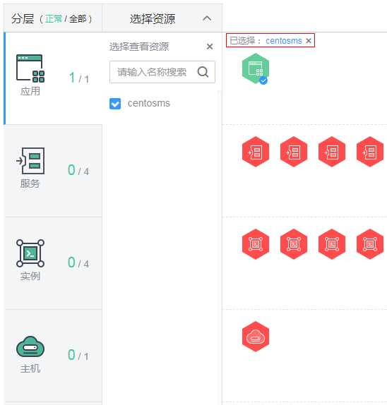
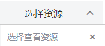
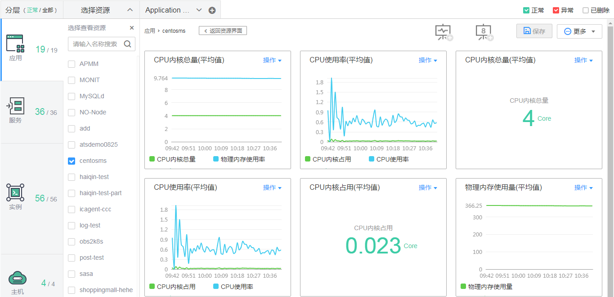

# 应用全景

应用全景是一站式立体化运维管理界面，提供应用、服务、实例、主机、中间件的全量监控视图和关联关系。在应用全景中可快速获取应用、服务、实例、主机、中间件的健康状态及各种指标，发现相关受影响的资源，跳转到资源对应的详情页面，进一步查看更详细内容，找到问题原因。通过应用全景，可完成日常巡检、故障（即应用异常）的影响分析等操作，保障应用顺畅运行。下面介绍应用全景界面常见操作。

## 查看关联关系

在“应用全景”界面，双击资源图标（或在左侧单击某一分层并选中资源名称前的复选框），查看关联关系。如[图1](#fig825052832418)所示，展示了centosms应用与服务、实例、主机的关联关系：centosms应用有4个服务，4个实例，部署在1个主机上。

**图 1**  查看关联关系  

您还可执行如下操作：

-   单击已选资源后的（如[图1](#fig825052832418)红框所示），关闭已选资源，返回“应用全景”界面。
-   单击资源图标，可在页面右下角查看、复制资源详情。
-   当资源过多时，单击的或，可对其进行隐藏，以便有更多空间展示资源图标。

## 查看指标图表

将鼠标移至资源图标上，单击图标右上角的，进入默认视图模板，查看资源的各种指标图表，如[图2](#fig12331840494)所示。

**图 2**  查看指标图表  

您还可执行如下操作：

-   **创建视图模板**

    AOM为每一类资源均提供了默认视图模板，且支持修改，例如，应用的默认视图模板Application template，您还可单击中的加号自定义视图模板。

-   **添加指标图表**

    单击、可在视图模板中分别添加曲线图、数字图。您还可对视图模板中的指标图表进行删除、移动、复制等操作，详细操作请参见[仪表盘](仪表盘.md)。

-   **添加到仪表盘**

    通过右上角“更多”下拉列表框，可对视图模板中的指标图表批量设置时间范围（只是临时展示，不支持保存）、添加视图模板到仪表盘并在“视图管理 \> 仪表盘”界面进行监控等。

-   单击“返回资源界面”，可返回上一级页面。

## 查看监控详情

选中资源，单击已选资源名称（如[图1](#fig825052832418)红框所示），可跳转到对应资源监控详情，进一步查看更详细内容。

