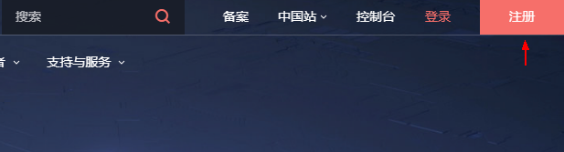

# 开通AOM

开通AOM前请先确认是否已注册华为云账号并对账号进行了实名认证。

## 注册华为云账号

1.  登录华为云网站[https://www.huaweicloud.com](https://www.huaweicloud.com/)。
2.  在页面右上角单击“注册”。

    

    进入注册页面，根据提示信息完成注册。

## 实名认证

您必须对账号进行实名认证，账号实名认证完成后才能正常使用AOM。

1.  登录华为云网站后将鼠标移动到右上角的用户名称，并在下拉列表中选择“账号中心”。
2.  在“基本信息”页面单击“认证信息”后的“实名认证”。

    进入实名认证页面，根据提示信息完成实名认证。

## 开通AOM

开通AOM时，因为不同区域是互相隔离的，对于不同的区域（例如：华北-北京一、华南-广州等），您需切换区域后分别进行开通操作。

单击页面右上角的“控制台”，在页面左上角单击选择区域，展开“所有服务”并选择“管理与部署 \> 应用运维管理 AOM”，在弹出的对话框中单击“免费开通”。

> **说明：** 
>AOM提供基础版和按需版两种计费方式，AOM默认为您开通基础版，可单击“切换版本”进行切换操作。

## 切换版本

AOM提供基础版和按需版两种计费方式，AOM默认为您开通基础版，可单击“切换版本”进行切换操作。

1.  登录AOM控制台，进入“总览\>监控概览”，单击顶部“切换版本”。
2.  选择版本，勾选提示信息，单击“立即切换”。

