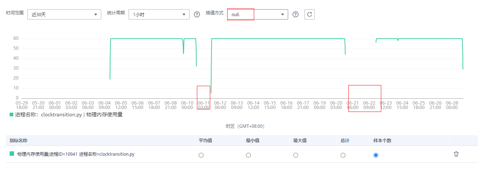
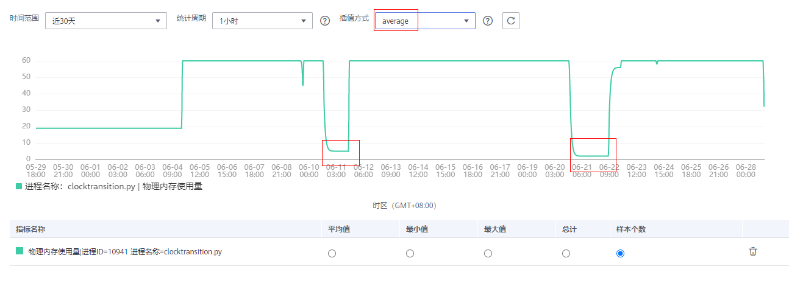

# 指标浏览

指标浏览展示了各资源的指标数据，您可实时监控指标值及趋势，还可将关注的指标添加到仪表盘，对其创建阈值规则和导出监控报告等操作，以便实时查看业务及分析数据关联分析。

## 监控指标

1.  在左侧导航栏中选择“监控 \> 指标浏览”。
2.  选择一个或多个（最多可选12个）关注的指标。
3.  参考[表1](#d0e3947)设置指标参数信息，查看页面右侧的指标图表，多角度对指标数据进行分析。

    **表 1**  指标参数说明

    
    <table><thead align="left"><tr id="row13127381"><th class="cellrowborder" valign="top" width="20%" id="mcps1.2.3.1.1">
参数

    </th>
    <th class="cellrowborder" valign="top" width="80%" id="mcps1.2.3.1.2">
说明

    </th>
    </tr>
    </thead>
    <tbody><tr id="row59437682"><td class="cellrowborder" valign="top" width="20%" headers="mcps1.2.3.1.1 ">
时间范围

    </td>
    <td class="cellrowborder" valign="top" width="80%" headers="mcps1.2.3.1.2 ">
需要监控的指标数据的时间范围。

    </td>
    </tr>
    <tr id="row16012632"><td class="cellrowborder" valign="top" width="20%" headers="mcps1.2.3.1.1 ">
统计周期

    </td>
    <td class="cellrowborder" valign="top" width="80%" headers="mcps1.2.3.1.2 ">
指标数据按照所设置的统计周期进行聚合。

    </td>
    </tr>
    <tr id="row29913342"><td class="cellrowborder" valign="top" width="20%" headers="mcps1.2.3.1.1 ">
统计方式

    </td>
    <td class="cellrowborder" valign="top" width="80%" headers="mcps1.2.3.1.2 ">
指标数据按照所设置的统计方式进行聚合。

    
 说明： 

样本个数为指标数据点的计数。

    

    </td>
    </tr>
    </tbody>
    </table>

## 更多设置

您还可以执行[表2](#table1679219139498)中的操作。

**表 2**  相关操作

<table><thead align="left"><tr id="row7794181394914"><th class="cellrowborder" valign="top" width="20%" id="mcps1.2.3.1.1">
操作

</th>
<th class="cellrowborder" valign="top" width="80%" id="mcps1.2.3.1.2">
说明

</th>
</tr>
</thead>
<tbody><tr id="row779471324911"><td class="cellrowborder" valign="top" width="20%" headers="mcps1.2.3.1.1 ">
添加指标图表到仪表盘

</td>
<td class="cellrowborder" valign="top" width="80%" headers="mcps1.2.3.1.2 ">
单击“添加到仪表盘”，可将该指标图表添加到仪表盘中。

</td>
</tr>
<tr id="row10794201364910"><td class="cellrowborder" valign="top" width="20%" headers="mcps1.2.3.1.1 ">
为指标添加阈值规则

</td>
<td class="cellrowborder" valign="top" width="80%" headers="mcps1.2.3.1.2 ">
单击“添加到阈值规则”，设置阈值规则参数，单击“添加”。

</td>
</tr>
<tr id="row47947132499"><td class="cellrowborder" valign="top" width="20%" headers="mcps1.2.3.1.1 ">
导出监控报告

</td>
<td class="cellrowborder" valign="top" width="80%" headers="mcps1.2.3.1.2 ">
单击“导出报告”，可将该指标图表以CSV格式导出，以便进行本地存储及进一步分析。

</td>
</tr>
<tr id="row970274984116"><td class="cellrowborder" valign="top" width="20%" headers="mcps1.2.3.1.1 ">
设置插值方式

</td>
<td class="cellrowborder" valign="top" width="80%" headers="mcps1.2.3.1.2 ">
当指标图表出现断点时，AOM默认使用null（即空值）表示断点，如<a href="#fig0737134817328">图1</a>所示。当您需要使用指标图表做汇报或展示时，出现断点的指标图表不太美观，您可通过切换插值为0或average的方式，对缺失的指标数据进行断点插值，进而规避掉断点。

插值方式您可以选择null、0或average。

<ul id="ul18810182132915"><li>null：默认设置，断点处使用空值表示。如下图所示：
<b>图1 </b>插值方式为null 

</li><li>0 ：断点处使用0表示。如下图所示：
<b>图2 </b>插值方式为0 

</li><li>average：断点处使用平均值表示<strong id="b158919383216">。</strong>如下图所示：
<b>图3 </b>插值方式为average 

 说明： 

average插值方式即断点处使用平均值表示，下面介绍该平均值的计算方法。

指标图表可能会出现多处断点，当出现多处断点时，以从左往右的顺序对断点分别进行插值，下面以首个断点为例介绍平均值的计算方法，其他断点平均值计算方法和首个断点类似。

<ul id="ul076416493518"><li>如果首个断点为指标图表上的第一个点，则断点处值为从其后一个点开始往右数起的第一个有效数据。
例如，指标图表上有a、b、c、d、e五个点，其中a=null、b=null、c=null、d=null、e=5，则首个断点a处的值为5。

</li><li>如果首个断点为指标图表中间的某一个点，则分为以下两种场景：
场景一：如果其前一个点为有效数据，其后一个点也为有效数据，则断点处值为其前一个点和后一个点的平均值。

例如，指标图表上有a、b、c、d、e五个点，其中a=1、b=null、c=3、d=null、e=5，则首个断点b处的值为（a+c）/2=（1+3）/2=2。

场景二：如果其前一个点为有效数据，其后一个点为空值，则断点处值为其前一个点和从其后一个点开始往右数起的第一个有效数据的平均值。

例如，指标图表上有a、b、c、d、e五个点，其中a=1、b=null、c=null、d=null、e=5，则第一个断点b处的值为（a+e）/2=（1+5）/2=3，因为是以从左往右顺序分别进行插值，所以第二个断点c处的值为（b+e）/2=（3+5）/2=4，第三个断点d处的值为（c+e）/2=（4+5）/2=4.5。

</li><li>如果首个断点为指标图表上的最后一个点，则断点处值为其前一个点的值。
例如，指标图表上有a、b、c、d、e五个点，其中a=1、b=2、c=3、d=4、e=null，则首个断点e处的值为4。

</li><li>如果指标图表上所有点均为断点，则使用average插值方式插值后，所有断点处的值还是null。
例如，指标图表上有a、b、c、d、e五个点，其中a=null、b=null、c=null、d=null、e=null，则所有断点处的值均为null。

</li></ul>

</li></ul>
</td>
</tr>
</tbody>
</table>

