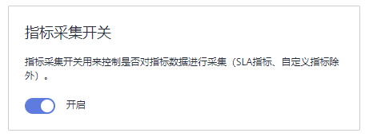

# 指标配置

指标采集开关用来控制是否对指标数据进行采集（SLA指标、自定义指标除外）。

前提条件：弹性云服务器上已安装ICAgent，详细操作请参见[安装ICAgent](安装ICAgent.md)。

1.  登录AOM控制台，选择“配置管理 \> 指标配置”。
2.  开启或者关闭指标采集开关。

    

    > **说明：** 
    >关闭该开关后，会停止指标数据采集，指标数据不再更新。

