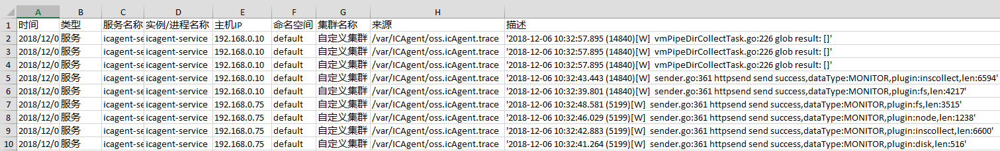

# 搜索日志

当需要通过日志来分析和定位问题时，使用日志搜索功能可帮您快速在海量日志中查询到所需的日志，您还可结合日志的来源信息和上下文原始数据一起辅助定位问题。

1.  登录[应用运维管理](https://console.huaweicloud.com/aom/#/aom/ams/summary)。
2.  在左侧导航栏中选择“日志管理 \> 日志搜索”。
3.  在“日志搜索”页面中按照界面提示设置日志查询条件。
4.  查看日志搜索结果。

    搜索结果中，关键词会高亮显示，同时会根据日志的采集时间对搜索结果进行排序，以方便您查看，排序方式默认为倒序，您可单击“时间”列的进行切换。单击黑色向上三角图标，可按时间正序排序（即时间最新的日志显示在最后方），单击黑色向下三角形图标，可按时间倒序排序（即时间最新的日志显示在最前方）。

    1.  单击日志列表左侧的，可进一步查看该条日志的主机IP、来源等详细信息。
    2.  AOM支持查看上下文信息，您不用在原始日文文件中上下翻页查找日志，单击“操作”列的“上下文”，即可查看该日志的前若干条（即上文）或后若干条（即下文）的日志，方便您定位问题。
        -   在“上下文显示行数”下拉列表框中，可设置该条日志的上下文原始数据显示行数。

            > **说明：**   
            >例如，设置“上下文显示行数”为“200”。  
            >-   若该日志之前已打印的日志条数 ≥100，该日志之后已打印的日志条数 ≥99，则该日志之前的100条和之后的99条日志会被作为上下文显示。  
            >-   若该日志之前已打印的日志条数 <100（例如，已打印90条日志），该日志之后已打印的日志条数 <99（例如，已打印80条日志），则该日志之前的90条和之后的80条日志会被作为上下文显示。  

        -   单击“导出本页”，可将已显示的日志上下文原始数据导出到本地。

    > **说明：**   
    >为了保障租户主机和服务的正常运行，租户的主机上会运行部分系统提供的服务（例如，kube-dns服务）。查询租户日志时也会查询到这些服务的日志。  

5.  （可选）单击“日志搜索”界面右侧的，选择导出格式，将搜索结果导出到本地。

    导出的日志内容已按[4](#li34212241)中您选择的排序方式进行了排序，且最多导出已排序的前5000条日志。例如，搜索结果中总共有6000条日志，已选择的排序方式是倒序，则只能导出时间最近的前5000条日志。

    支持以CSV格式和TXT格式导出日志，您可根据需求灵活选择。CSV格式可导出日志的内容、主机IP、来源等详细信息（如[图1](#fig17700153315202)所示）。TXT格式只能导出日志的内容（如[图2](#fig74285517415)所示），每行为一条日志，如果单条日志内容较多时建议使用Notepad++编辑器打开。

    **图 1**  以CSV格式导出日志  
    

    **图 2**  以TXT格式导出日志  
    

6.  （可选）单击“日志搜索”界面左侧的“配置转储”，可将搜索结果转储到OBS桶中，操作详见[添加日志转储](添加日志转储.md)。

