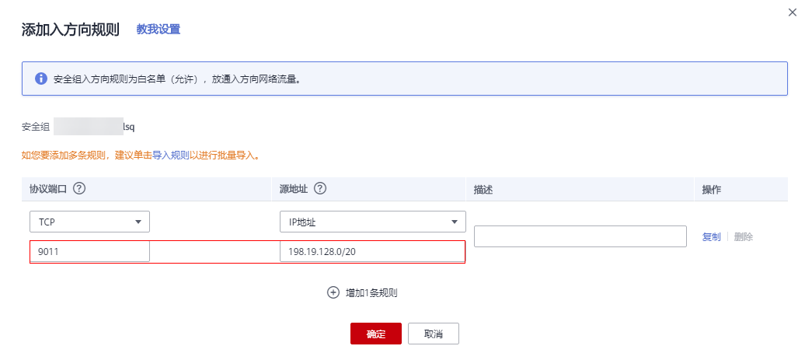

# 数据订阅<a name="aom_02_1013"></a>

AOM支持用户订阅指标或者告警信息，订阅后可以将数据转发到用户配置的kafka或DMS的Topic中，供消费者消费转发的订阅的信息。

> **须知：** 
>最多可创建10个数据订阅规则。

## 创建订阅规则<a name="zh-cn_topic_0255942048_section33138381237"></a>

1.  在左侧导航栏中选择“配置管理 \> 数据订阅”。
2.  单击“创建订阅规则”，设置相关参数后，单击“确定”。

    您可根据实际需求，选择订阅目标类型为“自定义Kafka”或“分布式消息服务DMS”。

    -   订阅目标类型为“自定义Kafka”，请参考[表1](#table17220164915329)配置参数。

        **表 1**  数据订阅规则参数说明

        <a name="table17220164915329"></a>
        <table><thead align="left"><tr id="row021924953211"><th class="cellrowborder" valign="top" width="20%" id="mcps1.2.4.1.1"><p id="p1219249133215"><a name="p1219249133215"></a><a name="p1219249133215"></a>参数</p>
        </th>
        <th class="cellrowborder" valign="top" width="56.75%" id="mcps1.2.4.1.2"><p id="p2021911490327"><a name="p2021911490327"></a><a name="p2021911490327"></a>说明</p>
        </th>
        <th class="cellrowborder" valign="top" width="23.25%" id="mcps1.2.4.1.3"><p id="p19219204917329"><a name="p19219204917329"></a><a name="p19219204917329"></a>示例</p>
        </th>
        </tr>
        </thead>
        <tbody><tr id="row9219149183211"><td class="cellrowborder" valign="top" width="20%" headers="mcps1.2.4.1.1 "><p id="p1521912493325"><a name="p1521912493325"></a><a name="p1521912493325"></a>规则名称</p>
        </td>
        <td class="cellrowborder" valign="top" width="56.75%" headers="mcps1.2.4.1.2 "><p id="p0219104919321"><a name="p0219104919321"></a><a name="p0219104919321"></a>订阅规则名称</p>
        </td>
        <td class="cellrowborder" valign="top" width="23.25%" headers="mcps1.2.4.1.3 "><p id="p13219154913211"><a name="p13219154913211"></a><a name="p13219154913211"></a>输入：aom-kafka-test。</p>
        </td>
        </tr>
        <tr id="row192197495323"><td class="cellrowborder" valign="top" width="20%" headers="mcps1.2.4.1.1 "><p id="p152191949193210"><a name="p152191949193210"></a><a name="p152191949193210"></a>订阅内容</p>
        </td>
        <td class="cellrowborder" valign="top" width="56.75%" headers="mcps1.2.4.1.2 "><p id="p621910496322"><a name="p621910496322"></a><a name="p621910496322"></a>支持“指标”和“告警”。</p>
        </td>
        <td class="cellrowborder" valign="top" width="23.25%" headers="mcps1.2.4.1.3 "><p id="p17219174973215"><a name="p17219174973215"></a><a name="p17219174973215"></a>选择：指标。</p>
        </td>
        </tr>
        <tr id="row1821913497329"><td class="cellrowborder" valign="top" width="20%" headers="mcps1.2.4.1.1 "><p id="p421914933218"><a name="p421914933218"></a><a name="p421914933218"></a>订阅目标类型</p>
        </td>
        <td class="cellrowborder" valign="top" width="56.75%" headers="mcps1.2.4.1.2 "><p id="p102191497325"><a name="p102191497325"></a><a name="p102191497325"></a>选择“自定义Kafka”或“分布式消息服务DMS”。</p>
        </td>
        <td class="cellrowborder" valign="top" width="23.25%" headers="mcps1.2.4.1.3 "><p id="p1021913495329"><a name="p1021913495329"></a><a name="p1021913495329"></a>自定义Kafka</p>
        </td>
        </tr>
        <tr id="row1322094918329"><td class="cellrowborder" valign="top" width="20%" headers="mcps1.2.4.1.1 "><p id="p112204498321"><a name="p112204498321"></a><a name="p112204498321"></a>订阅目标连接地址</p>
        </td>
        <td class="cellrowborder" valign="top" width="56.75%" headers="mcps1.2.4.1.2 "><p id="p1622064916324"><a name="p1622064916324"></a><a name="p1622064916324"></a>用户自己的kafka地址，需要打通网络。</p>
        <p id="p2220164910327"><a name="p2220164910327"></a><a name="p2220164910327"></a>格式为逗号分割的ipv4:port。例如: 192.168.0.1:9092,192.168.0.2:9092</p>
        </td>
        <td class="cellrowborder" valign="top" width="23.25%" headers="mcps1.2.4.1.3 "><p id="p1322054923210"><a name="p1322054923210"></a><a name="p1322054923210"></a>根据实际情况填写。</p>
        </td>
        </tr>
        </tbody>
        </table>

        1.  （可选）进入到“规则详情”，单击，配置Kafka SASL\_SSL，参数如[表2](#table17676115813360)所示。

            > **说明：** 
            >AOM当前仅支持Kafka SASL\_SSL安全认证配置，如果目前实例已经开启Kafka SASL\_SSL，请打开此开关。

            **表 2**  配置Kafka SASL\_SSL参数

            <a name="table17676115813360"></a>
            <table><thead align="left"><tr id="row1267510589361"><th class="cellrowborder" valign="top" width="24.14241424142414%" id="mcps1.2.4.1.1"><p id="p467514581369"><a name="p467514581369"></a><a name="p467514581369"></a>参数</p>
            </th>
            <th class="cellrowborder" valign="top" width="42.52425242524252%" id="mcps1.2.4.1.2"><p id="p196751458143612"><a name="p196751458143612"></a><a name="p196751458143612"></a>说明</p>
            </th>
            <th class="cellrowborder" valign="top" width="33.33333333333333%" id="mcps1.2.4.1.3"><p id="p15675175818365"><a name="p15675175818365"></a><a name="p15675175818365"></a>示例</p>
            </th>
            </tr>
            </thead>
            <tbody><tr id="row1467595815360"><td class="cellrowborder" valign="top" width="24.14241424142414%" headers="mcps1.2.4.1.1 "><p id="p1767525815361"><a name="p1767525815361"></a><a name="p1767525815361"></a>用户名</p>
            </td>
            <td class="cellrowborder" valign="top" width="42.52425242524252%" headers="mcps1.2.4.1.2 "><p id="p116751858163617"><a name="p116751858163617"></a><a name="p116751858163617"></a>SASL用户名用于实例访问认证。</p>
            </td>
            <td class="cellrowborder" valign="top" width="33.33333333333333%" headers="mcps1.2.4.1.3 "><p id="p667520584360"><a name="p667520584360"></a><a name="p667520584360"></a>demo</p>
            </td>
            </tr>
            <tr id="row1267513586366"><td class="cellrowborder" valign="top" width="24.14241424142414%" headers="mcps1.2.4.1.1 "><p id="p136751858173614"><a name="p136751858173614"></a><a name="p136751858173614"></a>密码</p>
            </td>
            <td class="cellrowborder" valign="top" width="42.52425242524252%" headers="mcps1.2.4.1.2 "><p id="p12675205843618"><a name="p12675205843618"></a><a name="p12675205843618"></a>SASL密码用于实例访问认证，请妥善管理密码，系统无法获取您设置的密码内容。</p>
            </td>
            <td class="cellrowborder" valign="top" width="33.33333333333333%" headers="mcps1.2.4.1.3 "><p id="p106751958103612"><a name="p106751958103612"></a><a name="p106751958103612"></a>-</p>
            </td>
            </tr>
            <tr id="row767655814364"><td class="cellrowborder" valign="top" width="24.14241424142414%" headers="mcps1.2.4.1.1 "><p id="p1767535815365"><a name="p1767535815365"></a><a name="p1767535815365"></a>客户端证书</p>
            </td>
            <td class="cellrowborder" valign="top" width="42.52425242524252%" headers="mcps1.2.4.1.2 "><p id="p86761858123615"><a name="p86761858123615"></a><a name="p86761858123615"></a>请采用.pem格式的客户端证书</p>
            </td>
            <td class="cellrowborder" valign="top" width="33.33333333333333%" headers="mcps1.2.4.1.3 "><p id="p26761758113613"><a name="p26761758113613"></a><a name="p26761758113613"></a>-</p>
            </td>
            </tr>
            </tbody>
            </table>

        2.  单击“验证并保存自定义Kafka配置信息”，验证自定义Kafka实例连通性。
        3.  选择数据发送topic后，单击“确定”。

    -   订阅目标类型选择“分布式消息服务DMS”，请参考[表3](#table132311349183212)配置参数。

        **表 3**  数据订阅规则参数说明

        <a name="table132311349183212"></a>
        <table><thead align="left"><tr id="row72226496328"><th class="cellrowborder" valign="top" width="20%" id="mcps1.2.4.1.1"><p id="p20220104915322"><a name="p20220104915322"></a><a name="p20220104915322"></a>参数</p>
        </th>
        <th class="cellrowborder" valign="top" width="56.42%" id="mcps1.2.4.1.2"><p id="p32211049163213"><a name="p32211049163213"></a><a name="p32211049163213"></a>说明</p>
        </th>
        <th class="cellrowborder" valign="top" width="23.580000000000002%" id="mcps1.2.4.1.3"><p id="p3222154963212"><a name="p3222154963212"></a><a name="p3222154963212"></a>示例</p>
        </th>
        </tr>
        </thead>
        <tbody><tr id="row922534911324"><td class="cellrowborder" valign="top" width="20%" headers="mcps1.2.4.1.1 "><p id="p11223174913218"><a name="p11223174913218"></a><a name="p11223174913218"></a>规则名称</p>
        </td>
        <td class="cellrowborder" valign="top" width="56.42%" headers="mcps1.2.4.1.2 "><p id="p182242049143219"><a name="p182242049143219"></a><a name="p182242049143219"></a>订阅规则名称</p>
        </td>
        <td class="cellrowborder" valign="top" width="23.580000000000002%" headers="mcps1.2.4.1.3 "><p id="p12224949173216"><a name="p12224949173216"></a><a name="p12224949173216"></a>输入：aom-kafka-test。</p>
        </td>
        </tr>
        <tr id="row12228154973214"><td class="cellrowborder" valign="top" width="20%" headers="mcps1.2.4.1.1 "><p id="p32251049203217"><a name="p32251049203217"></a><a name="p32251049203217"></a>订阅内容</p>
        </td>
        <td class="cellrowborder" valign="top" width="56.42%" headers="mcps1.2.4.1.2 "><p id="p3226649113211"><a name="p3226649113211"></a><a name="p3226649113211"></a>支持“指标”和“告警”。</p>
        </td>
        <td class="cellrowborder" valign="top" width="23.580000000000002%" headers="mcps1.2.4.1.3 "><p id="p6227149133219"><a name="p6227149133219"></a><a name="p6227149133219"></a>选择：指标。</p>
        </td>
        </tr>
        <tr id="row102312499322"><td class="cellrowborder" valign="top" width="20%" headers="mcps1.2.4.1.1 "><p id="p92281495327"><a name="p92281495327"></a><a name="p92281495327"></a>订阅目标类型</p>
        </td>
        <td class="cellrowborder" valign="top" width="56.42%" headers="mcps1.2.4.1.2 "><p id="p9228144914327"><a name="p9228144914327"></a><a name="p9228144914327"></a>选择“自定义Kafka”或“分布式消息服务DMS”。</p>
        </td>
        <td class="cellrowborder" valign="top" width="23.580000000000002%" headers="mcps1.2.4.1.3 "><p id="p823184910329"><a name="p823184910329"></a><a name="p823184910329"></a>分布式消息服务DMS</p>
        </td>
        </tr>
        <tr id="row13231164914322"><td class="cellrowborder" valign="top" width="20%" headers="mcps1.2.4.1.1 "><p id="p323134914327"><a name="p323134914327"></a><a name="p323134914327"></a>实例</p>
        </td>
        <td class="cellrowborder" valign="top" width="56.42%" headers="mcps1.2.4.1.2 "><p id="p1923112496326"><a name="p1923112496326"></a><a name="p1923112496326"></a>选择DMS实例，如没有DMS实例，请单击“创建DMS实例”，创建DMS实例。</p>
        </td>
        <td class="cellrowborder" valign="top" width="23.580000000000002%" headers="mcps1.2.4.1.3 "><p id="p1401198354"><a name="p1401198354"></a><a name="p1401198354"></a>kafka-aom-7160</p>
        </td>
        </tr>
        </tbody>
        </table>

        1.  进入到“规则详情”，单击“创建网络连接通道”。
        2.  验证DMS实例连通性。

            您需要确保在安全组"入方向规则"中，放通9011端口，源地址为"198.19.128.0/20"的网络流量。设置安全组规则操作如下：

            1.  登录管理控制台。
            2.  在左侧导航栏，单击，选择“网络 \> 虚拟私有云“。
            3.  在左侧导航栏单击“访问控制 \> 安全组“，在使用DMS所在的安全组右侧，单击“配置规则”。
            4.  在“入方向规则”页签下，单击“添加规则”，放通9011端口、源地址为“198.19.128.0/20”的网络流量。

                

        3.  输入DMS用户名和密码。
        4.  单击“验证并保存DMS配置信息”。
        5.  选择数据发送topic后，单击“确定”。


## 数据订阅格式说明<a name="section6390183912460"></a>

-   AOM格式的指标JSON格式代码片断

    ```
    package metric
    
    type MetricDatas struct {
       Metrics   []Metrics `json:"metrics"`
       ProjectId string    `json:"project_id"`
    }
    
    type Metrics struct {
       Metric      Metric  `json:"metric"`
       Values      []Value `json:"values"`
       CollectTime int64   `json:"collect_time"`
    }
    
    type Metric struct {
       Namespace  string      `json:"namespace"`
       Dimensions []Dimension `json:"dimensions"`
    }
    
    type Value struct {
       Value           interface{} `json:"value"`
       Type            string      `json:"type"`
       Unit            string      `json:"unit"`
       StatisticValues string      `json:"statisticvalues"`
       MetricName      string      `json:"metric_name"`
    }
    
    type Dimension struct {
       Name  string `json:"name"`
       Value string `json:"value"`
    }
    
    ```

-   kafka消息示例

    ```
    key:,
    value:{"metrics":[{"metric":{"namespace":"PAAS.NODE","dimensions":[{"name":"nodeName","value":"cn-north-4-vss-cop-master-1"},{"name":"nodeIP","value":"1.1.1.1"},{"name":"hostID","value":"75d97111-4734-4c6c-ae9e-f6111111111"},{"name":"nameSpace","value":"default"},{"name":"clusterId","value":"46a7bc0d-1d8b-11ea-9b04-333333333333333"},{"name":"clusterName","value":"cn-north-4-vss-111"},{"name":"diskDevice","value":"vda"},{"name":"master","value":"true"}]},"values":[{"value":0,"type":"","unit":"Kilobytes/Second","statisticvalues":"","metric_name":"diskReadRate"},{"value":30.267,"type":"","unit":"Kilobytes/Second","statisticvalues":"","metric_name":"diskWriteRate"}],"collect_time":1597821030037}],"project_id":"111111111111111111111"}
    ```

-   告警数据格式说明

    示例：

    ```
    {
        "events": [{
            "id": "4346299651651991683",
            "starts_at": 1597822250194,
            "ends_at": 0,
            "arrives_at": 1597822250194,
            "timeout": 300000,
            "resource_group_id": "312313123112222222222232131312131",
            "metadata": {
                "kind": "Pod",
                "event_severity": "Major",
                "resource_type": "service",
                "clusterId": "6add4ef5-1358-11ea-a5bf-111111111",
                "event_type": "alarm",
                "clusterName": "cce-ief-4516140c-96ca-4a5f-8d85-1111111",
                "namespace": "PAAS.NODE",
                "name": "test15769793809553052-f5557bd7f-qnfkm",
                "event_name": "调度失败##FailedScheduling",
                "resource_id": "clusterName=cce-ief-4516140c-96ca-4a5f-8d85-111111;clusterID=6add4ef5-1358-11ea-a5bf-11111111111;kind=Pod;namespace=30d5758f166947c6b164af604a654b09;name=test15769793809553052-f5557bd7f-qnfkm;uid=589fc746-245d-11ea-a465-fa163e5fc15d",
                "nameSpace": "30d5758f166947c6b164af604a654b09",
                "resource_provider": "CCE",
                "nodeID": "589fc746-245d-11ea-a465-fa163e5fc15d"
            },
            "annotations": {
                "alarm_probableCause_zh_cn": "FailedScheduling",
                "alarm_probableCause_en_us": "FailedScheduling",
                "message": "0/110 nodes are available: 1 node(s) had taints that the pod didn't tolerate, 109 node(s) didn't match node selector."
            },
            "attach_rule": {
                
            }
        }],
        "project_id": "312313123112222222222232131312131"
    }
    ```

    参数说明：

    **表 4**  告警参数

    <a name="table181901229105812"></a>
    <table><thead align="left"><tr id="row425452912587"><th class="cellrowborder" valign="top" width="20%" id="mcps1.2.4.1.1"><p id="p18254102935817"><a name="p18254102935817"></a><a name="p18254102935817"></a>参数</p>
    </th>
    <th class="cellrowborder" valign="top" width="20%" id="mcps1.2.4.1.2"><p id="p13254112925813"><a name="p13254112925813"></a><a name="p13254112925813"></a>参数类型</p>
    </th>
    <th class="cellrowborder" valign="top" width="60%" id="mcps1.2.4.1.3"><p id="p172542299587"><a name="p172542299587"></a><a name="p172542299587"></a>描述</p>
    </th>
    </tr>
    </thead>
    <tbody><tr id="row1225462915582"><td class="cellrowborder" valign="top" width="20%" headers="mcps1.2.4.1.1 "><p id="p1525432919585"><a name="p1525432919585"></a><a name="p1525432919585"></a>events</p>
    </td>
    <td class="cellrowborder" valign="top" width="20%" headers="mcps1.2.4.1.2 "><p id="p132541829155815"><a name="p132541829155815"></a><a name="p132541829155815"></a>Array ofobjects，详见 <a href="#table81981529165813">表5</a>。</p>
    </td>
    <td class="cellrowborder" valign="top" width="60%" headers="mcps1.2.4.1.3 "><p id="p10254152985815"><a name="p10254152985815"></a><a name="p10254152985815"></a>事件或者告警详情。</p>
    </td>
    </tr>
    <tr id="row76921156014"><td class="cellrowborder" valign="top" width="20%" headers="mcps1.2.4.1.1 "><p id="p1366101311010"><a name="p1366101311010"></a><a name="p1366101311010"></a>project_id</p>
    </td>
    <td class="cellrowborder" valign="top" width="20%" headers="mcps1.2.4.1.2 "><p id="p136937513011"><a name="p136937513011"></a><a name="p136937513011"></a>String</p>
    </td>
    <td class="cellrowborder" valign="top" width="60%" headers="mcps1.2.4.1.3 "><p id="p16931451606"><a name="p16931451606"></a><a name="p16931451606"></a>租户从IAM申请到的projectid，一般为32位字符串。</p>
    </td>
    </tr>
    </tbody>
    </table>

    **表 5**  EventModel

    <a name="table81981529165813"></a>
    <table><thead align="left"><tr id="row72542293587"><th class="cellrowborder" valign="top" width="20%" id="mcps1.2.4.1.1"><p id="p7254329115814"><a name="p7254329115814"></a><a name="p7254329115814"></a>参数</p>
    </th>
    <th class="cellrowborder" valign="top" width="20%" id="mcps1.2.4.1.2"><p id="p11254172915811"><a name="p11254172915811"></a><a name="p11254172915811"></a>参数类型</p>
    </th>
    <th class="cellrowborder" valign="top" width="60%" id="mcps1.2.4.1.3"><p id="p11254112915818"><a name="p11254112915818"></a><a name="p11254112915818"></a>描述</p>
    </th>
    </tr>
    </thead>
    <tbody><tr id="row847943417110"><td class="cellrowborder" valign="top" width="20%" headers="mcps1.2.4.1.1 "><p id="p5555635212"><a name="p5555635212"></a><a name="p5555635212"></a>id</p>
    </td>
    <td class="cellrowborder" valign="top" width="20%" headers="mcps1.2.4.1.2 "><p id="p11555635317"><a name="p11555635317"></a><a name="p11555635317"></a>String</p>
    </td>
    <td class="cellrowborder" valign="top" width="60%" headers="mcps1.2.4.1.3 "><p id="p1055520351519"><a name="p1055520351519"></a><a name="p1055520351519"></a>事件或者告警id，系统自动生成。</p>
    </td>
    </tr>
    <tr id="row325482965815"><td class="cellrowborder" valign="top" width="20%" headers="mcps1.2.4.1.1 "><p id="p112540290585"><a name="p112540290585"></a><a name="p112540290585"></a>starts_at</p>
    </td>
    <td class="cellrowborder" valign="top" width="20%" headers="mcps1.2.4.1.2 "><p id="p1025472955814"><a name="p1025472955814"></a><a name="p1025472955814"></a>Long</p>
    </td>
    <td class="cellrowborder" valign="top" width="60%" headers="mcps1.2.4.1.3 "><p id="p172549293587"><a name="p172549293587"></a><a name="p172549293587"></a>事件或者告警产生的时间，CST毫秒级时间戳。</p>
    </td>
    </tr>
    <tr id="row16254192945815"><td class="cellrowborder" valign="top" width="20%" headers="mcps1.2.4.1.1 "><p id="p182547292588"><a name="p182547292588"></a><a name="p182547292588"></a>ends_at</p>
    </td>
    <td class="cellrowborder" valign="top" width="20%" headers="mcps1.2.4.1.2 "><p id="p82545299585"><a name="p82545299585"></a><a name="p82545299585"></a>Long</p>
    </td>
    <td class="cellrowborder" valign="top" width="60%" headers="mcps1.2.4.1.3 "><p id="p16254132945817"><a name="p16254132945817"></a><a name="p16254132945817"></a>事件或者告警清除的时间，CST毫秒级时间戳，为0时表示未删除。</p>
    </td>
    </tr>
    <tr id="row37210511536"><td class="cellrowborder" valign="top" width="20%" headers="mcps1.2.4.1.1 "><p id="p184236591630"><a name="p184236591630"></a><a name="p184236591630"></a>arrives_at</p>
    </td>
    <td class="cellrowborder" valign="top" width="20%" headers="mcps1.2.4.1.2 "><p id="p17215117310"><a name="p17215117310"></a><a name="p17215117310"></a>Long</p>
    </td>
    <td class="cellrowborder" valign="top" width="60%" headers="mcps1.2.4.1.3 "><p id="p0729514312"><a name="p0729514312"></a><a name="p0729514312"></a>事件或者告警到达AOM的时间，CST毫秒级时间戳。</p>
    </td>
    </tr>
    <tr id="row0254102995814"><td class="cellrowborder" valign="top" width="20%" headers="mcps1.2.4.1.1 "><p id="p62541629105819"><a name="p62541629105819"></a><a name="p62541629105819"></a>timeout</p>
    </td>
    <td class="cellrowborder" valign="top" width="20%" headers="mcps1.2.4.1.2 "><p id="p4254122917586"><a name="p4254122917586"></a><a name="p4254122917586"></a>Long</p>
    </td>
    <td class="cellrowborder" valign="top" width="60%" headers="mcps1.2.4.1.3 "><p id="p225442945815"><a name="p225442945815"></a><a name="p225442945815"></a>告警自动清除时间。毫秒数，例如一分钟则填写为60000。默认清除时间为3天。</p>
    </td>
    </tr>
    <tr id="row129111228142"><td class="cellrowborder" valign="top" width="20%" headers="mcps1.2.4.1.1 "><p id="p58795291948"><a name="p58795291948"></a><a name="p58795291948"></a>resource_group_id</p>
    </td>
    <td class="cellrowborder" valign="top" width="20%" headers="mcps1.2.4.1.2 "><p id="p78141538161812"><a name="p78141538161812"></a><a name="p78141538161812"></a>String</p>
    </td>
    <td class="cellrowborder" valign="top" width="60%" headers="mcps1.2.4.1.3 "><p id="p12911728943"><a name="p12911728943"></a><a name="p12911728943"></a>资源组预留字段，当前默认和projectid的值一样。</p>
    </td>
    </tr>
    <tr id="row7254229115813"><td class="cellrowborder" valign="top" width="20%" headers="mcps1.2.4.1.1 "><p id="p102541129175813"><a name="p102541129175813"></a><a name="p102541129175813"></a>metadata</p>
    </td>
    <td class="cellrowborder" valign="top" width="20%" headers="mcps1.2.4.1.2 "><p id="p7254152918584"><a name="p7254152918584"></a><a name="p7254152918584"></a>Object</p>
    </td>
    <td class="cellrowborder" valign="top" width="60%" headers="mcps1.2.4.1.3 "><p id="p192546294584"><a name="p192546294584"></a><a name="p192546294584"></a>事件或者告警的详细信息，为键值对形式。必须字段为：</p>
    <a name="ul14254122965816"></a><a name="ul14254122965816"></a><ul id="ul14254122965816"><li>event_name：事件或者告警名称,类型为String；</li><li>event_severity：事件级别枚举值。类型为String，四种类型 "Critical", "Major", "Minor", "Info"；</li><li>event_type：事件类别枚举值。类型为String，event为普通告警，alarm为告警事件；</li><li>resource_provider：事件对应云服务名称。类型为String；</li><li>resource_type：事件对应资源类型。类型为String；</li><li>resource_id：事件对应资源信息。类型为String。</li></ul>
    </td>
    </tr>
    <tr id="row16254629135817"><td class="cellrowborder" valign="top" width="20%" headers="mcps1.2.4.1.1 "><p id="p12254629105812"><a name="p12254629105812"></a><a name="p12254629105812"></a>annotations</p>
    </td>
    <td class="cellrowborder" valign="top" width="20%" headers="mcps1.2.4.1.2 "><p id="p92546290584"><a name="p92546290584"></a><a name="p92546290584"></a>Object</p>
    </td>
    <td class="cellrowborder" valign="top" width="60%" headers="mcps1.2.4.1.3 "><p id="p102541829135811"><a name="p102541829135811"></a><a name="p102541829135811"></a>事件或者告警附加字段，可以为空。</p>
    </td>
    </tr>
    <tr id="row162541629155819"><td class="cellrowborder" valign="top" width="20%" headers="mcps1.2.4.1.1 "><p id="p162541293589"><a name="p162541293589"></a><a name="p162541293589"></a>attach_rule</p>
    </td>
    <td class="cellrowborder" valign="top" width="20%" headers="mcps1.2.4.1.2 "><p id="p1125432917583"><a name="p1125432917583"></a><a name="p1125432917583"></a>Object</p>
    </td>
    <td class="cellrowborder" valign="top" width="60%" headers="mcps1.2.4.1.3 "><p id="p5254129175810"><a name="p5254129175810"></a><a name="p5254129175810"></a>事件或者告警预留字段，为空。</p>
    </td>
    </tr>
    </tbody>
    </table>


## 后续操作<a name="zh-cn_topic_0255942048_section62341343181110"></a>

数据订阅规则设置完成后，AOM会将数据发到配置的kafka或DMS的Topic中，您可以消费订阅的指标或者告警信息。

