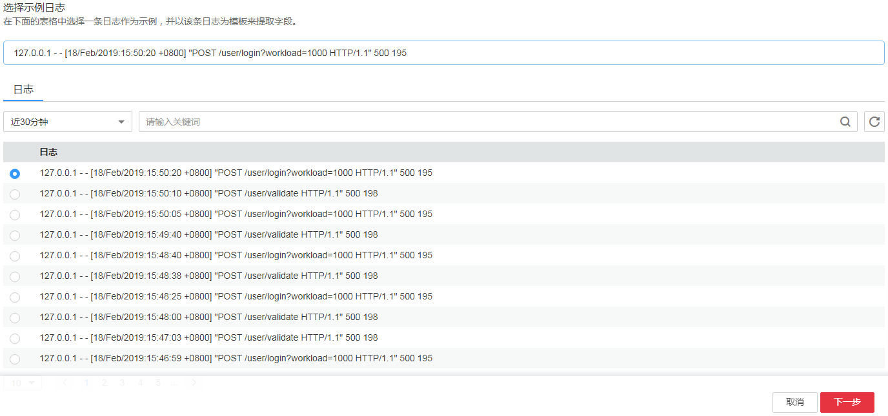

# 日志结构化<a name="aom_02_0086"></a>

该功能仅对华北-北京一、华东-上海二和华南-广州区域生效。

数据可分为结构化数据和非结构化数据。结构化数据指能够用数字或统一的数据模型加以描述的数据，具有严格的长度和格式。非结构化数据指不便于用数据库二维逻辑表来表现的数据，数据结构不规则或不完整，没有预定义的数据模型。

日志结构化是以日志桶为单位，通过提取规则将日志桶中的日志进行结构化，提取出有固定格式或相似度较高的日志，过滤掉不相关的日志。

## 注意事项<a name="section74319485525"></a>

-   日志结构化是以日志桶为单位，请先创建一个日志桶，操作详见[添加日志桶](添加日志桶.md)。
-   日志桶中的大部分日志需有一定的规则，否则结构化是无意义的。
-   每个日志桶只能添加一个提取规则，可单击“编辑规则”进行修改，或单击“删除规则”删除后重新添加。

## 结构化原始日志<a name="section16513131511247"></a>

通过对日志桶添加提取规则将日志桶中的原始日志按一定的规律进行提取，并将提取后的日志整合到一起，以便进行SQL查询与分析。

下面以Tomcat服务器的原始日志为例进行结构化：

1.  登录AOM控制台，在左侧导航栏中选择“日志管理 \> 日志结构化”。
2.  结构化是以日志桶为单位，请先创建一个日志桶，操作详见[添加日志桶](添加日志桶.md)。若您已创建过日志桶，请跳过该步骤。

    日志桶创建完成后，日志桶信息将自动同步至“日志结构化”界面，如下图所示。

    **图 1**  日志桶<a name="fig1048813575488"></a>  
    

3.  在“日志结构化”界面，选择目标日志桶，单击“添加提取规则”。
4.  选择示例日志：通过时间和关键词对日志桶中的原始日志进行查询与分析，初步找出可结构化的日志内容，然后选择一条比较典型的日志作为示例日志。

    如下图所示，可看到日志桶中的日志的内容比较规整，初步找出了待结构化的字段：IP、日期、方法、url、版本、返回码、请求大小，在日志列表中选中第一条日志前的单选框，即将第一行内容作为了示例日志，然后单击“下一步”。

    **图 2**  选择示例日志<a name="fig8135135015539"></a>  
    

5.  选择提取方法。

    -   正则表达式：使用正则表达式提取字段。
    -   特殊字符（暂不支持）：使用分隔符（例如：逗号、空格或字符）提取字段。

    **图 3**  选择提取方法<a name="fig185113104438"></a>  
    

6.  选择字段。

    在示例日志中，选中待结构化的日志内容，在弹出的对话框中为选中内容设置一个名称。如下图所示，依次提取出ip、date、method、url、version、code、size字段。

    若某条原始日志不符合提取规则，则无法进行提取，只显示原始日志。

    **图 4**  选择字段<a name="fig79258591591"></a>  
    

7.  单击“下一步”，确认无误后单击“确认”。完成日志结构化。

    这样已对Tomcat服务器的原始日志进行了结构化，结构化后的日志数据可理解为数据库中的二维表，接下来就可以使用SQL语句对ip、date、method、url、version、code、size字段进行查询与分析。


## SQL查询与分析<a name="section313011674316"></a>

对原始日志结构化后，等待1\~2分钟左右即可对结构化后的日志进行SQL查询与分析。

下面以Tomcat服务器结构化后的日志为例进行SQL查询与分析，定位出Tomcat服务器运行异常的原因。

1.  在左侧导航栏中选择“日志管理 \> 日志桶”。
2.  SQL查询也是以日志桶为单位，请在“桶日志”页签选择目标日志桶，然后单击“结构化日志”。

    **图 5**  结构化后的日志<a name="fig12389145618114"></a>  
    

3.  SQL查询与分析：设置时间范围和查询条件。查询条件请输入SQL语句，目前AOM支持的SQL语句详见[SQL查询语法](#section128657218189)。

    例如，需查询近6小时内HTTP返回码大于等于500的请求数，则可执行如下操作：

    在右上角的下拉列表框选择“近6小时”，在搜索框中输入SQL语句：select count\(\*\) where code \>= 500，如[图6](#fig089711264397)所示 。

    > **说明：**   
    >-   对于常用的、复杂的SQL语句，可单击创建统计规则，操作详见[创建统计规则](创建统计规则.md)。在后续查询时，不用再在文本框中手动输入，直接单击文本框，选择对应的统计规则及其SQL语句，即可自动输入。同时，统计规则创建成功后，AOM会对SQL语句返回的值进行统计并生成指标，可通过指标图表查看数据的走势。  
    >-   如果SQL语句返回的是单个数值，例如：select count\(\*\) where code \>= 500，则支持创建统计规则；如果SQL语句返回的是多个值，例如：select count\(\*\) group by ip，则不支持创建统计规则。  

    **图 6**  使用SQL语句进行查询<a name="fig089711264397"></a>  
    


## SQL查询语法<a name="section128657218189"></a>

AOM支持使用SQL语句（其中包括了聚合函数和数学函数）对结构化后的日志进行查询与分析。例如，使用MIN函数计算num列中的最小值。

-   **SQL语句**

    目前支持的SQL语句如[表1](#table1278194792517)所示。

    **表 1**  SQL语句说明

    <a name="table1278194792517"></a>
    <table><thead align="left"><tr id="row15276184714253"><th class="cellrowborder" valign="top" width="33.339999999999996%" id="mcps1.2.4.1.1"><p id="p127654752514"><a name="p127654752514"></a><a name="p127654752514"></a>语句</p>
    </th>
    <th class="cellrowborder" valign="top" width="33.33%" id="mcps1.2.4.1.2"><p id="p827611475251"><a name="p827611475251"></a><a name="p827611475251"></a>说明</p>
    </th>
    <th class="cellrowborder" valign="top" width="33.33%" id="mcps1.2.4.1.3"><p id="p102761047192515"><a name="p102761047192515"></a><a name="p102761047192515"></a>示例</p>
    </th>
    </tr>
    </thead>
    <tbody><tr id="row12276154714255"><td class="cellrowborder" valign="top" width="33.339999999999996%" headers="mcps1.2.4.1.1 "><p id="p1027615471253"><a name="p1027615471253"></a><a name="p1027615471253"></a>AS</p>
    </td>
    <td class="cellrowborder" valign="top" width="33.33%" headers="mcps1.2.4.1.2 "><p id="p1127616479252"><a name="p1127616479252"></a><a name="p1127616479252"></a>用于对列名进行重命名。</p>
    </td>
    <td class="cellrowborder" valign="top" width="33.33%" headers="mcps1.2.4.1.3 "><p id="p2276847202514"><a name="p2276847202514"></a><a name="p2276847202514"></a>select day as day1 , month as month1</p>
    </td>
    </tr>
    <tr id="row1227612475256"><td class="cellrowborder" valign="top" width="33.339999999999996%" headers="mcps1.2.4.1.1 "><p id="p1627674714253"><a name="p1627674714253"></a><a name="p1627674714253"></a>BETWEEN</p>
    </td>
    <td class="cellrowborder" valign="top" width="33.33%" headers="mcps1.2.4.1.2 "><p id="p14276124772510"><a name="p14276124772510"></a><a name="p14276124772510"></a>在WHERE子句中使用，用于选取介于两个值之间的数据范围，这些值可以是数值、文本或者日期。</p>
    </td>
    <td class="cellrowborder" valign="top" width="33.33%" headers="mcps1.2.4.1.3 "><p id="p1227615476254"><a name="p1227615476254"></a><a name="p1227615476254"></a>select * where day between 0 and 20</p>
    </td>
    </tr>
    <tr id="row927754718256"><td class="cellrowborder" valign="top" width="33.339999999999996%" headers="mcps1.2.4.1.1 "><p id="p132761147172519"><a name="p132761147172519"></a><a name="p132761147172519"></a>COUNT DISTINCT</p>
    </td>
    <td class="cellrowborder" valign="top" width="33.33%" headers="mcps1.2.4.1.2 "><p id="p202761647122516"><a name="p202761647122516"></a><a name="p202761647122516"></a>用于查询某列去重后值的个数。</p>
    </td>
    <td class="cellrowborder" valign="top" width="33.33%" headers="mcps1.2.4.1.3 "><p id="p427734792512"><a name="p427734792512"></a><a name="p427734792512"></a>select count(distinct name)</p>
    </td>
    </tr>
    <tr id="row027784732517"><td class="cellrowborder" valign="top" width="33.339999999999996%" headers="mcps1.2.4.1.1 "><p id="p18277174732513"><a name="p18277174732513"></a><a name="p18277174732513"></a>GROUP BY</p>
    </td>
    <td class="cellrowborder" valign="top" width="33.33%" headers="mcps1.2.4.1.2 "><p id="p1427711475256"><a name="p1427711475256"></a><a name="p1427711475256"></a>根据一个或多个列对结果集进行分组，经常与聚合函数一起使用。</p>
    </td>
    <td class="cellrowborder" valign="top" width="33.33%" headers="mcps1.2.4.1.3 "><p id="p162771347192518"><a name="p162771347192518"></a><a name="p162771347192518"></a>select * group by (year),(month)</p>
    </td>
    </tr>
    <tr id="row02771476258"><td class="cellrowborder" valign="top" width="33.339999999999996%" headers="mcps1.2.4.1.1 "><p id="p162770477254"><a name="p162770477254"></a><a name="p162770477254"></a>LIKE</p>
    </td>
    <td class="cellrowborder" valign="top" width="33.33%" headers="mcps1.2.4.1.2 "><p id="p727764712518"><a name="p727764712518"></a><a name="p727764712518"></a>在WHERE子句中搜索列中的指定模式。</p>
    </td>
    <td class="cellrowborder" valign="top" width="33.33%" headers="mcps1.2.4.1.3 "><p id="p2277647102512"><a name="p2277647102512"></a><a name="p2277647102512"></a>select * where name like 'zhang%'</p>
    </td>
    </tr>
    <tr id="row1277547102519"><td class="cellrowborder" valign="top" width="33.339999999999996%" headers="mcps1.2.4.1.1 "><p id="p527714742512"><a name="p527714742512"></a><a name="p527714742512"></a>ORDER BY</p>
    </td>
    <td class="cellrowborder" valign="top" width="33.33%" headers="mcps1.2.4.1.2 "><p id="p1094913142911"><a name="p1094913142911"></a><a name="p1094913142911"></a>用于对某列进行排序，同时支持多列排序。</p>
    </td>
    <td class="cellrowborder" valign="top" width="33.33%" headers="mcps1.2.4.1.3 "><p id="p102771747122512"><a name="p102771747122512"></a><a name="p102771747122512"></a>select * order by num asc</p>
    </td>
    </tr>
    <tr id="row16278047102519"><td class="cellrowborder" valign="top" width="33.339999999999996%" headers="mcps1.2.4.1.1 "><p id="p3277154782511"><a name="p3277154782511"></a><a name="p3277154782511"></a>WHERE</p>
    </td>
    <td class="cellrowborder" valign="top" width="33.33%" headers="mcps1.2.4.1.2 "><p id="p1327764711257"><a name="p1327764711257"></a><a name="p1327764711257"></a>用于规定选择的标准。</p>
    </td>
    <td class="cellrowborder" valign="top" width="33.33%" headers="mcps1.2.4.1.3 "><p id="p182771847142512"><a name="p182771847142512"></a><a name="p182771847142512"></a>select * where num &gt; 11 or num &lt;= 10</p>
    </td>
    </tr>
    </tbody>
    </table>


-   **聚合函数**

    聚合函数是对结构化后的日志的指定列进行的统计运算。聚合函数返回的是单个值，经常与SELECT语句和GROUP BY语句一起使用。AOM目前支持的聚合函数如[表2](#table375052617212)所示。

    **表 2**  聚合函数说明

    <a name="table375052617212"></a>
    <table><thead align="left"><tr id="row8752626722"><th class="cellrowborder" valign="top" width="33.33333333333333%" id="mcps1.2.4.1.1"><p id="p375242614213"><a name="p375242614213"></a><a name="p375242614213"></a>函数</p>
    </th>
    <th class="cellrowborder" valign="top" width="33.33333333333333%" id="mcps1.2.4.1.2"><p id="p1752226922"><a name="p1752226922"></a><a name="p1752226922"></a>含义</p>
    </th>
    <th class="cellrowborder" valign="top" width="33.33333333333333%" id="mcps1.2.4.1.3"><p id="p375292616213"><a name="p375292616213"></a><a name="p375292616213"></a>示例</p>
    </th>
    </tr>
    </thead>
    <tbody><tr id="row15393711143413"><td class="cellrowborder" valign="top" width="33.33333333333333%" headers="mcps1.2.4.1.1 "><p id="p775272610215"><a name="p775272610215"></a><a name="p775272610215"></a>count(*)</p>
    </td>
    <td class="cellrowborder" valign="top" width="33.33333333333333%" headers="mcps1.2.4.1.2 "><p id="p107521726623"><a name="p107521726623"></a><a name="p107521726623"></a>计算元组的个数。</p>
    </td>
    <td class="cellrowborder" valign="top" width="33.33333333333333%" headers="mcps1.2.4.1.3 "><p id="p475222614218"><a name="p475222614218"></a><a name="p475222614218"></a>select count(*)</p>
    </td>
    </tr>
    <tr id="row117524261423"><td class="cellrowborder" valign="top" width="33.33333333333333%" headers="mcps1.2.4.1.1 "><p id="p57523267213"><a name="p57523267213"></a><a name="p57523267213"></a>count(&lt;列名&gt;)</p>
    </td>
    <td class="cellrowborder" valign="top" width="33.33333333333333%" headers="mcps1.2.4.1.2 "><p id="p3752182618214"><a name="p3752182618214"></a><a name="p3752182618214"></a>计算一列值的个数。</p>
    </td>
    <td class="cellrowborder" valign="top" width="33.33333333333333%" headers="mcps1.2.4.1.3 "><p id="p8752026426"><a name="p8752026426"></a><a name="p8752026426"></a>select count(num)</p>
    </td>
    </tr>
    <tr id="row109710131494"><td class="cellrowborder" valign="top" width="33.33333333333333%" headers="mcps1.2.4.1.1 "><p id="p137521026921"><a name="p137521026921"></a><a name="p137521026921"></a>min(&lt;列名&gt;)</p>
    </td>
    <td class="cellrowborder" valign="top" width="33.33333333333333%" headers="mcps1.2.4.1.2 "><p id="p775282613211"><a name="p775282613211"></a><a name="p775282613211"></a>计算一列值的最小值。</p>
    </td>
    <td class="cellrowborder" valign="top" width="33.33333333333333%" headers="mcps1.2.4.1.3 "><p id="p11752112614213"><a name="p11752112614213"></a><a name="p11752112614213"></a>select min(num)</p>
    </td>
    </tr>
    <tr id="row19349174641611"><td class="cellrowborder" valign="top" width="33.33333333333333%" headers="mcps1.2.4.1.1 "><p id="p18262105171619"><a name="p18262105171619"></a><a name="p18262105171619"></a>max(&lt;列名&gt;)</p>
    </td>
    <td class="cellrowborder" valign="top" width="33.33333333333333%" headers="mcps1.2.4.1.2 "><p id="p122659515169"><a name="p122659515169"></a><a name="p122659515169"></a>计算一列值的最大值。</p>
    </td>
    <td class="cellrowborder" valign="top" width="33.33333333333333%" headers="mcps1.2.4.1.3 "><p id="p32682051141614"><a name="p32682051141614"></a><a name="p32682051141614"></a>select max(num)</p>
    </td>
    </tr>
    <tr id="row47521261623"><td class="cellrowborder" valign="top" width="33.33333333333333%" headers="mcps1.2.4.1.1 "><p id="p9752326323"><a name="p9752326323"></a><a name="p9752326323"></a>avg(&lt;列名&gt;)</p>
    </td>
    <td class="cellrowborder" valign="top" width="33.33333333333333%" headers="mcps1.2.4.1.2 "><p id="p675218261220"><a name="p675218261220"></a><a name="p675218261220"></a>计算一列值的平均值。</p>
    </td>
    <td class="cellrowborder" valign="top" width="33.33333333333333%" headers="mcps1.2.4.1.3 "><p id="p57524267218"><a name="p57524267218"></a><a name="p57524267218"></a>select avg(num)</p>
    </td>
    </tr>
    <tr id="row1944452618917"><td class="cellrowborder" valign="top" width="33.33333333333333%" headers="mcps1.2.4.1.1 "><p id="p07521626725"><a name="p07521626725"></a><a name="p07521626725"></a>sum(&lt;列名&gt;)</p>
    </td>
    <td class="cellrowborder" valign="top" width="33.33333333333333%" headers="mcps1.2.4.1.2 "><p id="p975219261723"><a name="p975219261723"></a><a name="p975219261723"></a>计算一列值的总和。</p>
    </td>
    <td class="cellrowborder" valign="top" width="33.33333333333333%" headers="mcps1.2.4.1.3 "><p id="p4752102615212"><a name="p4752102615212"></a><a name="p4752102615212"></a>select sum(num)</p>
    </td>
    </tr>
    <tr id="row1364105161920"><td class="cellrowborder" valign="top" width="33.33333333333333%" headers="mcps1.2.4.1.1 "><p id="p675213261821"><a name="p675213261821"></a><a name="p675213261821"></a>stats(&lt;列名&gt;)</p>
    </td>
    <td class="cellrowborder" valign="top" width="33.33333333333333%" headers="mcps1.2.4.1.2 "><p id="p375219262213"><a name="p375219262213"></a><a name="p375219262213"></a>分别计算一列值的个数、最小值、最大值、平均值和总和。</p>
    </td>
    <td class="cellrowborder" valign="top" width="33.33333333333333%" headers="mcps1.2.4.1.3 "><p id="p197523261926"><a name="p197523261926"></a><a name="p197523261926"></a>select stats(num)</p>
    </td>
    </tr>
    </tbody>
    </table>

-   **数学函数**

    数学函数是对结构化后的日志的指定列进行的数学运算。数学函数返回的是多个值，支持+ - \* / %运算符，经常与SELECT语句一起使用。AOM目前支持的数学函数如[表3](#table18822162313611)所示。

    示例：

    ```
    select log(num) * 2 as log_num where num > 0
    ```

    > **说明：**   
    >聚合数据和数学函数不能同时使用。例如，可使用select log\(num + 2\) \* 3语句进行搜索，但不支持使用select log\(sum\(num\) + 2\) \* 3语句进行搜索。  

    **表 3**  数学函数说明

    <a name="table18822162313611"></a>
    <table><thead align="left"><tr id="row20822623269"><th class="cellrowborder" valign="top" width="33.33333333333333%" id="mcps1.2.4.1.1"><p id="p1582214232062"><a name="p1582214232062"></a><a name="p1582214232062"></a>函数</p>
    </th>
    <th class="cellrowborder" valign="top" width="33.33333333333333%" id="mcps1.2.4.1.2"><p id="p6822723969"><a name="p6822723969"></a><a name="p6822723969"></a>含义</p>
    </th>
    <th class="cellrowborder" valign="top" width="33.33333333333333%" id="mcps1.2.4.1.3"><p id="p482217236611"><a name="p482217236611"></a><a name="p482217236611"></a>示例</p>
    </th>
    </tr>
    </thead>
    <tbody><tr id="row58221523967"><td class="cellrowborder" valign="top" width="33.33333333333333%" headers="mcps1.2.4.1.1 "><p id="p1682213239613"><a name="p1682213239613"></a><a name="p1682213239613"></a>abs(&lt;列名&gt;)</p>
    </td>
    <td class="cellrowborder" valign="top" width="33.33333333333333%" headers="mcps1.2.4.1.2 "><p id="p98221823562"><a name="p98221823562"></a><a name="p98221823562"></a>返回一列值的绝对值。</p>
    </td>
    <td class="cellrowborder" valign="top" width="33.33333333333333%" headers="mcps1.2.4.1.3 "><p id="p2822182320619"><a name="p2822182320619"></a><a name="p2822182320619"></a>select abs (num)</p>
    </td>
    </tr>
    <tr id="row158221523865"><td class="cellrowborder" valign="top" width="33.33333333333333%" headers="mcps1.2.4.1.1 "><p id="p88229231368"><a name="p88229231368"></a><a name="p88229231368"></a>cbrt(&lt;列名&gt;)</p>
    </td>
    <td class="cellrowborder" valign="top" width="33.33333333333333%" headers="mcps1.2.4.1.2 "><p id="p168226231464"><a name="p168226231464"></a><a name="p168226231464"></a>返回一列值的立方根。</p>
    </td>
    <td class="cellrowborder" valign="top" width="33.33333333333333%" headers="mcps1.2.4.1.3 "><p id="p178539515402"><a name="p178539515402"></a><a name="p178539515402"></a>select cbrt(num)</p>
    </td>
    </tr>
    <tr id="row16822162314616"><td class="cellrowborder" valign="top" width="33.33333333333333%" headers="mcps1.2.4.1.1 "><p id="p58221323563"><a name="p58221323563"></a><a name="p58221323563"></a>ceil(&lt;列名&gt;)</p>
    </td>
    <td class="cellrowborder" valign="top" width="33.33333333333333%" headers="mcps1.2.4.1.2 "><p id="p5822423162"><a name="p5822423162"></a><a name="p5822423162"></a>返回一列值向上最接近的整数。</p>
    </td>
    <td class="cellrowborder" valign="top" width="33.33333333333333%" headers="mcps1.2.4.1.3 "><p id="p891350154119"><a name="p891350154119"></a><a name="p891350154119"></a>select ceil(num)</p>
    </td>
    </tr>
    <tr id="row189322092810"><td class="cellrowborder" valign="top" width="33.33333333333333%" headers="mcps1.2.4.1.1 "><p id="p147619101888"><a name="p147619101888"></a><a name="p147619101888"></a>floor(&lt;列名&gt;)</p>
    </td>
    <td class="cellrowborder" valign="top" width="33.33333333333333%" headers="mcps1.2.4.1.2 "><p id="p13785101482"><a name="p13785101482"></a><a name="p13785101482"></a>返回一列值向下最接近的整数。</p>
    </td>
    <td class="cellrowborder" valign="top" width="33.33333333333333%" headers="mcps1.2.4.1.3 "><p id="p12801210088"><a name="p12801210088"></a><a name="p12801210088"></a>select floor(num)</p>
    </td>
    </tr>
    <tr id="row184029266108"><td class="cellrowborder" valign="top" width="33.33333333333333%" headers="mcps1.2.4.1.1 "><p id="p382432315611"><a name="p382432315611"></a><a name="p382432315611"></a>exp(&lt;列名&gt;)</p>
    </td>
    <td class="cellrowborder" valign="top" width="33.33333333333333%" headers="mcps1.2.4.1.2 "><p id="p10824923364"><a name="p10824923364"></a><a name="p10824923364"></a>返回一列值自然常数的指数。</p>
    </td>
    <td class="cellrowborder" valign="top" width="33.33333333333333%" headers="mcps1.2.4.1.3 "><p id="p176601350184216"><a name="p176601350184216"></a><a name="p176601350184216"></a>select exp(num)</p>
    </td>
    </tr>
    <tr id="row12824823264"><td class="cellrowborder" valign="top" width="33.33333333333333%" headers="mcps1.2.4.1.1 "><p id="p3824223962"><a name="p3824223962"></a><a name="p3824223962"></a>log(&lt;列名&gt;)</p>
    </td>
    <td class="cellrowborder" valign="top" width="33.33333333333333%" headers="mcps1.2.4.1.2 "><p id="p1182411233620"><a name="p1182411233620"></a><a name="p1182411233620"></a>返回一列值的以常数e为底的对数。</p>
    </td>
    <td class="cellrowborder" valign="top" width="33.33333333333333%" headers="mcps1.2.4.1.3 "><p id="p1214851220353"><a name="p1214851220353"></a><a name="p1214851220353"></a>select log(num)</p>
    </td>
    </tr>
    <tr id="row78243231166"><td class="cellrowborder" valign="top" width="33.33333333333333%" headers="mcps1.2.4.1.1 "><p id="p1482416231364"><a name="p1482416231364"></a><a name="p1482416231364"></a>log2(&lt;列名&gt;)</p>
    </td>
    <td class="cellrowborder" valign="top" width="33.33333333333333%" headers="mcps1.2.4.1.2 "><p id="p1982422314615"><a name="p1982422314615"></a><a name="p1982422314615"></a>返回一列值的以2为底的对数。</p>
    </td>
    <td class="cellrowborder" valign="top" width="33.33333333333333%" headers="mcps1.2.4.1.3 "><p id="p416041263512"><a name="p416041263512"></a><a name="p416041263512"></a>select log2(num)</p>
    </td>
    </tr>
    <tr id="row16312343163411"><td class="cellrowborder" valign="top" width="33.33333333333333%" headers="mcps1.2.4.1.1 "><p id="p107391525817"><a name="p107391525817"></a><a name="p107391525817"></a>log10(&lt;列名&gt;)</p>
    </td>
    <td class="cellrowborder" valign="top" width="33.33333333333333%" headers="mcps1.2.4.1.2 "><p id="p67392220814"><a name="p67392220814"></a><a name="p67392220814"></a>返回一列值的以10为底的对数。</p>
    </td>
    <td class="cellrowborder" valign="top" width="33.33333333333333%" headers="mcps1.2.4.1.3 "><p id="p16171151213517"><a name="p16171151213517"></a><a name="p16171151213517"></a>select log10(num)</p>
    </td>
    </tr>
    <tr id="row16738182387"><td class="cellrowborder" valign="top" width="33.33333333333333%" headers="mcps1.2.4.1.1 "><p id="p1528571310813"><a name="p1528571310813"></a><a name="p1528571310813"></a>pow(&lt;列名&gt;,n)</p>
    </td>
    <td class="cellrowborder" valign="top" width="33.33333333333333%" headers="mcps1.2.4.1.2 "><p id="p428710131286"><a name="p428710131286"></a><a name="p428710131286"></a>返回一列值的n次方数。</p>
    </td>
    <td class="cellrowborder" valign="top" width="33.33333333333333%" headers="mcps1.2.4.1.3 "><p id="p018081215352"><a name="p018081215352"></a><a name="p018081215352"></a>select pow(num,n)</p>
    </td>
    </tr>
    <tr id="row09493517817"><td class="cellrowborder" valign="top" width="33.33333333333333%" headers="mcps1.2.4.1.1 "><p id="p108312101481"><a name="p108312101481"></a><a name="p108312101481"></a>rint(&lt;列名&gt;)</p>
    </td>
    <td class="cellrowborder" valign="top" width="33.33333333333333%" headers="mcps1.2.4.1.2 "><p id="p470147142610"><a name="p470147142610"></a><a name="p470147142610"></a>返回一列值最接近的整数 。</p>
    </td>
    <td class="cellrowborder" valign="top" width="33.33333333333333%" headers="mcps1.2.4.1.3 "><p id="p83064594118"><a name="p83064594118"></a><a name="p83064594118"></a>select rint(num)</p>
    </td>
    </tr>
    <tr id="row199212101581"><td class="cellrowborder" valign="top" width="33.33333333333333%" headers="mcps1.2.4.1.1 "><p id="p482220235619"><a name="p482220235619"></a><a name="p482220235619"></a>round(&lt;列名&gt;)</p>
    </td>
    <td class="cellrowborder" valign="top" width="33.33333333333333%" headers="mcps1.2.4.1.2 "><p id="p18824162316619"><a name="p18824162316619"></a><a name="p18824162316619"></a>对一列值进行四舍五入。</p>
    </td>
    <td class="cellrowborder" valign="top" width="33.33333333333333%" headers="mcps1.2.4.1.3 "><p id="p17239162311428"><a name="p17239162311428"></a><a name="p17239162311428"></a>select round(num)</p>
    </td>
    </tr>
    <tr id="row79161011817"><td class="cellrowborder" valign="top" width="33.33333333333333%" headers="mcps1.2.4.1.1 "><p id="p195015518811"><a name="p195015518811"></a><a name="p195015518811"></a>sqrt(&lt;列名&gt;)</p>
    </td>
    <td class="cellrowborder" valign="top" width="33.33333333333333%" headers="mcps1.2.4.1.2 "><p id="p55711945161013"><a name="p55711945161013"></a><a name="p55711945161013"></a>返回一列值的平方根。</p>
    </td>
    <td class="cellrowborder" valign="top" width="33.33333333333333%" headers="mcps1.2.4.1.3 "><p id="p1095013517819"><a name="p1095013517819"></a><a name="p1095013517819"></a>select sqrt(num)</p>
    </td>
    </tr>
    </tbody>
    </table>


