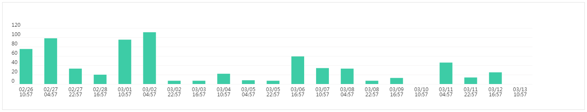
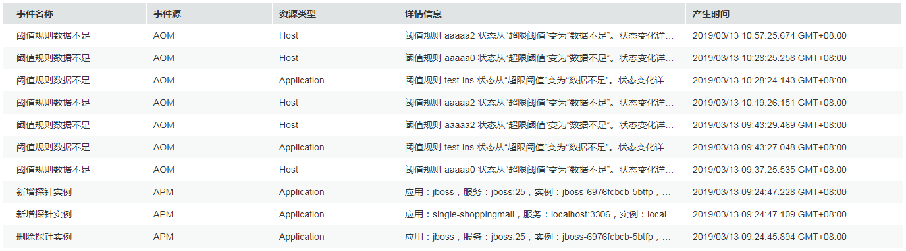

# 查看事件

事件告诉您AOM自身，或AOS、ServiceStage、CCE、APM等外部服务发生了某种变化，但不一定会引起业务异常，事件一般用来表达一些重要信息。您不用对事件进行处理。

## 查看事件

1.  登录[应用运维管理](https://console.huaweicloud.com/aom/#/aom/ams/summary)。
2.  在左侧导航栏中选择“告警中心 \> 事件列表”。

    “事件列表”界面下方的列表按时间顺序排列，时间最近的事件显示在最前端。

3.  设置时间范围或搜索条件。
    1.  设置时间范围

        查看已设时间范围内产生的事件。可通过如下两种方式设置时间范围：

        方式一：使用AOM预定义好的时间标签，例如，近1小时、近6小时、近一天等，您可根据实际需要选择不同的时间粒度。

        方式二：通过开始时间和结束时间，自定义时间范围，您最长可设置为30天。

    2.  设置搜索条件

        输入事件名称、事件源后，单击“搜索”，查看在已设时间范围内满足搜索条件的事件。

        > **说明：**   
        >-   单击“重置”可清除输入的搜索条件。  
        >-   AOM支持多个事件源搜索，多个事件源请用英文逗号分隔。  
        >-   搜索时，事件名称和事件源区分大小写。  

4.  查看搜索结果。
    -   通过柱状图查看满足[3](#li14478446171411)中已设时间范围和搜索条件的事件的统计数据。

        **图 1**  事件统计数据  
        

    -   通过列表查看满足[3](#li14478446171411)中已设时间范围和搜索条件的事件的基本信息。

        **图 2**  事件列表  
        

