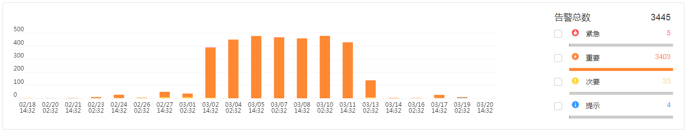
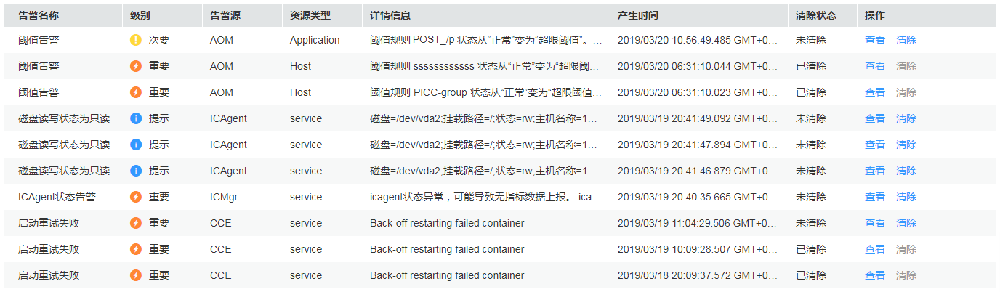

# 查看告警

告警是指AOM自身，或AOS、ServiceStage、CCE、APM等外部服务在异常情况或在可能导致异常情况下上报的信息，并且您需采取相应措施清除故障，否则会由于AOM自身或外部服务的功能异常而引起业务的异常。

## 查看告警

1.  登录AOM控制台，在左侧导航栏中选择“告警中心 \> 告警列表”。

    > **说明：**   
    >-   “告警列表”界面默认展示最近30天的告警统计数据和列表信息。  
    >-   “告警列表”界面下方的列表按时间顺序排列，时间最近的告警显示在最前端。  
    >-   单击“告警列表”界面右侧的，可查看最新上报的3条告警。  

2.  设置时间范围或搜索条件。
    1.  设置时间范围

        查看已设时间范围内产生的告警。可通过如下两种方式设置时间范围：

        方式一：使用AOM预定义好的时间标签，例如，近1小时、近6小时、近一天等，您可根据实际需要选择不同的时间粒度。

        方式二：通过开始时间和结束时间，自定义时间范围，您最长可设置为30天。

    2.  设置搜索条件

        输入清除状态、告警名称或告警源后，单击“搜索”，查看在已设时间范围内满足搜索条件的告警。

        > **说明：**   
        >-   单击“重置”可清除输入的搜索条件。  
        >-   AOM支持多个告警源搜索，多个告警源请用英文逗号分隔。  
        >-   搜索时，告警名称和告警源区分大小写。  

3.  查看搜索结果。
    -   通过柱状图查看满足[2](#li13952173133419)中已设时间范围和搜索条件的告警的统计数据。

        **图 1**  告警统计数据  
        

    -   通过列表查看满足[2](#li13952173133419)中已设时间范围和搜索条件的告警的基本信息。

        单击目标告警所在“操作”列中的“查看”可查看告警详情。

        **图 2**  告警列表  
        

4.  清除告警。

    当故障解除时，可在告警列表中单击目标告警所在“操作”列中的“清除”。

    同时AOM还支持阈值规则触发的告警自动清除功能。例如，您创建了一条阈值规则，当CPU使用率超过85%时，产生阈值告警，当CPU使用率低于85%时恢复正常，这种情况下，您可以不用手动清除，恢复正常后阈值告警会自动清除。

