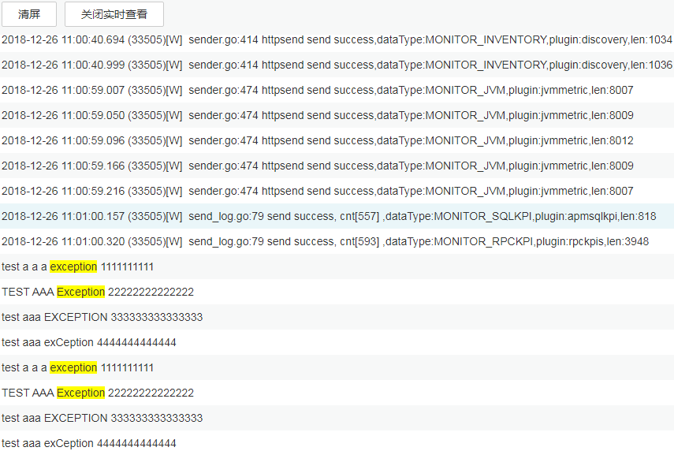
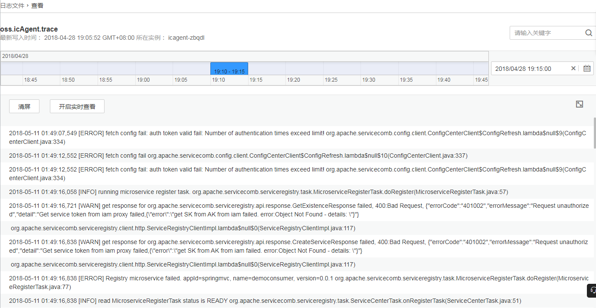

# 查看日志文件

您可快速查看服务实例的日志文件，以便定位问题。

1.  登录[应用运维管理](https://console.huaweicloud.com/aom/#/aom/ams/summary)。
2.  在左侧导航栏中选择“日志管理 \> 日志文件”。
3.  在“日志文件”页面左侧单击服务名称，在页面右侧的日志文件列表中即可查看其实例的日志文件名称、最新写入时间。
4.  单击该服务实例“操作”列的“查看”，可参考[表1](#table1977651418614)查看该服务实例日志文件详情，如[图2](#fig13776151417612)所示。

    **表 1**  操作说明

    
    <table><thead align="left"><tr id="row97759141063"><th class="cellrowborder" valign="top" width="15%" id="mcps1.2.4.1.1">
操作

    </th>
    <th class="cellrowborder" valign="top" width="15%" id="mcps1.2.4.1.2">
设置

    </th>
    <th class="cellrowborder" valign="top" width="70%" id="mcps1.2.4.1.3">
说明

    </th>
    </tr>
    </thead>
    <tbody><tr id="row19775151410615"><td class="cellrowborder" rowspan="2" valign="top" width="15%" headers="mcps1.2.4.1.1 ">
设置日志时间范围

    </td>
    <td class="cellrowborder" valign="top" width="15%" headers="mcps1.2.4.1.2 ">
日期

    </td>
    <td class="cellrowborder" valign="top" width="70%" headers="mcps1.2.4.1.3 ">
单击，选择日期。

    </td>
    </tr>
    <tr id="row5775114667"><td class="cellrowborder" valign="top" headers="mcps1.2.4.1.1 ">
时间范围

    </td>
    <td class="cellrowborder" valign="top" headers="mcps1.2.4.1.2 ">
单击时间轴蓝色部分，设置日志的时间范围。时间轴每次只能选择一个单位时间为5分钟。

    </td>
    </tr>
    <tr id="row1977518144618"><td class="cellrowborder" rowspan="3" valign="top" width="15%" headers="mcps1.2.4.1.1 ">
查看日志文件详情

    </td>
    <td class="cellrowborder" valign="top" width="15%" headers="mcps1.2.4.1.2 ">
清屏

    </td>
    <td class="cellrowborder" valign="top" width="70%" headers="mcps1.2.4.1.3 ">
单击“清屏”，可清除屏幕当前已显示的日志。清屏功能只会清除屏幕当前已显示的日志，不会删除日志。

    </td>
    </tr>
    <tr id="row157764147620"><td class="cellrowborder" valign="top" headers="mcps1.2.4.1.1 ">
查看实时日志

    </td>
    <td class="cellrowborder" valign="top" headers="mcps1.2.4.1.2 ">
查看实时日志功能默认关闭，可单击“开启实时查看”开启。开启后，可查看从当前时刻起，最新写入的日志。

    
日志中的exception记录了代码运行时出现的异常，在使用日志定位问题时，这些异常信息比较重要，关注度也比较高。在查看实时日志时，AOM会自动对日志中的异常关键词高亮显示（异常关键词严格区分大小写，只高亮显示exception和Exception，例如EXCEPTION、exCeption、EXception等均不会高亮显示），以便帮您快速定位出异常。如下所示：

    
<b>图1 </b>查看实时日志 

    </td>
    </tr>
    <tr id="row27761114865"><td class="cellrowborder" valign="top" headers="mcps1.2.4.1.1 ">
最大化

    </td>
    <td class="cellrowborder" valign="top" headers="mcps1.2.4.1.2 ">
单击，时间轴等功能将会在界面中隐藏，用来最大化显示日志。再次单击，可取消最大化显示。

    </td>
    </tr>
    </tbody>
    </table>

    **图 2**  日志文件详情  
    

5.  （可选）单击“操作”列的“配置转储”，可将日志文件转储到OBS桶中，操作详见[添加日志转储](添加日志转储.md)。

