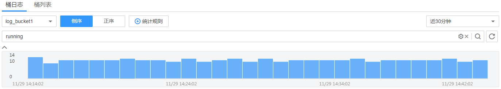
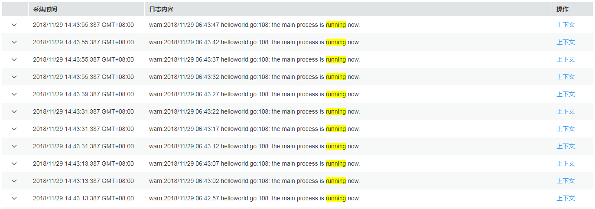
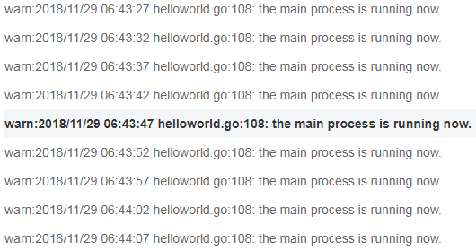

# 查看桶日志

桶日志是AOM提供的一种细粒度日志查询功能，您可以日志桶为单位查看日志，以便提取关键业务数据、快速查看并定位问题。

## 注意事项

-   查看桶日志前需确保至少已创建了一个日志桶，操作详见[添加日志桶](添加日志桶.md)，否则无法查看桶日志。
-   最多可查看最近7天内的桶日志。

## 查看桶日志

1.  登录[应用运维管理](https://console.huaweicloud.com/aom/#/aom/ams/summary)。
2.  在左侧导航栏中选择“日志管理 \> 日志桶”，在“桶日志”页签查看桶日志。
3.  设置查询条件。
    -   **选择日志桶**：在左上方的下拉列表框中选择目标日志桶。
    -   **设置查询的时间范围**：在右上方的下拉列表框中可选择“近30分钟”、“近1小时”或“近6小时”等相对时间，也可选择“自定义时间段”指定开始时间和结束时间来设置绝对时间。
    -   **输入关键词**：单击文本框，文本框下面显示了该桶下的所有统计规则及其关键词，可直接单击进行选择，选择后统计规则的关键词会自动输入到文本框中；也可直接在文本框中手动输入关键词。

        > **说明：**   
        >-   对于常用的、复杂的关键词，可单击，[创建统计规则](创建统计规则.md)。在后续查询时，不用再在文本框中手动输入，直接单击文本框，选择对应的统计规则及其关键词，即可自动输入。同时，统计规则创建成功后，AOM会对关键词进行统计并生成指标，您可在“指标监控”页面对其进行监控。  
        >-   关键词是指相邻两分词符之间的单词。单击，设置查询分词符，将搜索条件按照分词符进行切分，该设置的生效周期为本次会话，如果刷新界面或退出登录，会恢复到原来的分词配置。在搜索日志时，可使用切分后的单词进行搜索。  

4.  查看搜索结果。
    -   **通过柱状图查看统计数据**

        柱状图展示了满足[3](#li13990166371)中已设查询条件的日志条数在时间上的分布。横轴显示时间，并对横轴进行30等分，即将横轴均分为30个矩形块，每个矩形块表示的时间为**已选择的时间范围/30**，例如，时间范围选择近30分钟，则每个矩形块表示的时间为1分钟，若时间范围选择近60分钟，则每个矩形块表示的时间为2分钟，纵轴显示查询到的日志条数。

        

        将鼠标移至矩形块，tips提示显示该矩形块代表的时间范围（起始时间和结束时间）及该时间范围内满足查询条件的日志条数。单击矩形块（单击，可取消选中），日志列表会同步展示该矩形块相应的日志内容。

    -   **通过日志列表查看日志内容**

        日志列表中展示了满足[3](#li13990166371)中已设查询条件的日志的详细内容。

        

        您还可执行如下操作：

        -   单击，可查看指定日志的主机IP、来源等详细信息。
        -   对搜索结果排序：AOM会根据日志的采集时间对搜索结果进行排序，以方便您查看，排序方式默认为倒序，您可通过进行切换。
        -   查看指定日志的上下文：AOM支持查看上下文信息，您不用在原始日文文件中上下翻页查找日志，单击“操作”列的“上下文”，即可查看指定日志的前若干条（即上文）或后若干条（即下文）的日志，方便您定位问题。

            

