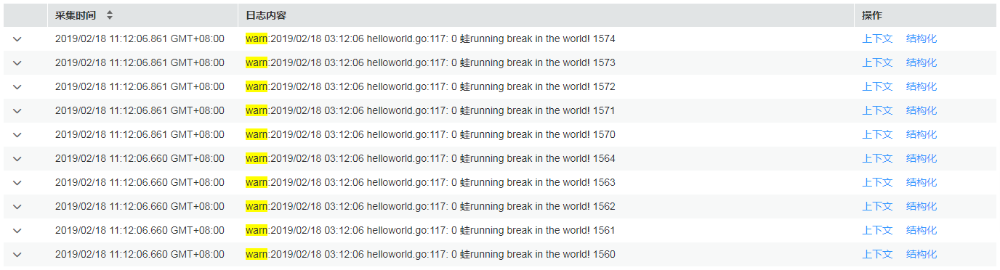

# 查看桶日志

桶日志是AOM提供的一种细粒度日志查询功能，您可以日志桶为单位查看日志，以便提取关键业务数据、快速查看并定位问题。

目前对于华北-北京一、华东-上海二和华南-广州区域，桶日志支持多维度日志信息查询和检索，您可对原始日志进行查询与分析，也可对结构化后的日志进行SQL查询与分析。

## 注意事项

-   查看桶日志前需确保至少已创建了一个日志桶，操作详见[添加日志桶](添加日志桶.md)，否则无法查看桶日志。
-   最多可查看最近7天内的桶日志。

## 查看原始日志

1.  登录AOM控制台，在左侧导航栏中选择“日志 \> 日志桶”，在“桶日志”页签查看桶日志。
2.  设置查询条件。
    -   **选择日志桶**：在左上方的下拉列表框中选择目标日志桶。
    -   **设置查询的时间范围**：在右上方的下拉列表框中可选择“近30分钟”、“近1小时”或“近6小时”等，也可选择“自定义时间段”指定开始时间和结束时间。
    -   **输入关键词**：单击文本框，文本框下面显示了该桶下的所有统计规则及其关键词，可直接单击进行选择，选择后统计规则的关键词会自动输入到文本框中；也可直接在文本框中手动输入关键词。

        > **说明：** 
        >对于常用的、复杂的关键词，可单击，[创建统计规则](创建统计规则.md)。在后续查询时，不用再在文本框中手动输入，直接单击文本框，选择对应的统计规则及其关键词，即可自动输入。同时，统计规则创建成功后，AOM会对关键词进行统计并生成指标，您可在“指标监控”页面对其进行监控。

3.  查看搜索结果。
    -   **通过柱状图查看统计数据**

        柱状图展示了满足[2](#zh-cn_topic_0169698259_li13990166371)中已设查询条件的日志条数在时间上的分布。横轴显示时间，并对横轴进行30等分，即将横轴均分为30个矩形块，每个矩形块表示的时间为**已选择的时间范围/30**，例如，时间范围选择近30分钟，则每个矩形块表示的时间为1分钟，若时间范围选择近60分钟，则每个矩形块表示的时间为2分钟，纵轴显示查询到的日志条数。

        **图 1**  通过柱状图查看统计数据  
        

        将鼠标移至矩形块，提示信息显示了该矩形块代表的时间范围（起始时间和结束时间）及该时间范围内满足查询条件的日志条数。单击矩形块（单击，可取消选中），日志列表会同步展示该矩形块相应的日志内容。

    -   **通过日志列表查看日志内容**

        日志列表中展示了满足[2](#zh-cn_topic_0169698259_li13990166371)中已设查询条件的日志的详细内容。

        **图 2**  通过日志列表查看日志内容  
        

        您还可执行如下操作：

        -   单击，可查看指定日志的主机IP、来源等详细信息。
        -   对搜索结果排序：AOM会根据日志的采集时间对搜索结果进行排序，以方便您查看，排序方式默认为倒序，您可单击“采集时间”列的进行切换。单击黑色向上三角图标，可按时间正序排序（即时间最新的日志显示在最后方），单击黑色向下三角形图标，可按时间倒序排序（即时间最新的日志显示在最前方）。
        -   查看指定日志的上下文：AOM支持查看上下文信息，您不用在原始日文文件中上下翻页查找日志，单击“操作”列的“上下文”，即可查看指定日志的前若干条（即上文）或后若干条（即下文）的日志，方便您定位问题。

            **图 3**  查看指定日志的上下文  
            

        -   结构化日志：单击“操作”列的“结构化”，将以该条日志作为示例日志，对该日志所在桶的所有日志进行结构化，操作详见[结构化原始日志](日志结构化.md#zh-cn_topic_0169698336_section16513131511247)。

## 查看结构化日志

> **须知：** 
>-   目前查看结构化日志功能仅对华北-北京一、华东-上海二和华南-广州区域生效。
>-   查看结构化日志前您需先通过添加提取规则对原始日志进行结构化，才能基于结构化的日志进行SQL查询与分析，操作详见[结构化原始日志](日志结构化.md#zh-cn_topic_0169698336_section16513131511247)。
>-   对原始日志结构化后，需要等待1\~2分钟左右才能进行SQL查询与分析。

下面以Tomcat服务器结构化后的日志为例进行SQL查询与分析，定位出Tomcat服务器运行异常的原因。

1.  登录AOM控制台，在左侧导航栏中选择“日志 \> 日志桶”。
2.  SQL查询也是以日志桶为单位，请在“桶日志”页签选择目标日志桶，然后单击“结构化日志”。

    **图 4**  结构化后的日志  
    

3.  SQL查询与分析：设置时间范围和查询条件。查询条件请输入SQL语句，目前AOM支持的SQL语句详见[SQL查询语法](日志结构化.md#zh-cn_topic_0169698336_section128657218189)。

    例如，需查询近6小时内HTTP返回码大于等于500的请求数，则可执行如下操作：

    在右上角的下拉列表框选择“近6小时”，在搜索框中输入SQL语句：select count\(\*\) where code \>= 500，如[图5](#zh-cn_topic_0169698259_fig20243192716911)所示 。

    > **说明：** 
    >-   对于常用的、复杂的SQL语句，可单击创建统计规则，操作详见[创建统计规则](创建统计规则.md)。在后续查询时，不用再在文本框中手动输入，直接单击文本框，选择对应的统计规则及其SQL语句，即可自动输入。同时，统计规则创建成功后，AOM会对SQL语句返回的值进行统计并生成指标，可通过指标图表查看数据的走势。
    >-   如果SQL语句返回的是单个数值，例如：select count\(\*\) where code \>= 500，则支持创建统计规则；如果SQL语句返回的是多个值，例如：select count\(\*\) group by ip，则不支持创建统计规则。

    **图 5**  使用SQL语句进行查询  
    

