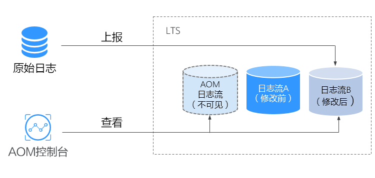
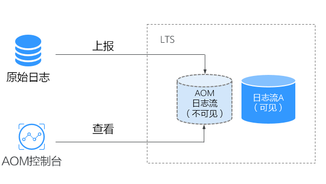

# 概述

> **说明：** 
>AOM日志接入LTS功能当前受限开放，如有需求可以通过[提交工单](https://support.huaweicloud.com/usermanual-ticket/zh-cn_topic_0127038618.html)，联系工程师为您开放此功能。

云日志服务LTS是华为云统一日志管理平台，提供日志搜索、结构化和可视化等功能。通过添加接入规则，可以将AOM中的CCE、CCI或自定义集群的日志映射至LTS，通过LTS查看和分析日志。映射不会产生额外的费用（除重复映射外）。

## 什么是映射

AOM中的日志实际上是以一个日志流的形式在LTS中存在（如[图1](#fig11995544194720)中的AOM日志流所示），AOM可以查询已配置采集路径的原始日志，但当前AOM的日志流无法在LTS控制台查看。您可以通过在AOM控制台添加接入规则来创建映射，映射创建后，即可通过LTS查看和分析AOM日志。

**图 1**  未创建映射  

创建日志流A并创建接入规则后，即已创建AOM至LTS的映射，最新的AOM日志将上报至日志流A，AOM可以查看映射前后所有的日志数据，日志流A不会复制或移动原AOM日志流中的历史数据，如[图2](#fig36185512471)所示。

**图 2**  已创建映射  

## 修改映射

如果您需要修改映射，如：将映射规则从日志流A变更为日志流B，最新的日志将上报至日志流B，AOM可以查询AOM日志流和日志流B的内容，无法查看日志流A的内容，如[图3](#fig1663425210110)所示。

**图 3**  修改映射  

## 删除映射

删除接入规则或删除映射日志流，即为删除映射。最新日志将仅上报至AOM日志流中，AOM将无法查看日志流A的日志内容，如[图4](#fig188294571843)所示。如果仅删除接入规则，未删除日志流A，则仍可以在LTS控制台查看之前已进行映射的日志。

**图 4**  删除映射  

> **说明：** 
>删除接入规则或删除映射日志流不可恢复，请您谨慎操作。

## 重复映射

如果将同一个工作负载或文件映射分别映射到日志流A和B中，最新日志将同时上报至流A和流B，AOM会出现流A和流B重复的日志，同时重复产生的日志会被计费，因此不建议重复配置。

**图 5**  重复映射  

