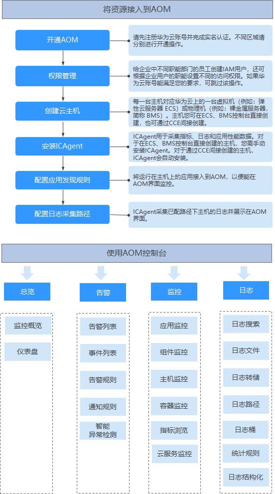

# 概述

应用运维管理（Application Operations Management）是云上应用的一站式立体化运维管理平台，实时监控用户的应用及相关云资源，采集并关联资源的各项指标、日志及事件等数据共同分析应用健康状态，提供灵活的告警及丰富的数据可视化功能，帮助用户及时发现故障，全面掌握应用、资源及业务的实时运行状况。

AOM作为云上应用的一站式立体化运维管理平台，可以实现对云主机、存储、网络、WEB容器、docker、kubernetes等应用运行环境的深入监控并进行集中统一的可视化管理，能够有效预防问题的产生及快速帮助应用运维人员定位故障，降低运维成本。AOM并非传统监控，它通过应用的角度看业务，满足企业对业务的高效和快速迭代的需求，可帮助企业实现 IT 对业务的有效支撑，保护、优化IT资产投资，使企业更好的达到其战略目标并实现IT资产调优。

## 控制台说明

**表 1**  AOM控制台说明

<table><thead align="left"><tr id="row95708333614"><th class="cellrowborder" valign="top" width="13.600000000000001%" id="mcps1.2.3.1.1">
类别

</th>
<th class="cellrowborder" valign="top" width="86.4%" id="mcps1.2.3.1.2">
说明

</th>
</tr>
</thead>
<tbody><tr id="row15701535363"><td class="cellrowborder" valign="top" width="13.600000000000001%" headers="mcps1.2.3.1.1 ">
总览

</td>
<td class="cellrowborder" valign="top" width="86.4%" headers="mcps1.2.3.1.2 ">
提供监控概览及仪表盘功能。

<ul id="ul1431747191"><li>监控概览
“监控概览”界面提供了资源、应用、应用用户体验的全链路、多层次、一站式运维界面。

</li><li>仪表盘
通过仪表盘可将不同图表展示到同一个屏幕上，通过不同的仪表形式来展示资源数据，例如，曲线图、数字图等，进而全面、深入地掌握监控数据。

</li></ul>
</td>
</tr>
<tr id="row55701836366"><td class="cellrowborder" valign="top" width="13.600000000000001%" headers="mcps1.2.3.1.1 ">
告警

</td>
<td class="cellrowborder" valign="top" width="86.4%" headers="mcps1.2.3.1.2 ">
提供告警列表、事件列表、阈值规则、通知规则等功能。

<ul id="ul2749726191214"><li>告警列表
告警是指AOM自身或外部服务在异常情况或在可能导致异常情况下上报的信息，并且您需采取相应措施清除故障，否则会由于AOM自身或外部服务的功能异常而引起业务的异常。

告警列表展示已设时间范围内产生的告警。

</li><li>事件列表
事件告诉您AOM自身或外部服务发生了某种变化，但不一定会引起业务异常，事件一般用来表达一些重要信息。

事件列表展示已设时间范围内产生的事件。

</li><li>阈值规则
通过阈值规则可对资源的指标设置阈值条件，当指标数据满足阈值条件时，会产生告警；当没有指标数据上报时，会产生数据不足事件，以便您在第一时间发现异常并进行处理。

</li><li>通知规则
AOM提供了告警通知功能，您可通过创建通知规则进行详细配置，当AOM自身或外部服务存在异常或可能存在异常而产生告警时，可利用此功能将告警信息通过邮件或短信发送给您指定的人员，以便提醒相关人员及时采取措施清除故障，避免造成业务损失。

</li></ul>
</td>
</tr>
<tr id="row157073143611"><td class="cellrowborder" valign="top" width="13.600000000000001%" headers="mcps1.2.3.1.1 ">
监控

</td>
<td class="cellrowborder" valign="top" width="86.4%" headers="mcps1.2.3.1.2 ">
提供应用监控、组件监控、主机监控、容器监控、指标浏览等功能。

<ul id="ul1424118489217"><li>应用监控
应用是您根据业务需要，对相同或者相近业务的一组组件进行逻辑划分，AOM提供以应用维度整体进行监控。

</li><li>组件监控
组件即您部署的服务，包括容器和普通进程。

组件列表展示了每个组件的类型、CPU占用、内存占用和告警状态等信息，AOM支持从组件下钻到实例，从实例下钻到容器。通过各层状态，您可完成对组件的立体监控。

</li><li>主机监控
通过AOM您可监控主机的资源占用与健康状态，监控主机的磁盘、文件系统等常用系统设备，监控运行在主机上的业务进程或实例的资源占用与健康状态。

</li><li>容器监控
容器监控的对象仅为通过CCE部署的工作负载、通过ServiceStage创建应用。

</li><li>指标浏览
指标浏览展示了各资源的指标数据，您可实时监控指标值及趋势，还可将关注的指标添加到仪表盘，对其创建阈值规则和导出监控报告等操作，以便实时查看业务及分析数据。

</li><li>云服务监控
云服务监控展示华为云各服务实例的历史性能数据曲线。最长可查阅近6个月内的数据，有助于用户了解实例运行状况。

</li></ul>
</td>
</tr>
<tr id="row1657017313367"><td class="cellrowborder" valign="top" width="13.600000000000001%" headers="mcps1.2.3.1.1 ">
日志

</td>
<td class="cellrowborder" valign="top" width="86.4%" headers="mcps1.2.3.1.2 ">
提供日志搜索、日志文件、日志转储、日志路径等功能。

<ul id="ul1681410205309"><li>日志搜索
当需要通过日志来分析和定位问题时，使用日志搜索功能可帮您快速在海量日志中查询到所需的日志，您还可结合日志的来源信息和上下文原始数据一起辅助定位问题。

</li><li>日志文件
您可快速查看组件实例的日志文件，以便定位问题。

</li><li>日志转储
AOM支持将日志转储到对象存储服务（Object Storage Service，简称OBS）的OBS桶中，以便进行长期存储。

</li><li>日志路径
AOM支持虚机（这里的虚机指操作系统为Linux的弹性云服务器或裸金属服务器）日志采集，即采集您自定义的日志文件并展现在AOM界面中，以供您检索。使用该功能前首先要配置日志采集路径。

</li><li>日志桶
日志桶是对日志文件逻辑上的分组，可用于转储、创建统计规则、以日志桶为单位查看日志等。

</li><li>统计规则
统计规则以日志桶为单位，您可在规则中配置关键词，AOM会统计该关键词在日志桶中每分钟出现的条数，并生成日志指标。

</li><li>日志结构化
日志结构化支持对原始日志按照正则表达式或者特殊字符进行分隔，以便对结构化后的日志按照SQL语法进行查询与分析。

</li></ul>
</td>
</tr>
<tr id="row135703314364"><td class="cellrowborder" valign="top" width="13.600000000000001%" headers="mcps1.2.3.1.1 ">
配置管理

</td>
<td class="cellrowborder" valign="top" width="86.4%" headers="mcps1.2.3.1.2 ">
提供Agent管理、应用发现、日志配置等功能。

<ul id="ul18144133343410"><li>Agent管理
ICAgent用于采集指标、日志和应用性能数据。对于在ECS、BMS控制台直接购买的主机，您需手动安装ICAgent。对于通过CCE间接购买的主机，ICAgent会自动安装，您不用安装ICAgent。

</li><li>应用发现
应用发现是指AOM通过配置的规则发现和收集您主机上部署的应用和关联的指标。

</li><li>日志配置
提供日志配额和分词设置功能。

</li><li>配额配置
当指标超过配额时，时间较早的指标将会被删除。

指标配额可通过切换基础版（受限免费）和按需版（按需计费）来修改。

</li><li>指标配置
指标采集开关用来控制是否对指标数据进行采集（SLA指标、自定义指标除外）。

</li></ul>
</td>
</tr>
</tbody>
</table>

## 使用流程

AOM使用流程如下图所示。

1.  **[开通AOM](开通AOM.md)**（必选）
2.  创建子账号并设置权限（可选）
3.  创建云主机（必选）
4.  **[安装ICAgent](安装ICAgent.md)**（必选）

    ICAgent是AOM的采集器，用于实时采集指标、日志和应用性能数据。

    如果是通过CCE购买的云主机，购买后自动安装ICAgent。

5.  [配置应用发现规则](配置应用发现规则.md)（可选）

    满足[内置发现规则](配置应用发现规则.md#section938317591962)的应用，安装ICAgent后该应用会自动被发现；对于不满足内置应用发现规则的，您则需配置应用发现规则。

6.  [配置日志采集路径](配置日志采集路径.md)（可选）

    如果您需使用AOM监控主机的日志，则需配置日志采集路径。

7.  运维（可选）

    您可使用AOM的[监控总览](监控总览.md)、[告警管理](告警管理.md)、[资源监控](资源监控.md)、[日志管理](日志管理.md)等功能进行日常运维。

