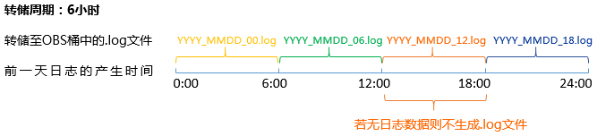

# 添加日志桶

日志桶是对日志文件逻辑上的分组。用于[日志转储](添加日志转储.md)、[创建统计规则](创建统计规则.md)、[以日志桶为单位查看日志](查看桶日志.md)等，使用这些功能前您需先创建一个日志桶。

## 注意事项

-   最多可添加20个日志桶，每个日志桶最多可添加10个日志文件。
-   同一个日志桶中只能添加同一个集群的日志文件。

## 添加日志桶

1.  登录[应用运维管理](https://console.huaweicloud.com/aom/#/aom/ams/summary)。
2.  在左侧导航栏中选择“日志管理 \> 日志桶”，单击“桶列表”页签，单击“添加日志桶”。
3.  设置日志桶名称和描述，添加目标日志文件。
4.  （可选）添加日志转储。

    您可在添加日志桶时通过高级设置添加日志转储，也可在创建完日志桶后进行配置，可参考[添加日志转储](添加日志转储.md)。

    日志转储配置成功后，日志桶和OBS桶之间建立了委托关系，AOM会根据您配置的转储周期，每天凌晨1点半自动转储前一天的日志文件到OBS桶中。

    **表 1**  参数说明

    
    <table><thead align="left"><tr id="row0737755184010"><th class="cellrowborder" valign="top" width="9%" id="mcps1.2.3.1.1">
参数

    </th>
    <th class="cellrowborder" valign="top" width="91%" id="mcps1.2.3.1.2">
说明

    </th>
    </tr>
    </thead>
    <tbody><tr id="row207371655134011"><td class="cellrowborder" valign="top" width="9%" headers="mcps1.2.3.1.1 ">
日志桶

    </td>
    <td class="cellrowborder" valign="top" width="91%" headers="mcps1.2.3.1.2 ">
AOM对日志文件逻辑上的分组。

    </td>
    </tr>
    <tr id="row1373716557406"><td class="cellrowborder" valign="top" width="9%" headers="mcps1.2.3.1.1 ">
OBS桶

    </td>
    <td class="cellrowborder" valign="top" width="91%" headers="mcps1.2.3.1.2 ">
OBS中存储对象的容器，日志桶中的日志文件会转储到OBS桶中。<a href="https://support.huaweicloud.com/productdesc-obs/zh-cn_topic_0045829091.html" target="_blank" rel="noopener noreferrer">什么是OBS桶？</a>

    </td>
    </tr>
    <tr id="row1273825518403"><td class="cellrowborder" valign="top" width="9%" headers="mcps1.2.3.1.1 ">
转储格式

    </td>
    <td class="cellrowborder" valign="top" width="91%" headers="mcps1.2.3.1.2 ">
转储到OBS桶中日志内容的格式，目前仅支持原始格式。

    
原始格式：对日志内容的格式不做任何变动，按日志打印时的原始格式进行转储。

    </td>
    </tr>
    <tr id="row10738555164015"><td class="cellrowborder" valign="top" width="9%" headers="mcps1.2.3.1.1 ">
转储周期

    </td>
    <td class="cellrowborder" valign="top" width="91%" headers="mcps1.2.3.1.2 ">
转储时以转储周期为粒度对日志文件进行分割，在OBS桶中生成<strong id="b1738135514404">24小时/转储周期</strong>个.log文件（例如转储周期为6小时，则生成4个.log文件），且.log文件名称命名规则为：YYYY_MMDD_HH（HH分隔时间段起始时间），若某整个分隔时间段内无日志数据，则不会生成.log文件。如下图所示：

    

    </td>
    </tr>
    </tbody>
    </table>

5.  单击“确认”。

## 更多日志桶操作

日志桶创建完成后，您还可执行[表2](#table14918185010104)中的操作。

**表 2**  相关操作

<table><thead align="left"><tr id="row17920135010100"><th class="cellrowborder" valign="top" width="20%" id="mcps1.2.3.1.1">
操作

</th>
<th class="cellrowborder" valign="top" width="80%" id="mcps1.2.3.1.2">
说明

</th>
</tr>
</thead>
<tbody><tr id="row4922150191019"><td class="cellrowborder" valign="top" width="20%" headers="mcps1.2.3.1.1 ">
添加日志转储

</td>
<td class="cellrowborder" valign="top" width="80%" headers="mcps1.2.3.1.2 ">
单击“操作”列的“配置转储”，可参考<a href="添加日志转储.md">添加日志转储</a>。

</td>
</tr>
<tr id="row13752165816484"><td class="cellrowborder" valign="top" width="20%" headers="mcps1.2.3.1.1 ">
修改日志桶

</td>
<td class="cellrowborder" valign="top" width="80%" headers="mcps1.2.3.1.2 ">
单击“操作”列的“编辑”。

</td>
</tr>
<tr id="row79230504106"><td class="cellrowborder" valign="top" width="20%" headers="mcps1.2.3.1.1 ">
删除日志桶

</td>
<td class="cellrowborder" valign="top" width="80%" headers="mcps1.2.3.1.2 ">
单击“操作”列的“删除”。

日志桶是AOM对日志文件逻辑上的分组，删除日志桶后，您的日志文件不会被删除。

</td>
</tr>
</tbody>
</table>

