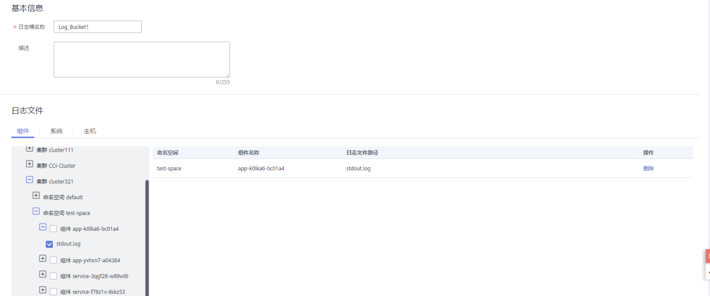

# 添加日志桶

日志桶是对日志文件逻辑上的分组。用于[创建统计规则](创建统计规则.md)、[以日志桶为单位查看日志](查看桶日志.md)等，使用这些功能前您需先添加一个日志桶。

## 注意事项

-   每个日志桶最多可添加500个日志文件。
-   同一个日志桶中只能添加同一个集群的日志文件。

## 添加日志桶

1.  登录AOM控制台，在左侧导航栏中选择“日志 \> 日志桶”。
2.  选择“桶列表”页签，单击“添加日志桶”，输入日志桶名称和描述，并添加目标日志文件，然后单击“确认”。如下图所示：

    **图 1**  添加日志桶  
    

## 更多日志桶操作

日志桶添加完成后，您还可执行[表1](#zh-cn_topic_0169698335_table14918185010104)中的操作。

**表 1**  相关操作

<table><thead align="left"><tr id="zh-cn_topic_0169698335_row17920135010100"><th class="cellrowborder" valign="top" width="20%" id="mcps1.2.3.1.1">
操作

</th>
<th class="cellrowborder" valign="top" width="80%" id="mcps1.2.3.1.2">
说明

</th>
</tr>
</thead>
<tbody><tr id="zh-cn_topic_0169698335_row6612162320287"><td class="cellrowborder" valign="top" width="20%" headers="mcps1.2.3.1.1 ">
查看桶日志

</td>
<td class="cellrowborder" valign="top" width="80%" headers="mcps1.2.3.1.2 ">
单击日志桶名称，可直接查看该桶的日志。

</td>
</tr>
<tr id="zh-cn_topic_0169698335_row167221335112717"><td class="cellrowborder" valign="top" width="20%" headers="mcps1.2.3.1.1 ">
修改日志桶

</td>
<td class="cellrowborder" valign="top" width="80%" headers="mcps1.2.3.1.2 ">
单击“操作”列的“编辑”。

</td>
</tr>
<tr id="zh-cn_topic_0169698335_row127911150285"><td class="cellrowborder" valign="top" width="20%" headers="mcps1.2.3.1.1 ">
删除日志桶

</td>
<td class="cellrowborder" valign="top" width="80%" headers="mcps1.2.3.1.2 ">
单击“操作”列的“删除”。

日志桶是AOM对日志文件逻辑上的分组，删除日志桶后，您的日志文件不会被删除。

</td>
</tr>
<tr id="zh-cn_topic_0169698335_row985215124113"><td class="cellrowborder" valign="top" width="20%" headers="mcps1.2.3.1.1 ">
添加统计规则

</td>
<td class="cellrowborder" valign="top" width="80%" headers="mcps1.2.3.1.2 ">
在“操作”列的“更多”下拉列表中选择“添加统计规则”，操作详见<a href="创建统计规则.md">创建统计规则</a>。

</td>
</tr>
<tr id="zh-cn_topic_0169698335_row142171961513"><td class="cellrowborder" valign="top" width="20%" headers="mcps1.2.3.1.1 ">
结构化日志

</td>
<td class="cellrowborder" valign="top" width="80%" headers="mcps1.2.3.1.2 ">
在“操作”列的“更多”下拉列表中选择“结构化”，操作详见<a href="日志结构化.md">日志结构化</a>。

</td>
</tr>
</tbody>
</table>

