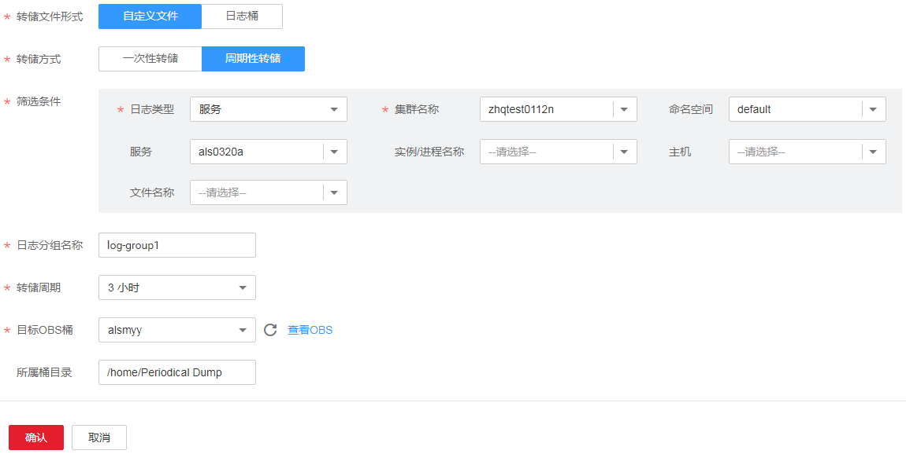
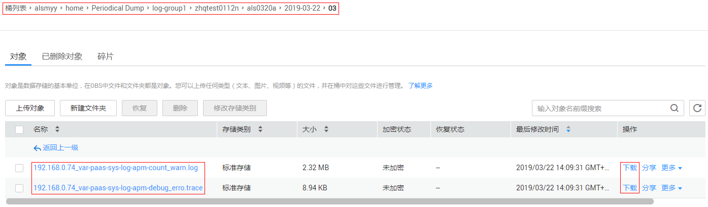
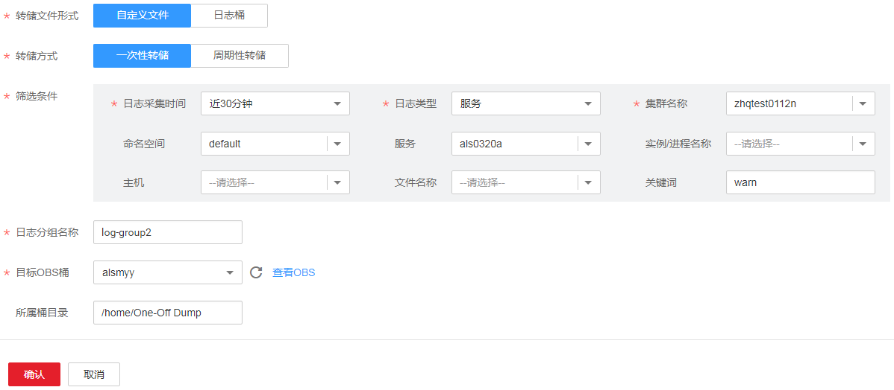
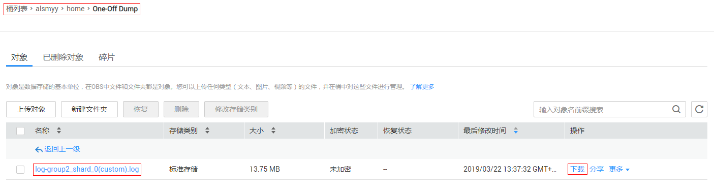

# 添加日志转储

根据您购买套餐的不同，AOM提供7天或30天的日志存储时长。AOM支持将日志转储到[对象存储服务](https://support.huaweicloud.com/productdesc-obs/zh-cn_topic_0045829060.html)（Object Storage Service，简称OBS）的[OBS桶](https://support.huaweicloud.com/productdesc-obs/zh-cn_topic_0045829091.html)中，以便进行长期存储。如果您有更长时间的日志存储需求，可添加日志转储。

AOM提供周期性转储和一次性转储两种转储方式，供您选择使用。

-   **周期性转储**：将当前日志实时转储到OBS桶中，且以转储周期为粒度对1天的日志进行分割，同一时间段的日志将转储到其对应的日志文件中。

    例如，您需长久存储固定维度的日志，就可以选择周期性转储，操作详见[添加周期性转储](#section246131702711)。

-   **一次性转储**：将历史日志一次性转储到OBS桶的同一个.log日志文件中。

    一次性转储类似于“日志搜索”界面的导出功能（详见[5](搜索日志.md#li10229194714111)），“日志搜索”界面最多可导出5000条日志，当日志数量比较多导出功能无法满足需求时，可对指定日志进行一次性转储，操作详见[添加一次性转储](#section1130151415546)。

## 添加周期性转储

下面以als0320a服务为例对其日志进行周期性转储：需实时将als0320a服务当前新产生的日志实时转储到OBS桶almyy的/home/Periodical Dump目录下，且将每3个小时的日志转储到其对应的日志文件中，可参考如下操作。

1.  登录[应用运维管理](https://console.huaweicloud.com/aom/#/aom/ams/summary)。
2.  在左侧导航栏中选择“日志管理 \> 日志转储”，单击“添加日志转储”。
3.  参考[表1](#table1517618282520)设置相关参数后，单击“确认”，如[图1](#fig618619164718)所示。

    **表 1**  周期性转储参数说明

    
    <table><thead align="left"><tr id="row141731428175214"><th class="cellrowborder" valign="top" width="20%" id="mcps1.2.4.1.1">
参数

    </th>
    <th class="cellrowborder" valign="top" width="60%" id="mcps1.2.4.1.2">
说明

    </th>
    <th class="cellrowborder" valign="top" width="20%" id="mcps1.2.4.1.3">
示例

    </th>
    </tr>
    </thead>
    <tbody><tr id="row161743289524"><td class="cellrowborder" valign="top" width="20%" headers="mcps1.2.4.1.1 ">
转储文件形式

    </td>
    <td class="cellrowborder" valign="top" width="60%" headers="mcps1.2.4.1.2 ">
包括自定义文件和日志桶。

    <ul id="ul617382865215"><li>自定义文件：通过设置筛选条件，将满足条件的日志划分到一个临时的分组里，以便将指定的日志进行转储。</li><li>日志桶：将日志桶中指定时间范围内的日志进行转储。</li></ul>
    
 说明： 

如果选择“日志桶”，则您需先创建一个日志桶，操作详见<a href="添加日志桶.md">添加日志桶</a>。

    

    </td>
    <td class="cellrowborder" valign="top" width="20%" headers="mcps1.2.4.1.3 ">
自定义文件

    </td>
    </tr>
    <tr id="row31741828155217"><td class="cellrowborder" valign="top" width="20%" headers="mcps1.2.4.1.1 ">
转储方式

    </td>
    <td class="cellrowborder" valign="top" width="60%" headers="mcps1.2.4.1.2 ">
包括一次性转储和周期性转储。

    </td>
    <td class="cellrowborder" valign="top" width="20%" headers="mcps1.2.4.1.3 ">
周期性转储

    </td>
    </tr>
    <tr id="row817462813529"><td class="cellrowborder" valign="top" width="20%" headers="mcps1.2.4.1.1 ">
筛选条件/日志采集时间

    </td>
    <td class="cellrowborder" valign="top" width="60%" headers="mcps1.2.4.1.2 ">
可按照日志类型、资源、日志文件名称等多个维度对日志进行筛选，以便将满足条件的日志进行转储。

    </td>
    <td class="cellrowborder" valign="top" width="20%" headers="mcps1.2.4.1.3 ">
日志类型选择服务，资源选择als0320a服务

    </td>
    </tr>
    <tr id="row12174828155215"><td class="cellrowborder" valign="top" width="20%" headers="mcps1.2.4.1.1 ">
日志分组名称/日志桶

    </td>
    <td class="cellrowborder" valign="top" width="60%" headers="mcps1.2.4.1.2 ">
待转储日志的逻辑分组，以便以分组为单位对日志进行转储。

    
 说明： 

转储任务删除后，日志分组也会同时删除。

    

    </td>
    <td class="cellrowborder" valign="top" width="20%" headers="mcps1.2.4.1.3 ">
log-group1

    </td>
    </tr>
    <tr id="row15175428105216"><td class="cellrowborder" valign="top" width="20%" headers="mcps1.2.4.1.1 ">
转储周期

    </td>
    <td class="cellrowborder" valign="top" width="60%" headers="mcps1.2.4.1.2 ">
对1天的日志以转储周期为粒度进行分割，将每天划分为<strong id="b6586948182513">24小时/转储周期</strong>个时间段，同一时间段的日志分别转储到其对应的日志文件中。

    
例如，转储周期选择3小时，则将每天划分为8个时间段，每天0:00~03:00产生的日志转储到“日志采集日期（格式为YYYY-MM-DD） &gt; 00”路径下对应的日志文件中，每天03:00~06:00产生的日志转储到“日志采集日期（格式为YYYY-MM-DD） &gt; 03”路径下对应的日志文件中，其他时间段以此类推。

    </td>
    <td class="cellrowborder" valign="top" width="20%" headers="mcps1.2.4.1.3 ">
3小时

    </td>
    </tr>
    <tr id="row11763281526"><td class="cellrowborder" valign="top" width="20%" headers="mcps1.2.4.1.1 ">
目标OBS桶

    </td>
    <td class="cellrowborder" valign="top" width="60%" headers="mcps1.2.4.1.2 ">
存储日志的OBS桶。

    
 说明： 

您需先创建一个OBS桶。单击“查看OBS”跳转到OBS界面进行创建，操作详见<a href="https://support.huaweicloud.com/usermanual-obs/zh-cn_topic_0045829088.html" target="_blank" rel="noopener noreferrer">创建桶</a>。

    

    </td>
    <td class="cellrowborder" valign="top" width="20%" headers="mcps1.2.4.1.3 ">
alsmyy

    </td>
    </tr>
    <tr id="row1176142875210"><td class="cellrowborder" valign="top" width="20%" headers="mcps1.2.4.1.1 ">
所属桶目录

    </td>
    <td class="cellrowborder" valign="top" width="60%" headers="mcps1.2.4.1.2 ">
OBS桶中存储日志的目录。

    </td>
    <td class="cellrowborder" valign="top" width="20%" headers="mcps1.2.4.1.3 ">
/home/Periodical Dump

    </td>
    </tr>
    </tbody>
    </table>

    **图 1**  周期性转储示例  
    

    添加成功后，日志桶和OBS桶之间建立了委托关系，指定资源当前新产生的日志将会实时转储到OBS桶中。

    例如，als0320a服务当前新产生的日志会实时转储到OBS桶almyy的/home/Periodical Dump目录下，且每3个小时的日志转储到其对应的日志文件中。

    > **说明：**   
    >周期性转储属于近实时转储，存在分钟级转储时延，时延与日志条数和日志大小有关，具体规格如下：  
    >-   5分钟内累计日志条数大于1000条或日志大小超过2MB时，实时转储。  
    >-   5分钟内累计日志条数小于1000条或日志大小不足2MB时，每5分钟转储。  

4.  将存储在OBS中的日志文件下载到本地，以供定位问题使用。
    1.  在周期性转储列表中，单击待操作的OBS桶名称，进入OBS服务的“概览”页面。
    2.  在左侧导航栏中单击“对象”，在“对象”页签中，找到存储在OBS中的日志文件，例如，192.168.0.74\_var-paas-sys-log-apm-count\_warn.log、192.168.0.74\_var-paas-sys-log-apm-debug\_erro.trace，如[图2](#fig975751712389)所示。

        ****转储到OBS桶中的日志文件路径：****日志文件路径与选择的“日志类型”有关，如下表所示。

        **表 2**  转储到OBS桶中的日志文件路径

        
        <table><thead align="left"><tr id="row1680275411371"><th class="cellrowborder" valign="top" width="20%" id="mcps1.2.3.1.1">
日志类型

        </th>
        <th class="cellrowborder" valign="top" width="80%" id="mcps1.2.3.1.2">
日志文件存储路径

        </th>
        </tr>
        </thead>
        <tbody><tr id="row118021054123713"><td class="cellrowborder" valign="top" width="20%" headers="mcps1.2.3.1.1 ">
服务

        </td>
        <td class="cellrowborder" valign="top" width="80%" headers="mcps1.2.3.1.2 ">
所属桶目录 &gt; 日志桶或日志分组名称 &gt; 集群名称 &gt; 服务名称 &gt; 日志采集日期（格式为YYYY-MM-DD） &gt; 文件编号（格式为0X）

        
例如，alsmyy &gt; home &gt; Periodical Dump &gt; log-group1 &gt; zhqtest0112n &gt; als0320a &gt; 2019-03-22&gt; 03。

        </td>
        </tr>
        <tr id="row1180225411371"><td class="cellrowborder" valign="top" width="20%" headers="mcps1.2.3.1.1 ">
主机

        </td>
        <td class="cellrowborder" valign="top" width="80%" headers="mcps1.2.3.1.2 ">
所属桶目录 &gt; 日志桶或日志分组名称  &gt; CONFIG_FILE &gt; default_appname &gt;日志采集日期（格式为YYYY-MM-DD） &gt; 文件编号（格式为0X）

        </td>
        </tr>
        <tr id="row48029549377"><td class="cellrowborder" valign="top" width="20%" headers="mcps1.2.3.1.1 ">
系统

        </td>
        <td class="cellrowborder" valign="top" width="80%" headers="mcps1.2.3.1.2 ">
所属桶目录 &gt; 日志桶或日志分组名称 &gt; 集群名称 &gt; 日志采集日期（格式为YYYY-MM-DD） &gt; 文件编号（格式为0X）

        </td>
        </tr>
        </tbody>
        </table>

        **转储到OBS桶中的日志文件名称**：主机IPV4\_日志文件来源（将“/”替换为“-”）\_日志文件名称，例如，192.168.0.74\_var-paas-sys-log-apm-count\_warn.log、192.168.0.74\_var-paas-sys-log-apm-debug\_erro.trace。

    3.  选中待下载的日志文件，单击右侧的“下载”，日志文件将下载到浏览器默认下载路径，如需要将日志文件保存到自定义路径下，请单击右侧的“下载为”。

        **图 2**  周期性转储到OBS的日志  
        

## 添加一次性转储

下面以als0320a服务为例对其日志进行一次性转储：将als0320a服务近30分钟且包含关键词warn的历史日志，一次性转储到OBS桶obs-log2的/home/One-Off Dump目录下，可参考如下操作。

1.  登录[应用运维管理](https://console.huaweicloud.com/aom/#/aom/ams/summary)。
2.  在左侧导航栏中选择“日志管理 \> 日志转储”，单击“添加日志转储”。
3.  参考[表3](#table93147547513)设置相关参数后，单击“确认”，如[图3](#fig13779173473817)所示。

    **表 3**  一次性转储参数说明

    
    <table><thead align="left"><tr id="row1231295411516"><th class="cellrowborder" valign="top" width="20%" id="mcps1.2.4.1.1">
参数

    </th>
    <th class="cellrowborder" valign="top" width="60%" id="mcps1.2.4.1.2">
说明

    </th>
    <th class="cellrowborder" valign="top" width="20%" id="mcps1.2.4.1.3">
示例

    </th>
    </tr>
    </thead>
    <tbody><tr id="row4312185417512"><td class="cellrowborder" valign="top" width="20%" headers="mcps1.2.4.1.1 ">
转储文件形式

    </td>
    <td class="cellrowborder" valign="top" width="60%" headers="mcps1.2.4.1.2 ">
包括自定义文件和日志桶。

    <ul id="ul203127541955"><li>自定义文件：通过设置筛选条件，将满足条件的日志划分到一个临时的分组里，以便将指定的日志进行转储。</li><li>日志桶：将日志桶中指定时间范围内的日志进行转储。</li></ul>
    
 说明： 

如果选择“日志桶”，则您需先创建一个日志桶，操作详见<a href="添加日志桶.md">添加日志桶</a>。

    

    </td>
    <td class="cellrowborder" valign="top" width="20%" headers="mcps1.2.4.1.3 ">
自定义文件

    </td>
    </tr>
    <tr id="row1831317541458"><td class="cellrowborder" valign="top" width="20%" headers="mcps1.2.4.1.1 ">
转储方式

    </td>
    <td class="cellrowborder" valign="top" width="60%" headers="mcps1.2.4.1.2 ">
包括一次性转储和周期性转储。

    </td>
    <td class="cellrowborder" valign="top" width="20%" headers="mcps1.2.4.1.3 ">
一次性转储

    </td>
    </tr>
    <tr id="row4313254351"><td class="cellrowborder" valign="top" width="20%" headers="mcps1.2.4.1.1 ">
筛选条件/日志采集时间

    </td>
    <td class="cellrowborder" valign="top" width="60%" headers="mcps1.2.4.1.2 ">
可按照日志采集时间、资源、关键词等多个维度对日志进行筛选，以便对满足筛选条件的日志进行转储。

    </td>
    <td class="cellrowborder" valign="top" width="20%" headers="mcps1.2.4.1.3 ">
日志采集时间选择30分钟，资源选择als0320a服务，关键词设置为warn。

    </td>
    </tr>
    <tr id="row33131854359"><td class="cellrowborder" valign="top" width="20%" headers="mcps1.2.4.1.1 ">
日志分组名称/日志桶

    </td>
    <td class="cellrowborder" valign="top" width="60%" headers="mcps1.2.4.1.2 ">
待转储日志的逻辑分组，以便以分组为单位对日志进行转储。

    
 说明： 

转储任务删除后，日志分组也会同时删除。

    

    </td>
    <td class="cellrowborder" valign="top" width="20%" headers="mcps1.2.4.1.3 ">
log-group2

    </td>
    </tr>
    <tr id="row73136543519"><td class="cellrowborder" valign="top" width="20%" headers="mcps1.2.4.1.1 ">
目标OBS桶

    </td>
    <td class="cellrowborder" valign="top" width="60%" headers="mcps1.2.4.1.2 ">
存储日志的OBS桶。

    
 说明： 

如果没有创建过OBS桶，请单击“查看OBS”跳转到OBS界面进行创建，操作详见<a href="https://support.huaweicloud.com/usermanual-obs/zh-cn_topic_0045829088.html" target="_blank" rel="noopener noreferrer">创建桶</a>。

    

    </td>
    <td class="cellrowborder" valign="top" width="20%" headers="mcps1.2.4.1.3 ">
alsmyy

    </td>
    </tr>
    <tr id="row1431415417518"><td class="cellrowborder" valign="top" width="20%" headers="mcps1.2.4.1.1 ">
所属桶目录

    </td>
    <td class="cellrowborder" valign="top" width="60%" headers="mcps1.2.4.1.2 ">
OBS桶中存储日志的目录。

    
 说明： 

如果不配置，则日志默认存储在OBS桶的根目录下。

    

    </td>
    <td class="cellrowborder" valign="top" width="20%" headers="mcps1.2.4.1.3 ">
/home/One-Off Dump

    </td>
    </tr>
    </tbody>
    </table>

    **图 3**  一次性转储示例  
    

    添加成功后，日志桶和OBS桶之间建立了委托关系，待“转储状态”变为“转储完成”时，符合条件的历史日志会一次性转储到OBS桶的同一个.log日志文件中。

    例如，als0320a服务近30分钟且包含关键词warn的历史日志会一次性转储到OBS桶obs-log2的/home/One-Off Dump目录下的log-group2\_shard\_0\(custom\).log日志文件中。

4.  将存储在OBS中的日志文件下载到本地，以供定位问题使用。
    1.  在一次性转储列表中，单击待操作的OBS桶名称，进入OBS服务的“概览”页面。
    2.  在左侧导航栏中单击“对象”，在“对象”页签中，找到存储在OBS中的日志文件，例如：/home/One-Off Dump/log-group2\_shard\_0\(custom\).log，如[图4](#fig196618114415)所示。

        **转储到OBS桶中的日志文件路径：**OBS桶 \> 所属桶目录。例如，alsmyy/home/One-Off Dump。

        ****转储到OBS桶中的**日志文件名称**：日志文件名称与选择的“转储文件形式”有关，如下表所示。

        **表 4**  转储到OBS桶中的日志文件名称

        
        <table><thead align="left"><tr id="row138631182328"><th class="cellrowborder" valign="top" width="20%" id="mcps1.2.3.1.1">
转储文件形式

        </th>
        <th class="cellrowborder" valign="top" width="80%" id="mcps1.2.3.1.2">
日志文件名称

        </th>
        </tr>
        </thead>
        <tbody><tr id="row118641086321"><td class="cellrowborder" valign="top" width="20%" headers="mcps1.2.3.1.1 ">
日志桶

        </td>
        <td class="cellrowborder" valign="top" width="80%" headers="mcps1.2.3.1.2 "><ul id="ul202451280333"><li>日志桶名称_shard_0(logPail)</li><li>日志桶名称_shard_1(logPail)</li></ul>
        </td>
        </tr>
        <tr id="row6864128153219"><td class="cellrowborder" valign="top" width="20%" headers="mcps1.2.3.1.1 ">
自定义文件

        </td>
        <td class="cellrowborder" valign="top" width="80%" headers="mcps1.2.3.1.2 "><ul id="ul115282473317"><li>日志分组名称_shard_0(custom)，例如：log-group2_shard_0(custom).log。</li><li>日志分组名称_shard_1(custom)</li></ul>
        </td>
        </tr>
        </tbody>
        </table>

    3.  选中待下载的日志文件，单击右侧的“下载”，日志文件将下载到浏览器默认下载路径，如需要将日志文件保存到自定义路径下，请单击右侧的“下载为”。

        **图 4**  一次性转储到OBS的日志  
        

