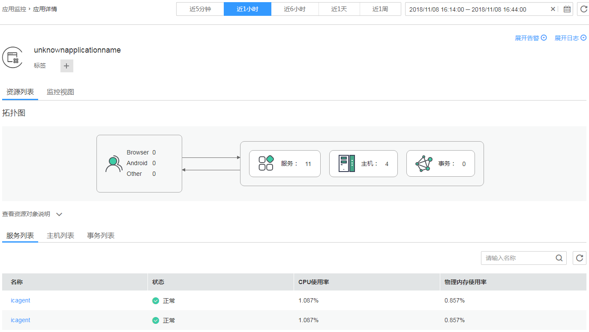
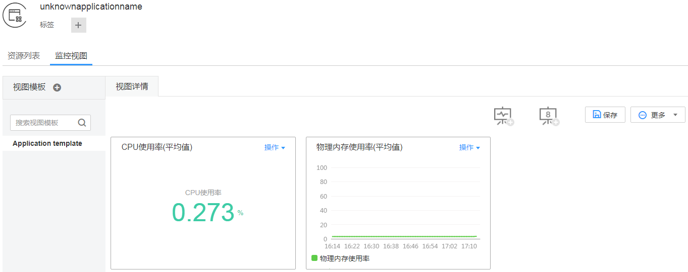
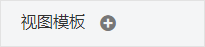

# 监控应用

应用是您根据业务需要，对完成相同或者相近业务的同一组服务进行的逻辑划分。应用的定义主要方便您对服务的运维，应用定义方式如下：

-   您在使用APM时，创建应用并安装了APM探针，可参考[快速入门-基于您的应用](https://support.huaweicloud.com/qs-apm/apm_00_0002.html)。
-   您在AOM的服务发现界面，配置应用信息，创建应用，可参考[配置服务发现](配置服务发现.md)。
-   您在AOM“应用监控 \> 服务列表”中创建应用，同时根据业务划分服务到应用中。

## 监控应用

1.  登录[应用运维管理](https://console.huaweicloud.com/aom/#/aom/ams/summary)。
2.  在左侧导航栏中选择“应用监控 \> 应用列表”，单击应用名称，在应用详情页面，以应用维度对服务进行批量管理与监控，例如，监控其主机、SLA指标、事务等。

    您还可执行如下操作：

    -   **查看当前应用关联的告警**

        AOM提供了告警的统计信息，单击（再次单击可收起），选择时间段（例如，近5分钟、近1小时、近6小时、近1天、近1周等），即可通过柱状图查看当前应用在某个时间段告警个数的变化趋势。在下面的告警列表中，可查看具体的告警，同时您可根据需要选择是否需要采取相应措施清除故障。

    -   **查看当前应用的日志量**

        AOM提供了日志量的统计信息，单击（再次单击可收起），选择时间段（例如，近5分钟、近1小时、近6小时、近1天、近1周等），即可通过柱状图查看当前应用在某个时间段日志量的变化趋势。

    

3.  在日常运维中，您可在“监控视图”页签中监控应用的各种指标。

    

    您还可执行如下操作：

    -   **创建视图模板**

        AOM提供了默认视图模板：Application template，且支持修改，您还可单击中的加号自定义视图模板。

    -   **添加指标图表**

        单击、可在视图模板中分别添加曲线图、数字图。您还可对视图模板中的指标图表进行删除、移动、复制等操作，详细操作请参见[仪表盘](仪表盘.md)。

    -   **添加到仪表盘**

        通过右上角“更多”下拉列表框，可对视图模板中的指标图表批量设置时间范围（只是临时展示，不支持保存）、添加视图模板到仪表盘并在“视图管理 \> 仪表盘”界面进行监控等。

