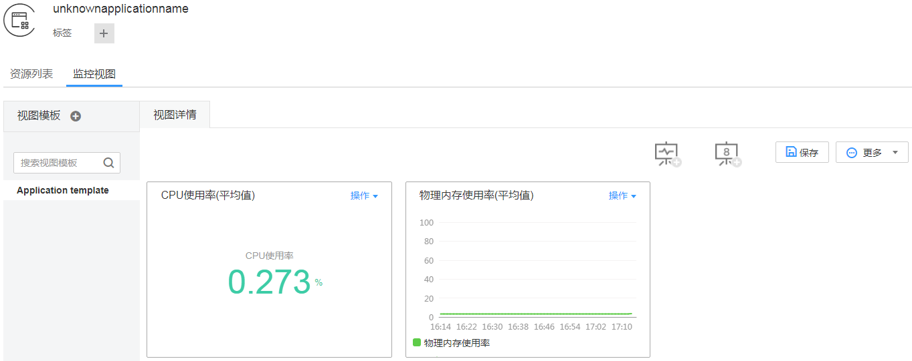
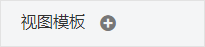

# 监控应用

应用是您根据业务需要，对相同或者相近业务的一组服务进行逻辑划分。应用的类型包括系统应用和自定义应用。系统应用是在APM部署并同步到AOM的应用，应用名称不能修改；自定义应用可以修改应用名称或编辑应用信息，即将功能相似或者组合完成某一功能的一系列服务划分为同一应用。

应用的定义方便您对服务的运维和管理，应用定义方式如下：

-   您在使用APM时，创建应用并安装了APM探针，可参考[快速入门-基于您的应用](https://support.huaweicloud.com/qs-apm/apm_00_0002.html)。此类应用为系统应用，您可以在AOM查询系统应用。
-   您在AOM的服务发现界面，配置应用信息，创建应用，可参考[配置服务发现](配置服务发现.md)。您可以自定义应用名称，也可以添加系统应用的应用名称。
-   您在AOM“应用监控 \> 应用列表”中创建应用，同时根据业务划分服务到应用中。您可以自定义应用，也可以查询系统应用。
-   您在AOM“应用监控 \> 服务列表”中创建应用，同时根据业务划分服务到应用中。您可以自定义应用，也可以查询系统应用。

## 监控应用

1.  登录AOM控制台，在左侧导航栏中选择“应用监控 \> 应用列表”。
2.  单击列表中应用的名称，在应用详情页面以应用维度对服务进行批量管理与监控。

    **图 1**  应用详情  
    

3.  在日常运维中，您可在“监控视图”页签中监控应用的各种指标。

    **图 2**  监控视图  
    

    您还可执行如下操作：

    -   **添加应用**

        对相同或相近业务的默认服务发现规则发现的服务或没有安装APM探针的服务，您可对其进行逻辑分组，即将其添加到同一应用，以应用维度整体进行监控。

        在“应用列表”界面的右上角，单击“新增应用”添加自定义应用。添加成功后，您可以监控此应用。

    -   **创建视图模板**

        AOM提供了默认视图模板：Application template，且支持修改，您还可单击中的加号自定义视图模板。

    -   **添加指标图表**

        单击、可在视图模板中分别添加曲线图、数字图。您还可对视图模板中的指标图表进行删除、移动、复制等操作，详细操作请参见[仪表盘](仪表盘.md)。

    -   **添加到仪表盘**

        通过右上角“更多”下拉列表框，可对视图模板中的指标图表批量设置时间范围、添加视图模板到仪表盘并在“视图管理 \> 仪表盘”界面进行监控等。

