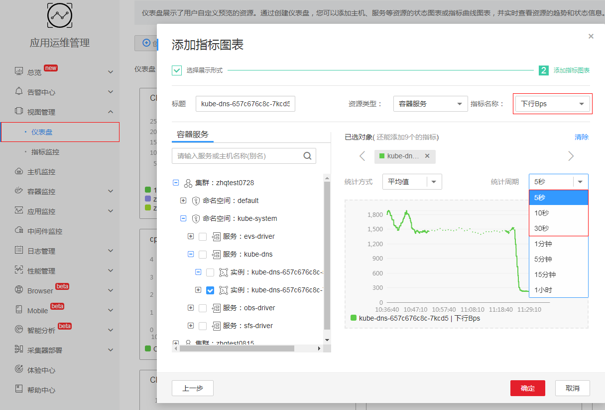
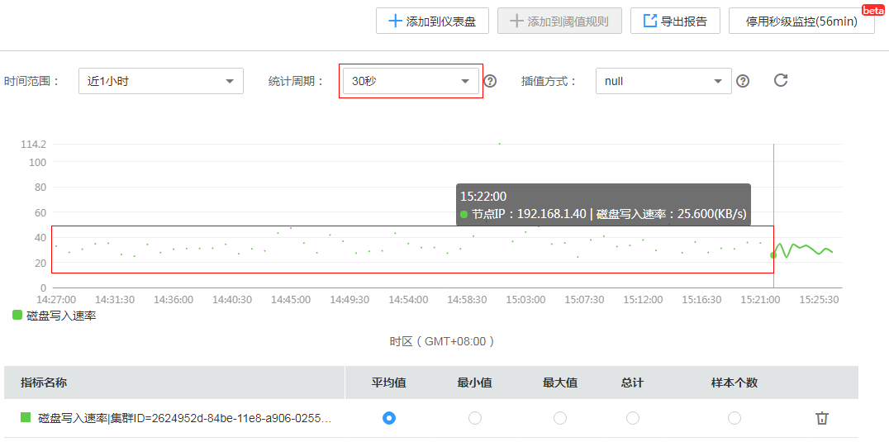
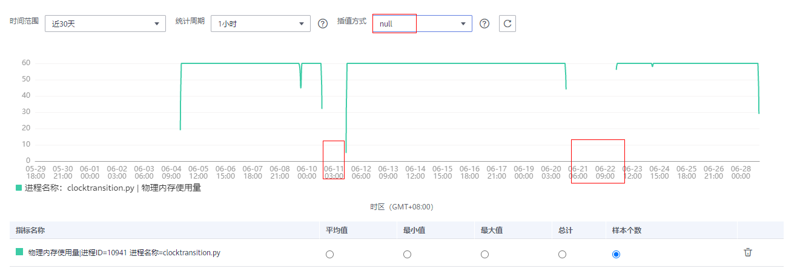
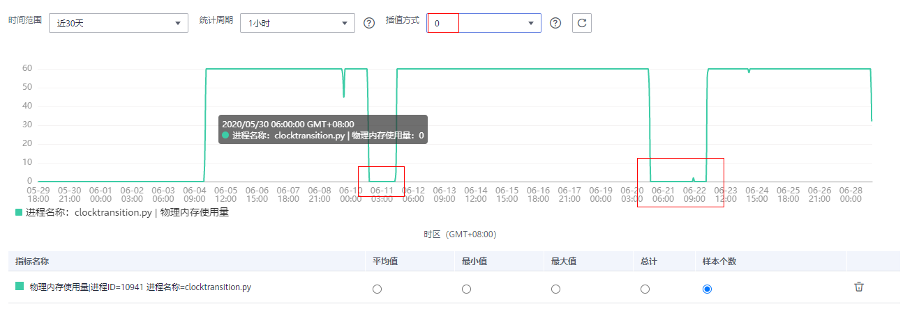
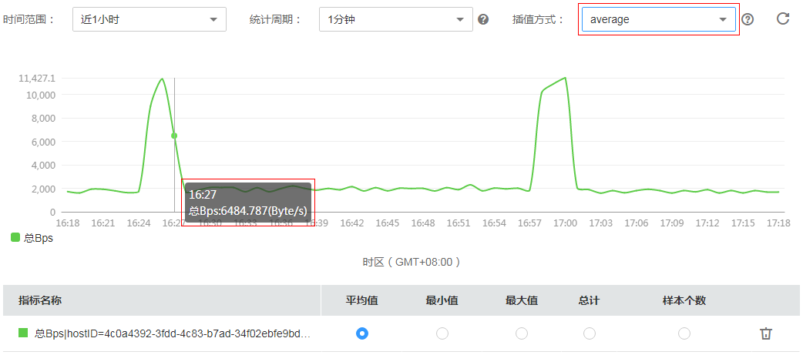

# 监控指标

指标监控展示了各资源的指标数据，您可实时监控指标值及趋势，还可将关注的指标添加到仪表盘，对其创建阈值规则、启动秒级监控和导出监控报告等操作，以便实时查看业务及做数据关联分析。

## 监控指标

1.  登录AOM控制台，在左侧导航栏中选择“视图管理 \> 指标监控”。
2.  在左侧指标树上选择一个或多个（最多可选12个）关注的指标，指标详细信息请参见[指标总览](https://support.huaweicloud.com/productdesc-aom/aom_06_0014.html)。
3.  参考[表1](#d0e3947)设置指标参数信息，查看页面右侧的指标图表，多角度对指标数据进行分析。

    **表 1**  指标参数说明

    
    <table><thead align="left"><tr id="row13127381"><th class="cellrowborder" valign="top" width="20%" id="mcps1.2.3.1.1">
参数

    </th>
    <th class="cellrowborder" valign="top" width="80%" id="mcps1.2.3.1.2">
说明

    </th>
    </tr>
    </thead>
    <tbody><tr id="row59437682"><td class="cellrowborder" valign="top" width="20%" headers="mcps1.2.3.1.1 ">
时间范围

    </td>
    <td class="cellrowborder" valign="top" width="80%" headers="mcps1.2.3.1.2 ">
需要监控的指标数据的时间范围。

    </td>
    </tr>
    <tr id="row16012632"><td class="cellrowborder" valign="top" width="20%" headers="mcps1.2.3.1.1 ">
统计周期

    </td>
    <td class="cellrowborder" valign="top" width="80%" headers="mcps1.2.3.1.2 ">
指标数据按照所设置的统计周期进行聚合。

    </td>
    </tr>
    <tr id="row29913342"><td class="cellrowborder" valign="top" width="20%" headers="mcps1.2.3.1.1 ">
统计方式

    </td>
    <td class="cellrowborder" valign="top" width="80%" headers="mcps1.2.3.1.2 ">
指标数据按照所设置的统计方式进行聚合。

    
 说明： 

样本个数为指标数据点的计数。

    

    </td>
    </tr>
    </tbody>
    </table>

## 更多设置

您还可以执行[表2](#table1679219139498)中的操作。

**表 2**  相关操作

<table><thead align="left"><tr id="row7794181394914"><th class="cellrowborder" valign="top" width="20%" id="mcps1.2.3.1.1">
操作

</th>
<th class="cellrowborder" valign="top" width="80%" id="mcps1.2.3.1.2">
说明

</th>
</tr>
</thead>
<tbody><tr id="row779471324911"><td class="cellrowborder" valign="top" width="20%" headers="mcps1.2.3.1.1 ">
添加指标图表到仪表盘

</td>
<td class="cellrowborder" valign="top" width="80%" headers="mcps1.2.3.1.2 ">
单击“添加到仪表盘”，可将该指标图表添加到仪表盘中。

</td>
</tr>
<tr id="row10794201364910"><td class="cellrowborder" valign="top" width="20%" headers="mcps1.2.3.1.1 ">
为指标添加阈值规则

</td>
<td class="cellrowborder" valign="top" width="80%" headers="mcps1.2.3.1.2 ">
单击“添加到阈值规则”，设置阈值规则参数，单击“添加”。

</td>
</tr>
<tr id="row47947132499"><td class="cellrowborder" valign="top" width="20%" headers="mcps1.2.3.1.1 ">
导出监控报告

</td>
<td class="cellrowborder" valign="top" width="80%" headers="mcps1.2.3.1.2 ">
单击“导出报告”，可将该指标图表以CSV格式导出，以便进行本地存储及进一步分析。

</td>
</tr>
<tr id="row279441316491"><td class="cellrowborder" valign="top" width="20%" headers="mcps1.2.3.1.1 ">
启用秒级监控

</td>
<td class="cellrowborder" valign="top" width="80%" headers="mcps1.2.3.1.2 ">
AOM支持如下两种不同粒度的指标监控。

<ul id="ul9354113271920"><li>分钟级监控：默认提供1分钟级粒度的指标监控，即采集周期为1分钟，ICAgent每1分钟采集一次指标数据。
您不需要进行任何设置。

</li><li>秒级监控：提供5秒、10秒、30秒级粒度的指标监控，即采集周期为5秒、10秒或30秒，ICAgent每5秒、10秒或30秒采集一次指标数据。
当您在业务高峰时期需要对资源进行更全面细致的监控，1分钟级粒度的指标监控已无法满足需求时，您可在指标监控界面启用秒级监控并根据实际需求选择采集周期，进而进行秒级监控，如下图所示：

<b>图1 </b>秒级监控-指标监控界面 

秒级监控对您的仪表盘也生效，启用秒级监控后，您可在仪表盘中对指标进行秒级监控。如下图所示：

<b>图2 </b>秒级监控-仪表盘界面 

 说明： 

在使用秒级监控时，您需注意以下使用限制：

<ul id="ul559051716358"><li>秒级监控生效时长为60分钟。
您单击“启用秒级监控”后，“启用秒级监控”按钮变为“停用秒级监控”，同时系统开始倒计时，您不需要进行任何操作，1小时后AOM会自动停用秒级监控。

</li><li>秒级监控不支持立即启停，启停间隔为1分钟。
启用秒级监控后，需立即停用时，您需等待1分钟方能停用。

停用秒级监控后，需立即启用时，您需等待1分钟方能启用。

</li><li>启用秒级监控后，“指标监控”和“仪表盘”界面指标的统计周期将自动切换为您设置的采集周期；停用秒级监控后，指标统计周期会自动恢复为您启用前的默认设置。</li><li>自定义指标、SLA指标、集群指标暂不支持秒级监控。<a href="https://support.huaweicloud.com/productdesc-aom/aom_06_0011.html" target="_blank" rel="noopener noreferrer">SLA指标有哪些？</a>  <a href="https://support.huaweicloud.com/productdesc-aom/aom_06_0010.html" target="_blank" rel="noopener noreferrer">集群指标有哪些？</a></li><li>启用秒级监控后，当您将统计周期切换为5秒、10秒或30秒时，启用秒级监控前的指标数据会出现断点。
例如，您15:22:00启用秒级监控并设置采集周期为30秒，当您将统计周期由1分钟切换为30秒时，因15:22:00前ICAgent每1分钟采集一次指标数据，类似14:27:30、14:28:30、14:29:30等时间点ICAgent不会采集指标数据，故这些时间点会出现断点。15:22:00后ICAgent每30秒采集一次指标数据，断点将会消失，如下图所示。

<b>图3 </b>出现断点的指标图表 

您也可通过选择相应的插值方式，形成连续曲线。

</li></ul>

</li></ul>
</td>
</tr>
<tr id="row970274984116"><td class="cellrowborder" valign="top" width="20%" headers="mcps1.2.3.1.1 ">
设置插值方式

</td>
<td class="cellrowborder" valign="top" width="80%" headers="mcps1.2.3.1.2 ">
当指标图表出现断点时，AOM默认使用null（即空值）表示断点，如<a href="#fig3375195102312">图4</a>所示。当您需要使用指标图表做汇报或展示时，出现断点的指标图表不太美观，您可通过切换插值为0或average的方式，对缺失的指标数据进行断点插值，进而规避掉断点。

插值方式您可以选择null、0或average。

<ul id="ul18810182132915"><li>null：默认设置，断点处使用空值表示。如下图所示：
<b>图4 </b>插值方式为null 

</li><li>0 ：断点处使用0表示。如下图所示：
<b>图5 </b>插值方式为0 

</li><li>average：断点处使用平均值表示<strong id="b158919383216">。</strong>如下图所示：
<b>图6 </b>插值方式为average 

 说明： 

average插值方式即断点处使用平均值表示，下面介绍该平均值的计算方法。

指标图表可能会出现多处断点，当出现多处断点时，以从左往右的顺序对断点分别进行插值，下面以首个断点为例介绍平均值的计算方法，其他断点平均值计算方法和首个断点类似。

<ul id="ul1746591614315"><li>如果首个断点为指标图表上的第一个点，则断点处值为从其后一个点开始往右数起的第一个有效数据。
例如，指标图表上有a、b、c、d、e五个点，其中a=null、b=null、c=null、d=null、e=5，则首个断点a处的值为5。

</li><li>如果首个断点为指标图表中间的某一个点，则分为以下两种场景：
场景一：如果其前一个点为有效数据，其后一个点也为有效数据，则断点处值为其前一个点和后一个点的平均值。

例如，指标图表上有a、b、c、d、e五个点，其中a=1、b=null、c=3、d=null、e=5，则首个断点b处的值为（a+c）/2=（1+3）/2=2。

场景二：如果其前一个点为有效数据，其后一个点为空值，则断点处值为其前一个点和从其后一个点开始往右数起的第一个有效数据的平均值。

例如，指标图表上有a、b、c、d、e五个点，其中a=1、b=null、c=null、d=null、e=5，则第一个断点b处的值为（a+e）/2=（1+5）/2=3，因为是以从左往右顺序分别进行插值，所以第二个断点c处的值为（b+e）/2=（3+5）/2=4，第三个断点d处的值为（c+e）/2=（4+5）/2=4.5。

</li><li>如果首个断点为指标图表上的最后一个点，则断点处值为其前一个点的值。
例如，指标图表上有a、b、c、d、e五个点，其中a=1、b=2、c=3、d=4、e=null，则首个断点e处的值为4。

</li><li>如果指标图表上所有点均为断点，则使用average插值方式插值后，所有断点处的值还是null。
例如，指标图表上有a、b、c、d、e五个点，其中a=null、b=null、c=null、d=null、e=null，则所有断点处的值均为null。

</li></ul>

</li></ul>
</td>
</tr>
</tbody>
</table>

