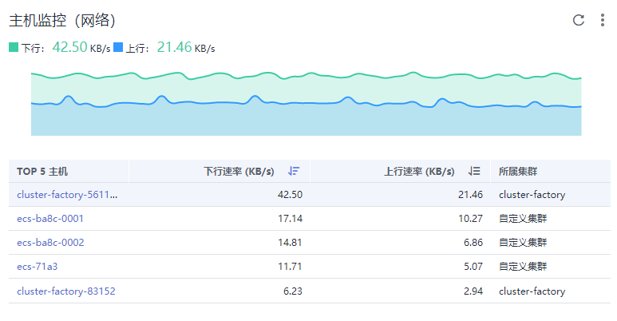

# 监控概览

“监控概览”界面提供了资源、应用、应用用户体验的全链路、多层次、一站式运维界面。分别展示了基础设施监控、信息统计、主机监控（CPU&内存）、组件监控（CPU&内存）、容器实例监控（CPU&内存）、主机监控（磁盘）、主机监控（网络）、集群监控（CPU&内存）和集群监控（磁盘）9种数据信息卡片，下面分别介绍各卡片内容及操作：

## 基础设施监控卡片

**图 1**  基础设施监控  

此卡片主要展示基础设施的指标数据。可通过选择集群，呈现某一个集群或者所有集群中的信息。如图选择所有集群，即该基础设施监控卡片呈现所有集群的如下信息：

-   主机运行状态，CPU、物理内存的使用量。
-   近1小时网络流量数据的趋势图，趋势图每1分钟一个点，趋势图每一个点的值表示1分钟内所有集群的接收Bps之和、发送Bps之和。趋势图上方的值为最新时间点所有集群的接收Bps之和、发送Bps之和。
-   近1小时CPU及内存使用率数据的趋势图，趋势图的每一个点分别表示1分钟内所有集群的CPU使用率的平均值以及所有集群的内存使用率的平均值。趋势图上方的值为最新时间点所有集群的CPU使用率的平均值和所有集群的内存使用率的平均值。

## 应用监控卡片

**图 2**  应用监控  

此卡片主要展示应用监控的指标数据。

1.  应用、组件、容器和实例的运行状态。
2.  选择一个应用，可呈现该应用的如下信息：
    -   近1小时网络流量数据的趋势图，趋势图每1分钟一个点，趋势图每一个点的值表示1分钟内所选应用的接收Bps、发送Bps。趋势图上方的值为最新时间点所选应用的接收Bps、发送Bps。
    -   近1小时CPU及内存使用率数据的趋势图，趋势图的每一个点分别表示1分钟内所选应用的CPU使用率以及内存使用率。趋势图上方的值为最新时间点所选应用的CPU使用率和内存使用率。

## 信息统计卡片

**图 3**  信息统计  

此卡片主要统计展示告警、日志使用量、阈值规则、告警/主机个数趋势图的数据。其中告警/主机个数趋势图展示的是近15天的趋势。

## 主机监控（CPU&内存）卡片

**图 4**  主机监控（CPU&内存）  

此卡片主要展示了3种信息：

-   统计最新时间前1分钟内的主机的CPU使用率、内存使用率在TOP5的主机信息。
-   最近1小时内的所选主机的CPU使用率、内存使用率的趋势图，趋势图的每一个点分别表示1分钟内主机CPU&内存使用率的值。
-   趋势图上方的值为所选主机下监控的最新时间点CPU&内存使用率的值。

## 组件监控（CPU&内存）卡片

**图 5**  组件监控（CPU&内存）卡片  

此卡片主要展示了4种信息：

-   统计最新时间前1分钟内的组件的CPU使用率、内存使用率在TOP5的组件信息。
-   最近1小时内的所选组件的CPU使用率、内存使用率的趋势图，趋势图的每一个点分别表示1分钟内组件CPU&内存使用率的值。
-   趋势图上方的值为所选组件下监控的最新时间点CPU&内存使用率的值。
-   此卡片左下角通过勾选可隐藏系统组件。

## 容器实例监控（CPU&内存）卡片

**图 6**  容器实例监控（CPU&内存）  

此卡片主要展示了4种信息：

-   统计最新时间前1分钟内的容器实例的CPU使用率、内存使用率在TOP5的实例信息。
-   最近1小时内的所选容器实例的CPU使用率、内存使用率的趋势图，趋势图的每一个点分别表示1分钟内容器实例CPU&内存使用率的值。
-   趋势图上方的值为所选容器实例下监控的最新时间点CPU&内存使用率的值。
-   此卡片左下角通过勾选可隐藏系统实例。

## 主机监控（磁盘）卡片

**图 7**  主机监控（磁盘）  

此卡片主要展示了3种信息：

-   统计最新时间前1分钟内的主机的磁盘读/写速率在TOP5的主机信息。
-   最近1小时内的所选主机的磁盘读/写速率的趋势图，趋势图的每一个点分别表示1分钟内主机的磁盘读/写速率的值。
-   趋势图上方的值为所选主机的磁盘监控的最新时间点主机的磁盘读/写速率的值。

## 主机监控（网络）卡片

**图 8**  主机监控（网络）  

此卡片主要展示了3种信息：

-   统计最新时间前1分钟内的主机的网络发送/接收速率在TOP5的主机信息。
-   最近1小时内的所选主机的网络发送/接收速率的趋势图，趋势图的每一个点分别表示1分钟内所选主机的网络发送/接收速率的值。
-   趋势图上方的值为所选主机的网络监控的最新时间点主机的网络发送/接收速率的值。

## 集群监控（CPU&内存）卡片

**图 9**  集群监控（CPU&内存）  

此卡片主要展示了3种信息：

-   统计最新时间前1分钟内的集群的CPU使用率、内存使用率在TOP5的集群信息。
-   最近1小时内的所选集群的CPU使用率、内存使用率的趋势图，趋势图的每一个点分别表示1分钟内集群CPU&内存使用率的值。
-   趋势图上方的值为所选集群下监控的最新时间点CPU&内存使用率的值。

## 更多监控概览界面操作

您还可以执行[表1](#table62191141172620)中的操作。

**表 1**  相关操作

<table><thead align="left"><tr id="row17219114119268"><th class="cellrowborder" valign="top" width="20%" id="mcps1.2.3.1.1">
操作

</th>
<th class="cellrowborder" valign="top" width="80%" id="mcps1.2.3.1.2">
说明

</th>
</tr>
</thead>
<tbody><tr id="row1532855313308"><td class="cellrowborder" valign="top" width="20%" headers="mcps1.2.3.1.1 ">
将卡片移至收藏夹

</td>
<td class="cellrowborder" valign="top" width="80%" headers="mcps1.2.3.1.2 ">
如果不需要关注某个卡片时，可单击卡片右上角的并选择“移至收藏夹”。卡片移至收藏夹后将在“监控概览”界面隐藏。若后续又需使用时，您可从收藏夹中快速获取。

</td>
</tr>
<tr id="row1979961219393"><td class="cellrowborder" valign="top" width="20%" headers="mcps1.2.3.1.1 ">
将卡片添加到仪表盘

</td>
<td class="cellrowborder" valign="top" width="80%" headers="mcps1.2.3.1.2 ">
可单击卡片右上角的并选择“添加至仪表盘”。

</td>
</tr>
<tr id="row20219841152617"><td class="cellrowborder" valign="top" width="20%" headers="mcps1.2.3.1.1 ">
放大指标图表

</td>
<td class="cellrowborder" valign="top" width="80%" headers="mcps1.2.3.1.2 ">
单击指标图表右上角的。

</td>
</tr>
<tr id="row19219204172614"><td class="cellrowborder" valign="top" width="20%" headers="mcps1.2.3.1.1 ">
蓝色字体下钻

</td>
<td class="cellrowborder" valign="top" width="80%" headers="mcps1.2.3.1.2 ">
单击界面中的“主机”“应用”、“组件”等蓝色字体可下钻到具体详情页面，查看更详细的数据。

</td>
</tr>
</tbody>
</table>

