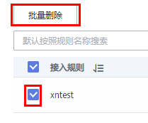

# 管理接入规则

本章为您介绍如何添加、查看、删除接入规则。

## 前提条件

-   已创建需要映射的日志组和日志流。创建方法请参见：[创建日志组和日志流](https://support.huaweicloud.com/qs-lts/lts_08301.html)，也可以在添加接入规则页面直接创建。
-   已有集群、命名空间和工作负载，详情请参见：[CCE用户指南](https://support.huaweicloud.com/cce/)、[CCI用户指南](https://support.huaweicloud.com/cci/)；已[配置容器服务日志采集路径](配置容器服务日志采集路径.md)。

## 添加接入规则

将AOM中的CCE、CCI或自定义集群的日志映射至LTS需要进行如下操作步骤：

1.  登录AOM控制台，在左侧导航栏中选择“日志 \> 接入LTS”。
2.  单击“添加接入规则”。
3.  选择接入类型。请根据您的需求选择“按命名空间接入”“按工作负载接入”或“自动映射”。
    -   **按命名空间接入**：将所选命名空间的全部日志接入到指定的日志流。
        1.  规则名称：填写规则名称（自定义即可）。
        2.  选择集群：在下拉框中选择已有集群。
        3.  命名空间：在下拉框中选择已有命名空间。
        4.  工作负载：默认为“全部”，不可更改。
        5.  容器：在下拉框中选择已有容器。
        6.  选择接入规则：
            -   全部日志：选择日志组和日志流。
            -   指定日志路径：填写需要接入的日志路径，然后选择日志组和日志流。

    -   **按工作负载接入**：将所选工作负载的日志接入到指定的日志流
        1.  规则名称：填写规则名称（自定义即可）。
        2.  选择集群：在下拉框中选择已有集群。
        3.  命名空间：在下拉框中选择已有命名空间。
        4.  工作负载：在下拉框中选择已有工作负载，可以选择一个或多个。
        5.  容器：在下拉框中选择已有容器。
        6.  选择接入规则：
            -   全部日志：选择日志组和日志流。
            -   指定日志路径：填写需要接入的日志路径，然后选择日志组和日志流。

    -   **自动映射**：自动将工作负载的日志接入到系统生成的同名日志流。
        1.  规则名称：填写规则名称（自定义即可，如test）。选择集群：在下拉框中选择已有集群。
        2.  命名空间：在下拉框中选择已有命名空间。
        3.  工作负载：在下拉框中选择已有工作负载，可以选择一个或多个。

            若选择1个工作负载，规则创建成功后规则名称会被命名为“自定义规则名称\_0”，如“test\_0”；若选择多个工作负载，规则创建成功后规则名称会被依次命名为“自定义规则名称\_0”、“自定义规则名称\_1”等，如“test\_0”、“test\_1”。

        4.  选择接入规则：选择日志组，并根据工作负载自动生成同名日志流，默认为已选择的工作负载的全部日志都接入。

## 查看和管理接入规则

您可以在接入LTS界面对已添加的接入规则进行搜索、查看、编辑和删除。

-   搜索

    单击搜索框，选择搜索维度，如选择“工作负载”，然后继续选择该维度下的可选项。如未选择搜索维度，直接输入搜索关键字，则默认按照接入规则名称搜索。

    **图 1**  选择搜索维度  
    

-   查看

    您可以在“接入LTS”界面查看已创建的接入规则。单击搜索框右上方的，可以设置显示字段。单击“所属日志组”列的日志组名称，可以跳转到LTS控制台的日志组详情。

-   编辑

    在“接入LTS”界面，单击“操作”列的，可以编辑该接入规则。修改接入规则的影响请参见[修改映射](概述-0.md#section42756211404)。

-   删除

    在“接入LTS”界面，单击“操作”列的，可以删除该接入规则。或勾选规则名称，进行批量删除。

    **图 2**  批量删除接入规则。  
    

    > **说明：** 
    >删除接入规则或删除映射日志流不可恢复，请您谨慎操作。删除接入规则的影响请参见[删除映射](概述-0.md#section2327059232)。

