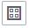
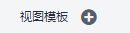

# 组件监控

组件即您部署的服务，包括容器和普通进程。例如，云容器引擎（CCE）服务中的工作负载（workload）可以是一个组件，同时直接在虚机上运行的tomcat也可以是一个组件。

组件列表展示了每个组件的类型、CPU占用、内存占用和告警状态等信息，您可直观了解每个组件的运行状态。单击组件名称，可了解更多组件状态。AOM支持从组件下钻到实例，从实例下钻到容器。通过各层状态，您可完成对组件的立体监控。

1.  在左侧导航栏中选择“监控 \> 组件监控”，查看组件列表。
    -   组件列表中对组件名称、状态、所属应用、部署方式、应用发现规则等参数进行展示。
    -   为了方便您查看组件列表，您可以单击右上角图标对组件列表进行过滤显示，实现隐藏系统组件。
    -   可以在组件列表上方设置过滤条件，实现组件列表过滤显示。

2.  您可根据需要选择是否对组件执行如下操作：
    -   **添加别名**

        当组件名称比较复杂，不便于识别时，您可为该组件增加一个便于识别的别名。

        单击“操作”列下的“增加别名”进行增加。

    -   **添加标签**

        标签是组件的标识，通过标签您可区分系统组件和非系统组件，AOM默认为系统组件（系统组件包括icagent、css-defender、nvidia-driver-installer、nvidia-gpu-device-plugin、kube-dns、org.tanukisoftware.wrapper.WrapperSimpleApp、evs-driver, obs-driver、sfs-driver, icwatchdog、sh等）打上“System Component”标签，您可单击右上角的，通过选中或取消选中“隐藏系统组件”前的复选框，自定义系统组件的展示与隐藏。同时AOM支持您自定义标签，方便您对组件进行管理。

        在组件列表中，单击组件所在行“操作”列的“增加标签”，单击，输入标签后，单击，再单击“确定”。标签添加成功后，您还可在页面右上角的搜索框中输入标签关键字，使用标签快速搜索组件。

        > **说明：** 
        >-   组件列表的“标签”列默认隐藏，您可单击右上角的，通过选中或取消选中“标签”前的复选框，自定义其展示与隐藏。在“标签”列中，多个标签间用英文双引号分隔，在使用标签搜索组件时输入双引号里的内容即可。
        >-   组件列表的“应用发现规则”列说明：
        >    -   Sys\_Rule：说明组件由AOM内置应用发现规则“Sys\_Rule”自动发现，详见[内置发现规则](配置应用发现规则.md#section938317591962)。
        >    -   Default\_Rule：说明组件由AOM内置应用发现规则“Default\_Rule”自动发现，详见[内置发现规则](配置应用发现规则.md#section938317591962)。
        >    -   自定义应用发现规则：规则名称无固定值，规则名称是您手动配置的应用发现规则名称，说明应用由您自定义的发现规则发现。

3.  设置搜索条件搜索要查看的组件。
4.  单击名称，进入“组件详情”页面。
    -   在“实例列表”页签，可查看该组件所有实例的概况。

        > **说明：** 
        >单击实例名称，可监控业务进程或组件pod的资源占用与健康状态。

    -   在“主机列表”页签，可查看该组件所在的主机概况。
    -   在“告警分析”页签，可查看该组件的告警情况。

    -   单击“监控视图”页签，可监控该组件的各种指标。
        1.  AOM提供了默认视图模板：Service Template，且支持修改，您还可单击中的加号自定义视图模板。
        2.  单击、可在视图模板中分别添加曲线图、数字图。您还可对视图模板中的指标图表进行删除、移动、复制等操作，详细操作请参见[仪表盘](仪表盘.md)。
        3.  通过右上角“更多”下拉列表框，可对添加视图模板到仪表盘并在“ 仪表盘”界面进行监控等。

