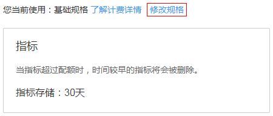
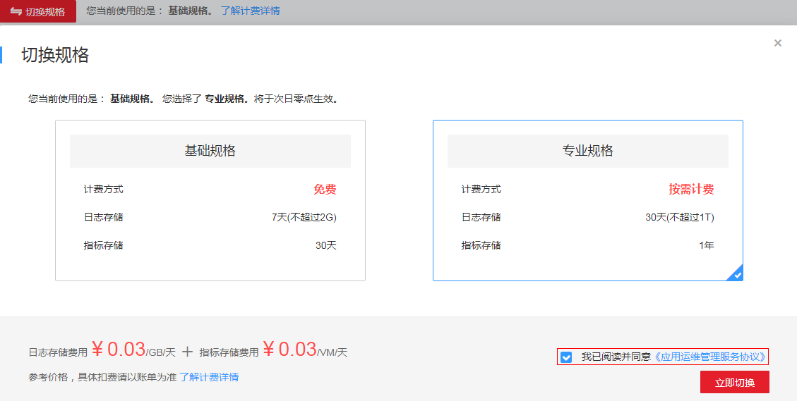

# 设置指标配额

配额有基础规格和专业规格两种可供您切换，基础规格与专业规格相比较，基础规格在计费方式上是免费的，但是指标存储的容量比较少。您可通过自己的需求，切换为基础规格或者专业规格。

1.  登录[应用运维管理](https://console.huaweicloud.com/aom/#/aom/ams/summary)。
2.  在左侧导航栏中选择“应用监控 \> 配额设置”。
3.  在配额界面可以看到您当前使用的指标规格。如果您想要修改，可单击“修改规格”，跳转到运维概览界面。

    

    > **说明：**   
    >您还可以通过登录[应用运维管理](https://console.huaweicloud.com/aom/#/aom/ams/summary)后，在左侧导航栏中选择“总览 \> 运维概览”，查看到您当前使用的规格，并进行修改切换。  

4.  单击“切换规格”，在切换规格对话框中选择您想要使用的规格（切换规格后您的日志配额也会被同时修改），勾选“我已阅读并同意[《应用运维管理服务协议》](https://www.huaweicloud.com/declaration/tsa_aom.html)”选框。

    

5.  单击“立即切换”，至此配额修改完成。

