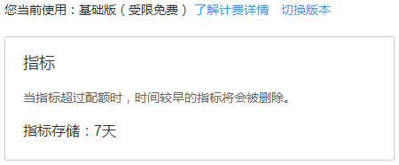
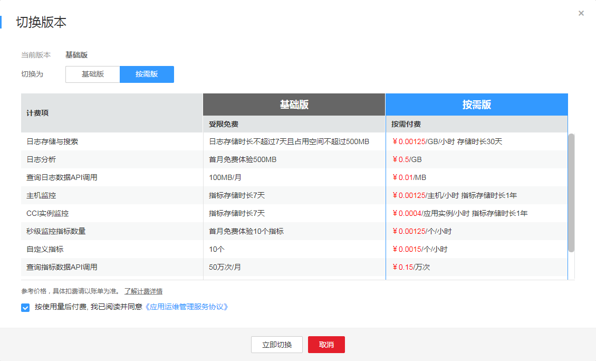

# 设置指标配额

配额有基础版和按需版两种可供您切换，基础版与按需版相比较，基础版在计费方式上是免费的，但指标存储时长较少。您可通过自己的需求，切换为基础版或按需版。

1.  登录[应用运维管理](https://console.huaweicloud.com/aom/#/aom/ams/summary)。
2.  在左侧导航栏中选择“应用监控 \> 配额设置”。
3.  在配额界面可看到您当前使用的指标配额。如果您想要修改，可单击“切换版本”，跳转到运维概览界面。

    **图 1**  指标配额  
    

    > **说明：**   
    >您还可以通过登录[应用运维管理](https://console.huaweicloud.com/aom/#/aom/ams/summary)后，在左侧导航栏中选择“总览 \> 运维概览”，查看到您当前使用的版本，并进行修改切换。  

4.  单击“切换版本”，在切换版本对话框中选择您想要使用的版本（切换版本后您的其他配额也会被同时修改），勾选复选框，单击“立即切换”，至此配额修改完成。

    **图 2**  设置指标配额  
    

