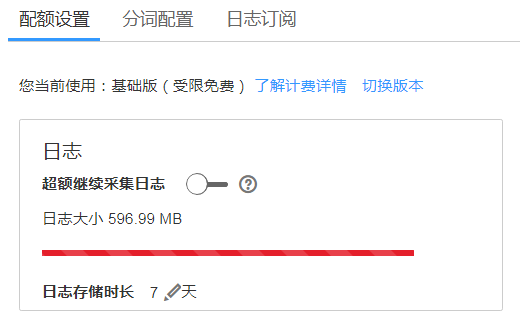

# 设置日志配额

配额有基础版和按需版两种可供您切换，且收费不同，详见[价格详情](https://www.huaweicloud.com/pricing.html?tab=detail#/aom)。您可通过自己的需求，切换为基础版或者按需版。

1.  登录AOM控制台，在左侧导航栏中选择“日志管理 \> 配置中心”。
2.  在“配额设置”界面可以看到您当前使用的版本、日志大小、存储时长。

    **图 1**  日志配额  
    

    -   **切换版本**：如果您想要修改版本，可单击“切换版本”，跳转到运维概览界面。在切换规格对话框中选择您想要使用的版本（切换版本后您的其他配额也会被同时修改），勾选复选框，单击“立即切换”，配额修改完成。
    -   **超额继续采集日志**：打开此开关表示日志量超过赠送配额时将继续采集日志，超过部分按需收费。关闭开关时，日志量达到赠送配额后将停止日志采集。
    -   **日志存储时长**：可设置为1-30天，默认为7天。

    > **说明：**   
    >您还可以在左侧导航栏中选择“总览 \> 运维概览”，查看或切换当前使用的版本。  

