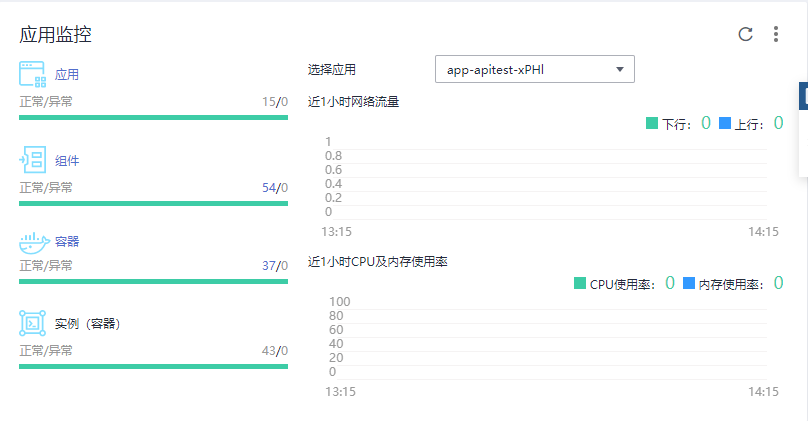
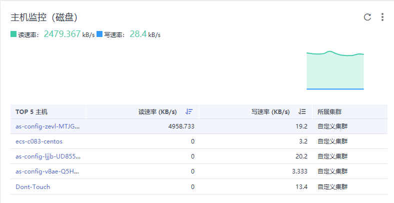
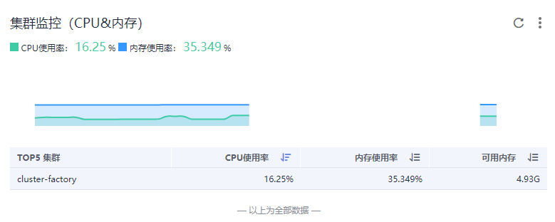

# 运维概览

“运维概览”界面提供了资源、应用、应用用户体验的全链路、多层次、一站式运维界面。分别展示了应用性能监控、用户体验监控、基础设施监控、应用监控、信息统计、主机监控（CPU&内存）、服务监控（CPU&内存）、实例监控（CPU&内存）、主机监控（磁盘）、主机监控（网络）、集群监控（CPU&内存）和集群监控（磁盘）12种数据信息卡片，下面分别介绍各卡片内容及操作：

## 应用性能监控卡片

**图 1**  应用性能监控  

此卡片主要展示应用的性能数据，包含应用性能指数圈图和指标趋势图。因为这些数据是由应用性能管理服务采集处理的，所以如果您的界面中此卡片没有数据且鼠标移动到卡片的时候显示，请单击去开通应用性能管理服务。

-   应用性能指数圈图上的每一段表示一个应用，且圈图上监控到的应用为使用了APM探针的应用（可参考[快速入门-基于您的应用](https://support.huaweicloud.com/qs-apm/apm_00_0002.html)）。每一段的颜色表示用户对应用性能的满意度（红色：用户体验较差，0 ≤  [Apdex](https://support.huaweicloud.com/productdesc-apm/apm_06_0002.html#apm_06_0002__zh-cn_topic_0090516649_s832fc4f0378f4d2b83bd1f93f5b8740c)  < 0.3；黄色：用户体验一般，0.3 ≤ Apdex < 0.75；绿色：用户体验较满意，0.75 ≤ Apdex ≤ 1）。每一段的占比与应用的Apdex值有关，Apdex值越大，占比越大，用户对应用性能的满意度也越高。例如上图有3个应用，则圈图有3段，其中有1个应用用户体验较差，1个应用用户体验一般，1个应用用户体验较满意，绿色分段占比最多，Apdex值最大，用户满意度也最高。
-   近1小时吞吐量、近1小时请求时延趋势图绘制了应用的最近一小时吞吐量、请求时延，每5分钟一个点。趋势图上方的值表示近1小时内所有应用吞吐量，或请求时延的平均值。
-   近1小时吞吐量、近1小时平均时延汇总了吞吐量、平均时延为Top3的应用列表。

## 用户体验监控卡片

**图 2**  用户体验监控  

此卡片主要展示应用用户体验的浏览器端的数据，包含地图、指标数据、TOP5数据。因为这些数据是由应用性能管理服务采集处理的，所以如果您的界面中此卡片没有数据且鼠标移动到卡片的时候显示，请单击去开通应用性能管理服务。用户体验数据是显示所选应用的浏览器端的用户体验数据，您可根据需要在下拉框中选择需要查看的应用及指标项（Apdex、错误数、吞吐量、时延）。地图、指标数据、TOP5数据区域展示的是最近5分钟的浏览器端用户体验数据。

## 基础设施监控卡片

**图 3**  基础设施监控  

此卡片主要展示基础设施的指标数据。可通过选择集群，呈现某一个集群或者所有集群中的信息。如图选择所有集群，即该基础设施监控卡片呈现所有集群的如下信息：

-   主机运行状态，CPU、物理内存和磁盘的使用量。
-   近1小时网络流量数据的趋势图，趋势图每1分钟一个点，趋势图每一个点的值表示1分钟内所有集群的下行Bps之和、上行Bps之和。趋势图上方的值为最新时间点所有集群的下行Bps之和、上行Bps之和。
-   近1小时CPU及内存使用率数据的趋势图，趋势图的每一个点分别表示1分钟内所有集群的CPU使用率的平均值以及所有集群的内存使用率的平均值。趋势图上方的值为最新时间点所有集群的CPU使用率的平均值和所有集群的内存使用率的平均值。

## 应用监控卡片

**图 4**  应用监控  

此卡片主要展示应用监控的指标数据。

1.  应用、服务、容器和实例的运行状态。
2.  选择一个应用，可呈现该应用的如下信息：
    -   近1小时网络流量数据的趋势图，趋势图每1分钟一个点，趋势图每一个点的值表示1分钟内所选应用的下行Bps、上行Bps。趋势图上方的值为最新时间点所选应用的下行Bps、上行Bps。
    -   近1小时CPU及内存使用率数据的趋势图，趋势图的每一个点分别表示1分钟内所选应用的CPU使用率以及内存使用率。趋势图上方的值为最新时间点所选应用的CPU使用率和内存使用率。

## 信息统计卡片

**图 5**  信息统计  

此卡片主要统计展示告警、日志配额、阈值规则、日志&主机用量趋势图的数据。其中日志&主机用量趋势图是展示的是近15天的日志&主机用量趋势。

## 主机监控（CPU&内存）卡片

**图 6**  主机监控（CPU&内存）  

此卡片主要展示了3种信息：

-   统计最新时间前1分钟内的主机的CPU使用率、内存使用率在TOP5的主机信息。
-   最近1小时内的所选主机的CPU使用率、内存使用率的趋势图，趋势图的每一个点分别表示1分钟内主机CPU&内存使用率的值。
-   趋势图上方的值为所选主机下监控的最新时间点CPU&内存使用率的值。

## 服务监控（CPU&内存）卡片

**图 7**  服务监控（CPU&内存）卡片  

此卡片主要展示了4种信息：

-   统计最新时间前1分钟内的服务的CPU使用率、内存使用率在TOP5的服务信息。
-   最近1小时内的所选服务的CPU使用率、内存使用率的趋势图，趋势图的每一个点分别表示1分钟内服务CPU&内存使用率的值。
-   趋势图上方的值为所选服务下监控的最新时间点CPU&内存使用率的值。
-   此卡片左下角通过勾选可隐藏系统服务。

## 实例监控（CPU&内存）卡片

**图 8**  实例监控（CPU&内存）  

此卡片主要展示了4种信息：

-   统计最新时间前1分钟内的实例的CPU使用率、内存使用率在TOP5的实例信息。
-   最近1小时内的所选实例的CPU使用率、内存使用率的趋势图，趋势图的每一个点分别表示1分钟内实例CPU&内存使用率的值。
-   趋势图上方的值为所选实例下监控的最新时间点CPU&内存使用率的值。
-   此卡片左下角通过勾选可隐藏系统实例。

## 主机监控（磁盘）卡片

**图 9**  主机监控（磁盘）  

此卡片主要展示了3种信息：

-   统计最新时间前1分钟内的主机的磁盘读/写速率在TOP5的主机信息。
-   最近1小时内的所选主机的磁盘读/写速率的趋势图，趋势图的每一个点分别表示1分钟内主机的磁盘读/写速率的值。
-   趋势图上方的值为所选主机的磁盘监控的最新时间点主机的磁盘读/写速率的值。

## 主机监控（网络）卡片

**图 10**  主机监控（网络）  

此卡片主要展示了3种信息：

-   统计最新时间前1分钟内的主机的网络上行/下行速率在TOP5的主机信息。
-   最近1小时内的所选主机的网络上行/下行速率的趋势图，趋势图的每一个点分别表示1分钟内所选主机的网络上行/下行速率的值。
-   趋势图上方的值为所选主机的网络监控的最新时间点主机的网络上行/下行速率的值。

## 集群监控（CPU&内存）卡片

**图 11**  集群监控（CPU&内存）  

此卡片主要展示了3种信息：

-   统计最新时间前1分钟内的集群的CPU使用率、内存使用率在TOP5的集群信息。
-   最近1小时内的所选集群的CPU使用率、内存使用率的趋势图，趋势图的每一个点分别表示1分钟内集群CPU&内存使用率的值。
-   趋势图上方的值为所选集群下监控的最新时间点CPU&内存使用率的值。

## 集群监控（磁盘）卡片

**图 12**  集群监控（磁盘）  

此卡片主要展示了3种信息：

-   统计最新时间前1分钟内的集群的磁盘使用率在TOP5的集群信息。
-   最近1小时内的所选集群的磁盘使用率的趋势图，趋势图的每一个点分别表示1分钟内集群的磁盘使用率的值。
-   趋势图上方的值为所选集群的磁盘监控的最新时间点集群的磁盘使用率的值。

## 更多运维概览界面操作

您还可以执行[表1](#table62191141172620)中的操作。

**表 1**  相关操作

<table><thead align="left"><tr id="row17219114119268"><th class="cellrowborder" valign="top" width="20%" id="mcps1.2.3.1.1">
操作

</th>
<th class="cellrowborder" valign="top" width="80%" id="mcps1.2.3.1.2">
说明

</th>
</tr>
</thead>
<tbody><tr id="row36091017204813"><td class="cellrowborder" valign="top" width="20%" headers="mcps1.2.3.1.1 ">
全屏监控

</td>
<td class="cellrowborder" valign="top" width="80%" headers="mcps1.2.3.1.2 ">
单击“运维概览”界面右上角的，设置在线时长后，进入运维概览全屏模式，展现更酷炫的监控界面。操作详见<a href="https://support.huaweicloud.com/aom_faq/aom_03_0012.html" target="_blank" rel="noopener noreferrer">如何设置全屏模式在线时长？</a>

</td>
</tr>
<tr id="row1532855313308"><td class="cellrowborder" valign="top" width="20%" headers="mcps1.2.3.1.1 ">
将卡片移至收藏夹

</td>
<td class="cellrowborder" valign="top" width="80%" headers="mcps1.2.3.1.2 ">
如果不需要关注某个卡片时，可单击卡片右上角的并选择“移至收藏夹”。卡片移至收藏夹后将在“运维概览”界面隐藏。若后续又需使用时，您可从收藏夹中快速获取。

</td>
</tr>
<tr id="row19386711144716"><td class="cellrowborder" valign="top" width="20%" headers="mcps1.2.3.1.1 ">
将卡片中的资源Top5图表添加到仪表盘

</td>
<td class="cellrowborder" valign="top" width="80%" headers="mcps1.2.3.1.2 ">
单击卡片右上角的并选择“添加到仪表盘”。

 说明： 
<ul id="ul0805142714718"><li>应用性能监控卡片、用户体验监控卡片、基础设施监控卡片、应用监控卡片、信息统计卡片均不支持该操作。</li><li>卡片中的资源Top5图表的指标项为多个，您以哪一个指标项进行排序，则会将哪一个指标项的Top5数据添加到仪表盘中。</li><li>卡片中的资源Top5图表和在仪表盘中添加的资源Top5图表的区别：
区别一：统计单位不同。前者的统计单位为所有集群下的所有资源；后者的统计单位为某个集群下的所有资源。

区别二：指标项选择范围不同。前者只能将图表中展示的指标项添加到仪表盘，指标项固定且不支持自定义选择；后者的指标项多，且支持自定义选择。

区别三：前者只支持查看资源Top5；后者除了支持查看资源Top5，还支持查看资源Top15。

区别四：前者添加到仪表盘后不支持编辑操作；后者支持编辑操作。

</li></ul>

</td>
</tr>
<tr id="row20219841152617"><td class="cellrowborder" valign="top" width="20%" headers="mcps1.2.3.1.1 ">
放大指标图表

</td>
<td class="cellrowborder" valign="top" width="80%" headers="mcps1.2.3.1.2 ">
单击指标图表右上角的。

</td>
</tr>
<tr id="row19219204172614"><td class="cellrowborder" valign="top" width="20%" headers="mcps1.2.3.1.1 ">
蓝色字体下钻

</td>
<td class="cellrowborder" valign="top" width="80%" headers="mcps1.2.3.1.2 ">
单击界面中的“主机”“应用”、“服务”等蓝色字体可下钻到具体详情页面，查看更详细的数据。

</td>
</tr>
</tbody>
</table>

